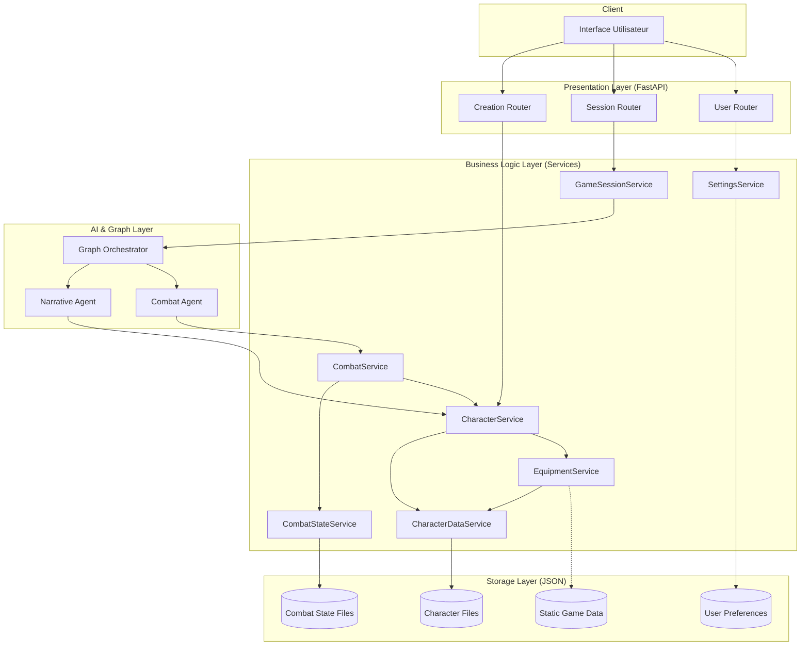
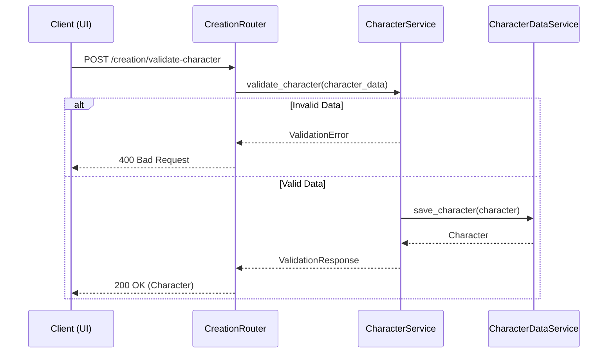
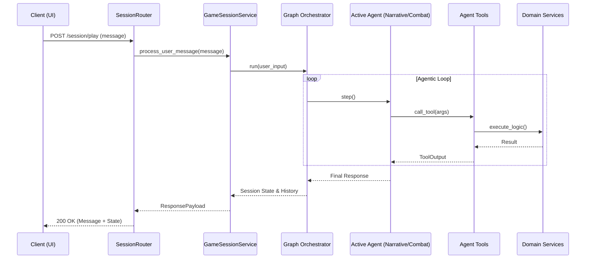

# Architecture du Projet JDR

Ce document décrit l'architecture technique du projet JDR (Jeu de Rôle), un système backend piloté par l'IA pour la gestion de parties de JDR.

## Stack Technologique

- **Langage**: Python 3.11+
- **Framework Web**: FastAPI
- **IA & Agents**: PydanticAI, Pydantic Graph
- **Validation de Données**: Pydantic V2
- **Gestion de Dépendances**: Poetry
- **Tests**: Pytest

## Principes Architecturaux

1. **Séparation des Responsabilités**: Chaque couche a une responsabilité unique (Présentation, Logique Métier, Données).
2. **Type Safety**: Utilisation extensive des type hints et de Pydantic pour garantir la robustesse des données.
3. **Stateless Services**: Les services ne conservent pas d'état entre les requêtes (sauf via la persistance).
4. **Dependency Injection**: Les dépendances sont gérées via un conteneur global (`DependencyContainer`) pour les services stateless.
5. **Documentation First**: Le code et l'architecture sont documentés pour faciliter la maintenance.

## Architecture en Couches

### 1. Couche de Présentation (Routers)

Gère les requêtes HTTP, la validation des entrées/sorties et la délégation aux services.

- `back/routers/creation.py`: Gestion de la création de personnages.
- `back/routers/session.py`: Gestion des sessions de jeu et du chat.
- `back/routers/user.py`: Gestion des préférences utilisateur globales.

### 2. Couche Logique Métier (Services)

Contient la logique pure du jeu et de l'application.

- `CharacterService`: Orchestration des actions sur les personnages.
- `CharacterDataService`: Persistance des personnages (Load/Save).
- `EquipmentService`: Gestion de l'inventaire, achat/vente, équipement.
- `CombatService`: Logique centrale du combat (initiative, tours, attaques, dégâts).
- `CombatStateService`: Persistance de l'état des combats.
- `GameSessionService`: Gestion de l'état de la session de jeu et orchestration des agents.
- `SettingsService`: Gestion des préférences utilisateur globales.
- `DependencyContainer`: Singleton gérant l'instanciation unique des services stateless (`CharacterDataService`, `EquipmentService`).

### 3. Couche Graph & Agent (IA)

Gère l'intelligence artificielle et le flux narratif.

- **Pydantic Graph**: Orchestre les états de la conversation (Narratif vs Combat).
- **Agents**:
  - `NarrativeAgent`: Gère l'histoire, les dialogues et l'exploration.
  - `CombatAgent`: Gère les actions de combat et la stratégie des PNJ.

### 4. Couche Modèle de Domaine (Domain Models)

Définit les structures de données et les règles de validation.

- `back/models/domain/`: Modèles Pydantic (Character, Stats, Skills, Equipment, CombatState, UserPreferences).
- `back/models/enums.py`: Énumérations partagées.

### 5. Couche de Stockage (Storage)

Gère la persistance des données (actuellement fichiers JSON).

- `gamedata/characters/`: Sauvegarde des personnages.
- `gamedata/settings/`: Sauvegarde des préférences utilisateur.
- `gamedata/combat_states/`: Sauvegarde des états de combat actifs.

## Diagramme d'Architecture Global

## Flux de Données

1. **Chargement des Données Statiques**:
    - Les `Managers` (EquipmentManager, RacesManager, etc.) chargent les données YAML au démarrage ou à la demande.
    - *Note: Les managers SpellsManager et CombatSystemManager ont été retirés au profit de modèles simplifiés et de logique intégrée au service de combat.*

2. **Cycle de Vie d'une Requête de Jeu**:
    - Le client envoie un message au `SessionRouter`.
    - Le `SessionRouter` appelle `GameSessionService`.
    - `GameSessionService` invoque le `Graph Orchestrator`.
    - Le graphe détermine l'agent actif (Narratif ou Combat).
    - L'agent utilise des `Tools` pour interagir avec les `Services` (ex: `equip_item`, `attack`).
    - Les `Services` mettent à jour les modèles de domaine et persistent les changements via `CharacterDataService` ou `CombatStateService`.
    - La réponse est renvoyée au client.

## Diagrammes de Séquence

### 1. Création de Personnage (Validation)

### 2. Boucle de Jeu (Play Scenario)

## Design Patterns Clés

- **Repository Pattern (Simplifié)**: `CharacterDataService` et `CombatStateService` agissent comme des repositories pour l'accès aux fichiers.
- **Service Layer**: Encapsulation de la logique métier.
- **Dependency Injection**: Injection des services dans les routeurs et entre services.
- **State Machine**: Utilisation de Pydantic Graph pour gérer les états de la conversation.
