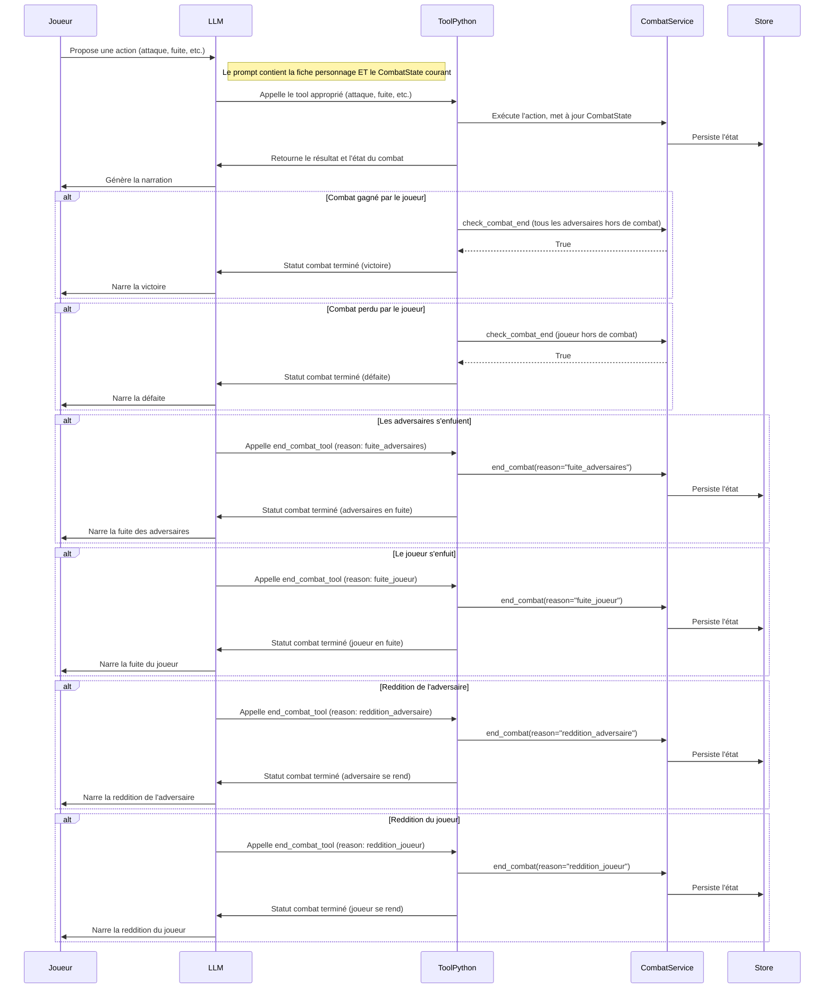

# Gestion complète des combats – Architecture et bonnes pratiques

## 1. Objectifs
Garantir la cohérence, la traçabilité et la robustesse de la gestion des combats dans le JdR orchestré par LLM, en séparant strictement la logique métier (Python/tools) et la narration (LLM).

---

## 2. Classes et structures recommandées

### 2.1 CombatState
Classe centrale pour stocker l’état du combat.

```python
class CombatState(BaseModel):
    combat_id: str
    round: int
    participants: list[dict]  # id, nom, PV, statut, initiative, etc.
    initiative_order: list[str]  # IDs triés
    current_turn: int
    log: list[str]  # Historique des actions
    status: str  # "en_cours", "termine", etc.
    end_reason: Optional[str] = None  # fuite, victoire, reddition, etc.
```

### 2.2 CombatService
Service métier pour manipuler CombatState.

```python
class CombatService:
    def start_combat(self, participants: list[dict]) -> CombatState: ...
    def roll_initiative(self, combat_state: CombatState) -> CombatState: ...
    def perform_attack(self, combat_state: CombatState, attacker_id: str, target_id: str, ...) -> CombatState: ...
    def apply_damage(self, combat_state: CombatState, target_id: str, amount: int) -> CombatState: ...
    def end_turn(self, combat_state: CombatState) -> CombatState: ...
    def check_combat_end(self, combat_state: CombatState) -> bool: ...
    def end_combat(self, combat_state: CombatState, reason: str) -> CombatState: ...
    def get_combat_summary(self, combat_state: CombatState) -> dict: ...
```

---

## 3. Outils (Tools) à exposer au LLM

- `roll_initiative`
- `perform_attack`
- `resolve_attack`
- `calculate_damage`
- `apply_damage`
- `end_combat_tool` (outil explicite pour terminer un combat sur demande du LLM, ex : fuite, reddition)
- `check_combat_end_tool` (outil pour vérifier si le combat est terminé automatiquement)

**Exemple pour end_combat_tool :**
```python
def end_combat_tool(combat_id: str, reason: str) -> dict:
    """
    ### end_combat_tool
    **Description :** Termine explicitement un combat en précisant la raison (fuite, reddition, etc.).
    **Paramètres :**
    - `combat_id` (str) : Identifiant du combat.
    - `reason` (str) : Raison de la fin du combat.
    **Retour :** Dictionnaire contenant le statut final du combat.
    """
```

---

## 4. Prompt système (extraits à intégrer)

- Toujours injecter l’état du combat (CombatState sérialisé) dans le prompt à chaque tour.
- Préciser dans le prompt que le LLM doit utiliser les outils pour toute action de jeu, y compris la fin de combat (fuite, reddition, etc.).
- Exemple d’instruction à ajouter :

> "Pour mettre fin à un combat (fuite, reddition, etc.), utilise l’outil `end_combat_tool` avec la raison appropriée. Ne conclus jamais un combat sans passer par cet outil ou sans validation de l’état via les outils."

---

## 5. Synchronisation et persistance

- L’état du combat doit être stocké et mis à jour uniquement via CombatService et persisté (ex : JSONL, base de données).
- Après chaque action, vérifier la cohérence de l’état (PV, statut, etc.).
- Injecter l’état à chaque tour dans le prompt du LLM.

---

## 6. Tests

- Écrire des tests unitaires pour chaque méthode de CombatService.
- Tester les cas de fin de combat automatique (tous les adversaires hors de combat) et manuelle (fuite, reddition).
- Vérifier la cohérence de l’état après chaque action.

---

## 7. Résumé du flux

1. Le LLM propose une action (attaque, fuite, etc.).
2. L’outil Python exécute l’action, met à jour CombatState, vérifie la fin éventuelle du combat.
3. Si le LLM souhaite terminer le combat (hors cas automatique), il appelle explicitement `end_combat_tool`.
4. L’état mis à jour est injecté dans le prompt pour le tour suivant.
5. La narration s’appuie toujours sur l’état réel, jamais sur une supposition du LLM.

---

## 8. Bonnes pratiques

- Ne jamais laisser le LLM modifier l’état du combat directement.
- Centraliser toute la logique métier dans les services et tools Python.
- Documenter chaque méthode selon le standard du projet (en français, format markdown).
- Garder une trace de toutes les actions dans le log du combat.

---

## 9. Diagramme de séquence – Gestion complète des scénarios de combat



---

Ce diagramme de séquence illustre tous les scénarios possibles de fin de combat, en garantissant que la logique métier et la persistance sont toujours gérées côté Python, et que le LLM ne fait qu'initier ou narrer les transitions d'état.

---

## 10. Injection du CombatState dans le prompt

À chaque tour de jeu, l’état courant du combat (CombatState) doit être injecté dans le prompt envoyé au LLM, en plus de la fiche personnage. Cela garantit que le LLM dispose d’une vision exacte et à jour de la situation (PV, statut, initiative, etc.) pour générer une narration cohérente, proposer des actions pertinentes, et utiliser correctement les outils.

**Bonnes pratiques :**
- Sérialiser le CombatState (par exemple en JSON ou résumé structuré).
- L’injecter dans le prompt système ou utilisateur, à chaque tour, en plus de la fiche personnage.
- Préciser dans le prompt que le LLM doit s’appuyer sur cet état pour toute décision ou narration liée au combat.

---

**Ce document doit être mis à jour à chaque évolution majeure de la gestion des combats.**
