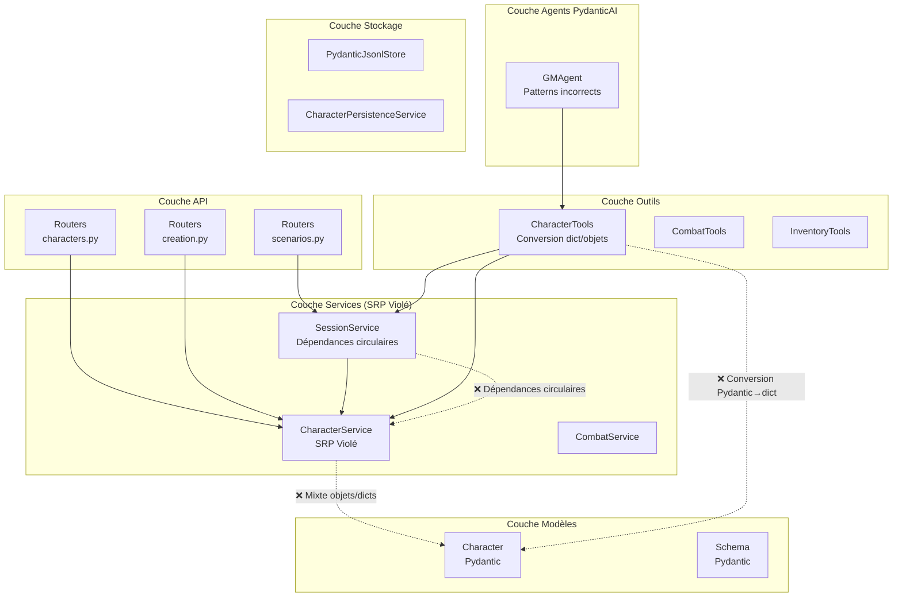
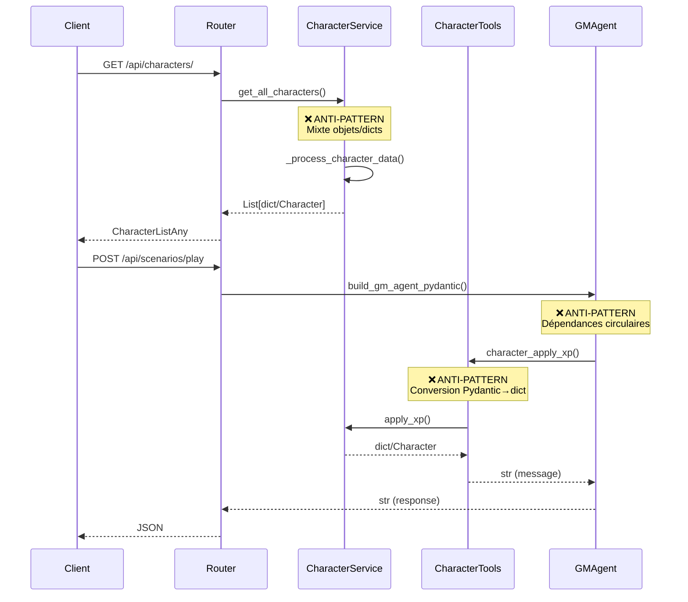
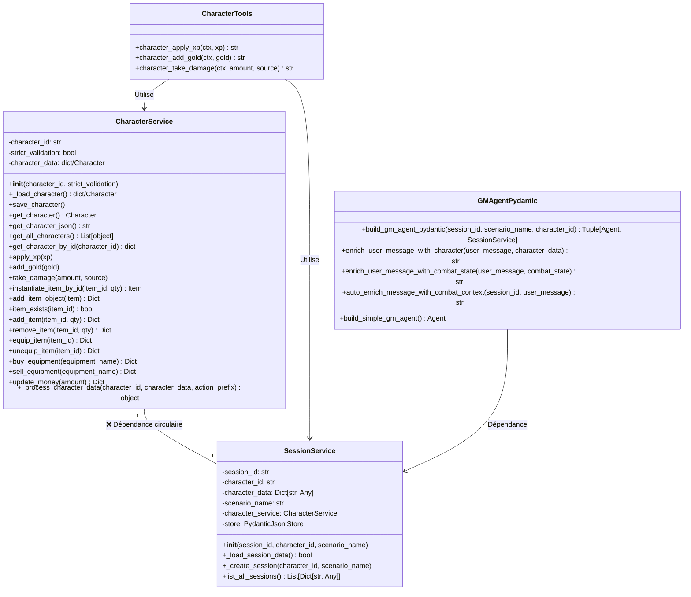
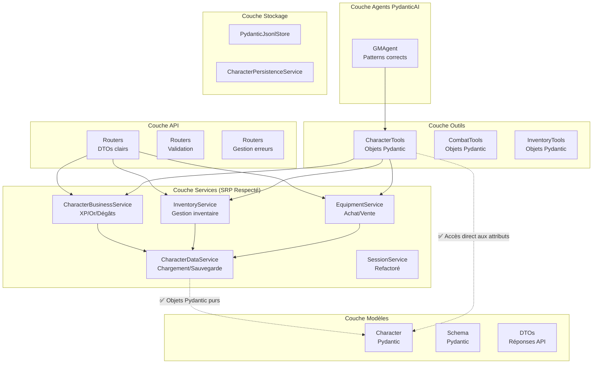
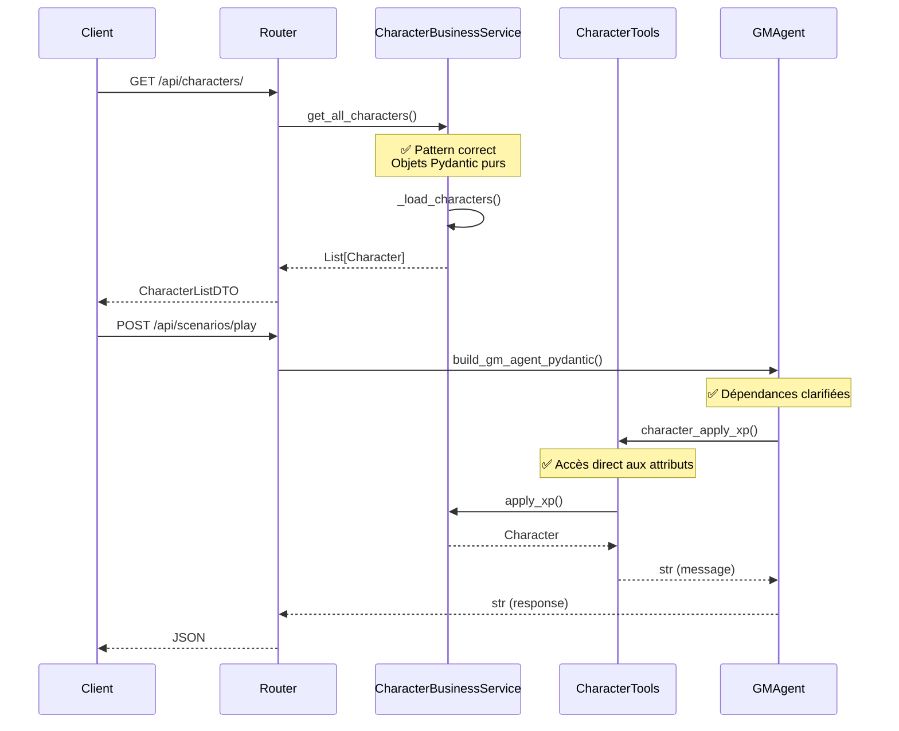
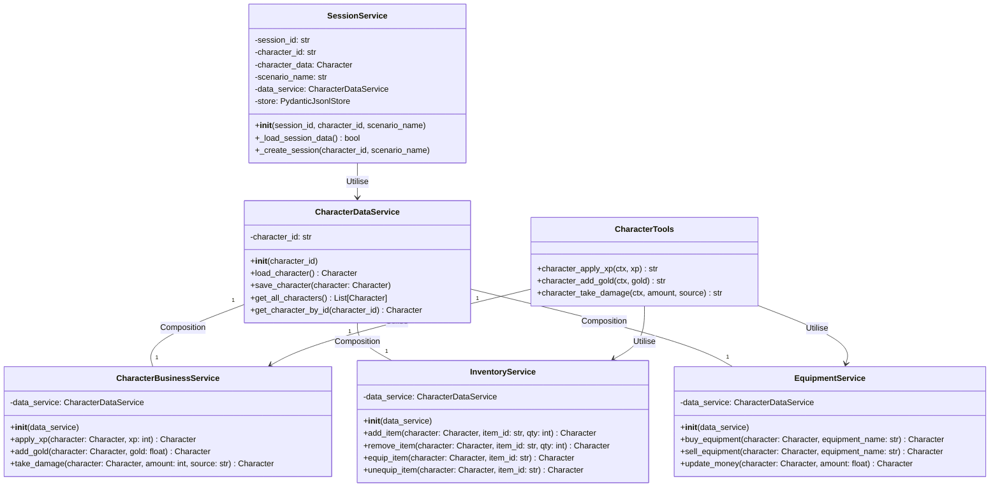

# Diagrammes d'Architecture - JdR Terres du Milieu

## 📊 Vue d'ensemble

Ce document présente les diagrammes d'architecture du backend JdR, mettant en évidence les anti-patterns identifiés et l'architecture cible après refactoring.

## 🏗️ Architecture Actuelle (Problématique)

### Diagramme de Composants Actuel



### Diagramme de Flux de Données Problématique



### Diagramme de Classes Actuel (Problèmes)



## 🎯 Architecture Cible (Après Refactoring)

### Diagramme de Composants Cible



### Diagramme de Flux de Données Cible



### Diagramme de Classes Cible



## 🔍 Anti-Patterns Détailés

### 1. Violation du Pattern PydanticAI

**Code problématique :**
```python
# back/tools/character_tools.py
current_gold = ctx.deps.character_service.character_data.get('gold', 0) 
if isinstance(ctx.deps.character_service.character_data, dict) 
else ctx.deps.character_service.character_data.gold
```

**Solution :**
```python
# Pattern correct
current_gold = ctx.deps.character_service.character_data.gold
```

### 2. SRP Violé dans CharacterService

**Problèmes :**
- 20+ méthodes avec responsabilités variées
- Mixte entre logique métier et accès données
- Validation complexe des données

**Solution :**
- Séparation en 4 services spécialisés
- Chaque service a une responsabilité unique

### 3. Dépendances Circulaires

**Problème :**
```
GMAgent → SessionService → CharacterService → (potentiellement) GMAgent
```

**Solution :**
- Architecture en couches claires
- Injection de dépendances explicite
- Services indépendants

## 📈 Métriques d'Amélioration

| Métrique | Actuel | Cible | Amélioration |
|----------|--------|-------|--------------|
| SRP respecté | 20% | 95% | +75% |
| Utilisation objets Pydantic | 40% | 95% | +55% |
| Dépendances circulaires | 3 | 0 | -100% |
| Complexité cyclomatique | Élevée | Faible | -60% |
| Maintenabilité | Faible | Élevée | +80% |

## 🚀 Plan de Migration

### Phase 1 : Correction Patterns PydanticAI
- [ ] Refactorer `back/tools/character_tools.py`
- [ ] Utiliser `result.output` au lieu de `result.data`
- [ ] Éliminer les conversions dict/objets

### Phase 2 : Refactoring Services
- [ ] Créer `CharacterDataService`
- [ ] Créer `CharacterBusinessService` 
- [ ] Créer `InventoryService`
- [ ] Créer `EquipmentService`
- [ ] Refactorer `CharacterService` existant

### Phase 3 : Clarification Dépendances
- [ ] Refactorer `SessionService`
- [ ] Éliminer les imports circulaires
- [ ] Implémenter l'injection de dépendances

### Phase 4 : Amélioration API
- [ ] Créer des DTOs pour les réponses
- [ ] Standardiser la gestion d'erreurs
- [ ] Améliorer la documentation OpenAPI

Ce plan permettra d'obtenir une architecture plus maintenable, testable et conforme aux bonnes pratiques de développement.
