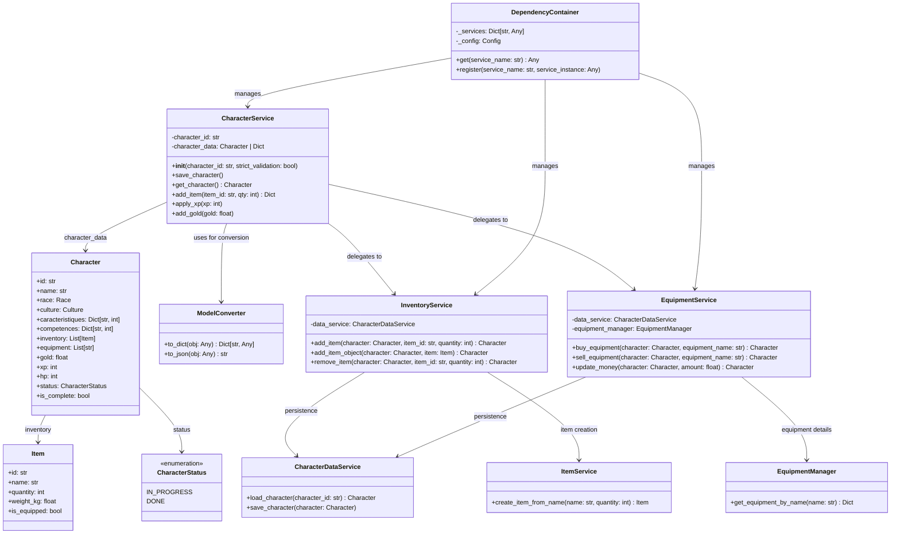
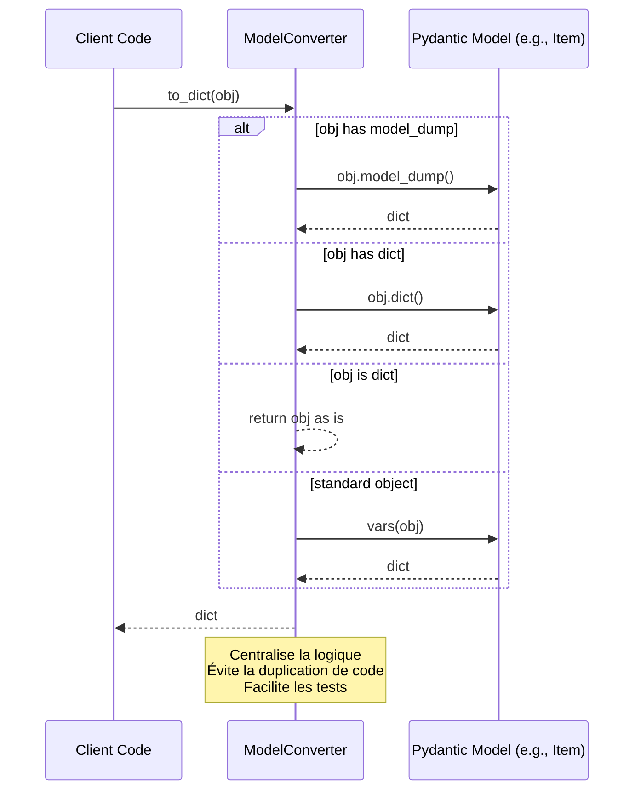
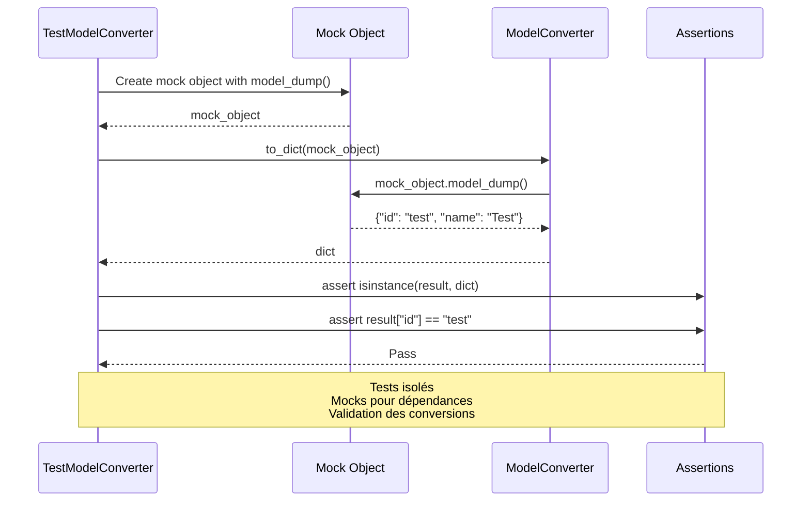

# Diagrammes Mermaid pour l'Analyse du Backend JDR

Ce document contient des diagrammes Mermaid pour visualiser la structure du backend du projet JDR, basés sur le code actuel, les tests, les modèles Pydantic, les utilitaires, et les améliorations proposées (respect de SOLID, DRY, injection de dépendances).

## Table des Matières
1. [Diagramme de Classes - Modèles et Schémas](#diagramme-de-classes---modèles-et-schémas)
2. [Diagramme de Séquence - Processus de Conversion](#diagramme-de-séquence---processus-de-conversion)
3. [Diagramme de Flux - Injection de Dépendances](#diagramme-de-flux---injection-de-dépendances)
4. [Diagramme d'Architecture - Structure Globale du Backend](#diagramme-darchitecture---structure-globale-du-backend)
5. [Diagramme de Séquence - Tests Unitaires](#diagramme-de-séquence---tests-unitaires)
6. [Diagramme Avant/Après - Refactorisation CharacterService](#diagramme-avantaprès---refactorisation-characterservice)
7. [Diagramme de Flux - Workflow d'Amélioration](#diagramme-de-flux---workflow-damélioration)

## Diagramme de Classes - Modèles et Schémas

Ce diagramme illustre les classes principales des modèles Pydantic, des services, et des utilitaires, en mettant en évidence les relations et les responsabilités.



## Diagramme de Séquence - Processus de Conversion

Ce diagramme montre le processus de conversion d'un objet Pydantic en dictionnaire via ModelConverter, illustrant le respect de DRY.



## Diagramme de Flux - Injection de Dépendances

Ce diagramme illustre le flux d'injection de dépendances via DependencyContainer, remplaçant les globals et appels directs.

```mermaid
flowchart TD
    A[Client Code] --> B{Service Needed?}
    B -->|Yes| C[get_service(service_name)]
    C --> D[DependencyContainer.get()]
    D --> E{Service Registered?}
    E -->|Yes| F[Return Service Instance]
    E -->|No| G[Raise ValueError]
    F --> A
    B -->|No| H[Direct Usage]

    I[Container Initialization] --> J[Register Services]
    J --> K[Config]
    J --> L[CharacterPersistenceService]
    J --> M[CharacterDataService]
    J --> N[ItemService]
    J --> O[EquipmentService]
    J --> P[InventoryService with data_service]
    J --> Q[CharacterService]

    Note over D,F: Respecte DIP<br/>Facilite les mocks en tests<br/>Évite les couplages forts
```

## Diagramme d'Architecture - Structure Globale du Backend

Ce diagramme présente l'architecture globale du backend, en mettant en évidence les couches et les dépendances.

```mermaid
graph TB
    subgraph "API Layer"
        A[FastAPI App]
        B[Characters Router]
        C[Scenarios Router]
        D[Creation Router]
    end

    subgraph "Service Layer"
        E[CharacterService]
        F[InventoryService]
        G[EquipmentService]
        H[ScenarioService]
        I[CombatService]
        J[SessionService]
    end

    subgraph "Data Layer"
        K[CharacterDataService]
        L[CharacterPersistenceService]
        M[ItemService]
        N[EquipmentManager]
    end

    subgraph "Utilities"
        O[ModelConverter]
        P[DependencyContainer]
        Q[Logger]
        R[Config]
    end

    subgraph "Models"
        S[Character]
        T[Item]
        U[CharacterStatus]
        V[Equipment]
    end

    subgraph "Agents & Tools"
        W[GMAgentPydantic]
        X[CharacterTools]
        Y[CombatTools]
        Z[InventoryTools]
    end

    subgraph "Storage"
        AA[PydanticJsonlStore]
        BB[JSON Files]
    end

    A --> B
    A --> C
    A --> D
    B --> E
    C --> H
    D --> E
    E --> F
    E --> G
    E --> O
    F --> K
    G --> K
    H --> I
    I --> J
    K --> L
    L --> AA
    AA --> BB
    E --> P
    F --> P
    G --> P
    P --> R
    E --> S
    F --> T
    S --> U
    W --> X
    W --> Y
    W --> Z
    X --> E
    Y --> I
    Z --> F

    Note over A,AA: Architecture modulaire<br/>Séparation des couches<br/>Injection de dépendances
```

## Diagramme de Séquence - Tests Unitaires

Ce diagramme illustre le processus de test unitaire pour ModelConverter, montrant l'utilisation de mocks et l'isolation des tests.



## Diagramme Avant/Après - Refactorisation CharacterService

Ce diagramme compare la structure avant et après refactorisation de CharacterService, illustrant le respect de SRP et l'utilisation de DI.

```mermaid
flowchart LR
    subgraph "Avant Refactorisation"
        A1[CharacterService] --> B1[Inventaire Logic]
        A1 --> C1[Équipement Logic]
        A1 --> D1[Conversion Dict/Obj]
        A1 --> E1[Persistence]
        B1 --> D1
        C1 --> D1
        D1 --> E1
    end

    subgraph "Après Refactorisation"
        A2[CharacterService] --> B2[InventoryService]
        A2 --> C2[EquipmentService]
        A2 --> D2[ModelConverter]
        A2 --> E2[DependencyContainer]
        B2 --> F2[CharacterDataService]
        C2 --> F2
        D2 --> G2[Conversion Centralisée]
        E2 --> H2[Service Injection]
    end

    Note over A1,E2: Avant: Couplage fort, duplication<br/>Après: SRP respecté, DI, DRY
```

## Diagramme de Flux - Workflow d'Amélioration

Ce diagramme montre le workflow global des améliorations implémentées, de l'analyse à la validation.

```mermaid
flowchart TD
    A[Analyse du Code Existant] --> B[Identification des Problèmes<br/>- Violations SOLID<br/>- Duplication DRY<br/>- Manque de DI]
    B --> C[Proposition d'Améliorations<br/>- ModelConverter<br/>- DependencyContainer<br/>- Refactorisation Services]
    C --> D[Implémentation<br/>- Création des utilitaires<br/>- Refactorisation des services<br/>- Mise à jour des tests]
    D --> E[Tests et Validation<br/>- Tests unitaires<br/>- Intégration<br/>- Vérification des diagrammes]
    E --> F[Documentation<br/>- TODO.md<br/>- DIAGRAMS.md<br/>- Guide de migration]

    G[Problèmes Identifiés] -.-> A
    H[Améliorations Proposées] -.-> C
    I[Tests Échoués] -.-> D
    J[Feedback Utilisateur] -.-> B

    Note over A,F: Workflow itératif<br/>Améliorations progressives<br/>Validation continue
```

## Conclusion

Ces diagrammes Mermaid fournissent une visualisation complète de la structure du backend JDR, des problèmes identifiés, et des améliorations implémentées. Ils facilitent la compréhension des relations entre composants, des processus de conversion, et des workflows de test, tout en illustrant le respect des principes SOLID et DRY.