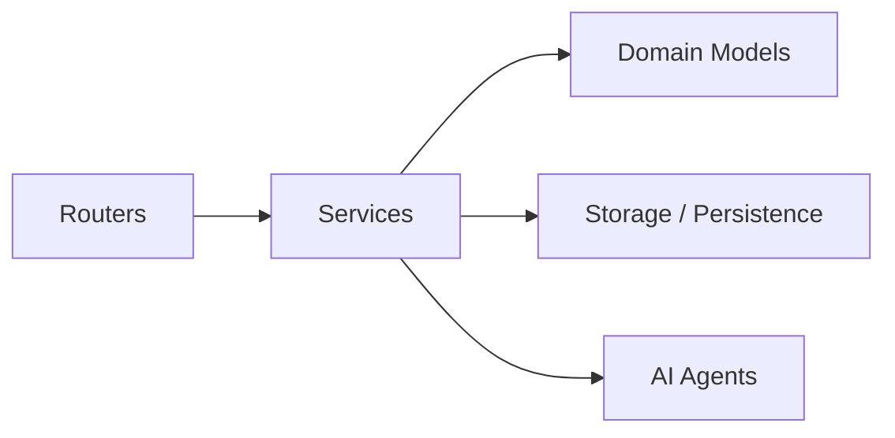

# JDR - Jeu de Rôle Assisté par IA

Bienvenue sur le projet JDR, un système de jeu de rôle backend piloté par l'IA, conçu pour offrir une expérience de jeu immersive et dynamique.

## 🚀 État du Projet

Le projet est en développement actif. Le backend est fonctionnel avec une gestion avancée des personnages, un système de combat au tour par tour, et une narration pilotée par des agents IA.

## 🛠 Stack Technologique

- **Langage**: Python 3.11+
- **Framework**: FastAPI
- **IA**: PydanticAI, Pydantic Graph, Google Gemini
- **Données**: Pydantic V2, JSON (Persistance), YAML (Données statiques)
- **Outils**: Poetry, Pytest, Ruff

## 🏗 Architecture

### Principes Clés

- **Architecture Hexagonale Simplifiée**: Séparation claire entre le cœur métier (Domain), l'application (Services) et les interfaces (Routers).
- **Agentic Workflow**: Utilisation de graphes d'états pour orchestrer les interactions entre l'utilisateur et les différents agents spécialisés (Narrateur, Maître de Combat).

### Architecture des Services



- **CharacterService**: Cœur de la gestion des personnages (stats, progression).
- **EquipmentService**: Gestion complète de l'inventaire et de l'équipement.
- **CombatService**: Moteur de résolution des combats (initiative, attaques, dégâts).
- **CombatStateService**: Persistance et chargement des états de combat.
- **SettingsService**: Gestion des préférences utilisateur globales.
- **GameSessionService**: Point d'entrée pour la boucle de jeu principale.

## 🎲 Système de Jeu

### Statistiques

Le système utilise les 6 caractéristiques classiques (Force, Dextérité, Constitution, Intelligence, Sagesse, Charisme) pour dériver les modificateurs et les compétences.

### Combat

- **Initiative**: Basée sur la Dextérité.
- **Actions**: Attaque, Sort, Utilisation d'objet.
- **Tour par Tour**: Géré par le `CombatService` et l'agent de combat.
- **État**: Persistant via `CombatStateService`, permettant de reprendre un combat interrompu.

### Magie

- Système simplifié géré par le modèle `Spells` (Sorts connus, Emplacements de sorts).
- Pas de gestionnaire complexe de sorts ; la logique est intégrée aux modèles et aux agents.

## 📂 Structure du Projet

```text
back/
├── agents/             # Agents IA (Narrative, Combat)
├── models/             # Modèles Pydantic
│   ├── domain/         # Modèles métier (Character, Item, etc.)
│   └── ...
├── routers/            # Endpoints FastAPI (Creation, Session, User)
├── services/           # Logique métier (Combat, Equipment, Settings...)
├── tools/              # Outils pour les agents IA
├── utils/              # Utilitaires (Logger, Exceptions)
├── tests/              # Tests unitaires et d'intégration
└── gamedata/           # Données statiques (YAML) et persistance (JSON)
```

## 🔌 API Reference

### User

- `GET /user/preference`: Récupérer les préférences utilisateur.
- `PUT /user/preference`: Mettre à jour les préférences.

### Creation

- `POST /creation/validate-character`: Valider un personnage complet.
- `POST /creation/validate-character/by-id`: Valider un personnage existant.

### Session

- `POST /session/play`: Envoyer une action au maître du jeu.

## 📝 Spécification Technique

### Chargement des Données

Les données statiques (Races, Classes, Équipement) sont chargées depuis des fichiers YAML via des Managers (`RacesManager`, `EquipmentManager`).

### Outils PydanticAI

Les agents interagissent avec le monde via des outils typés définis dans `back/tools/`.

- `combat_tools.py`: Outils de combat (attaquer, finir le tour).
- `equipment_tools.py`: Outils d'inventaire (acheter, ajouter, retirer, décrémenter quantités).
- `character_tools.py`: Outils de personnage (monnaie, dégâts, soins, XP).
- `skill_tools.py`: Outils de compétences (jets de compétence).

### Persistance

- **Personnages**: Fichiers JSON dans `gamedata/characters/`.
- **Combats**: Fichiers JSON dans `gamedata/combat_states/`.
- **Préférences**: Fichier JSON dans `gamedata/settings/`.

## 💻 Installation et Développement

Voir `CONTRIBUTING.md` pour les détails sur l'installation et les standards de code.

```bash
# Lancer le serveur de développement
./run_dev.sh
```
