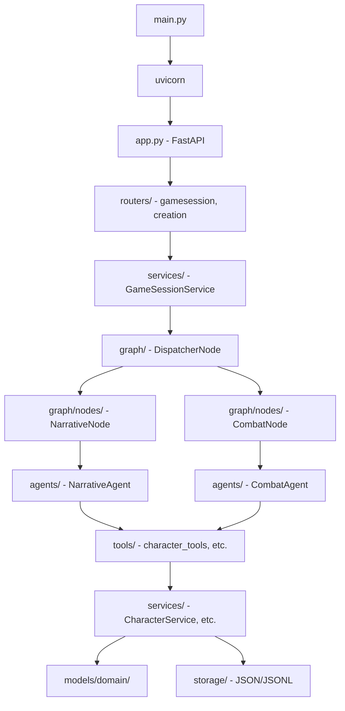
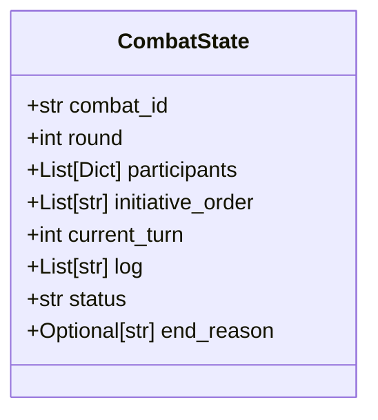
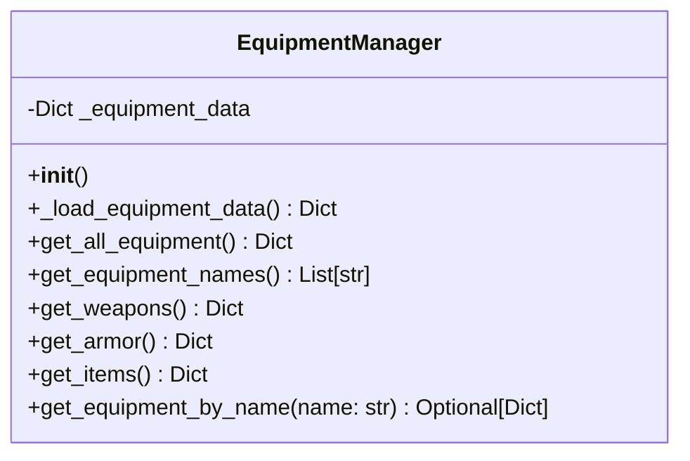
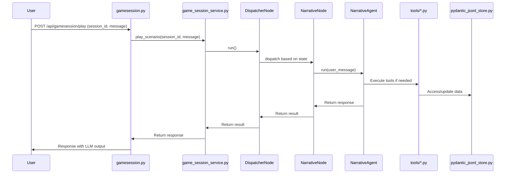

# JdR "Terres du Milieu" - Middle-earth RPG

<!-- markdownlint-disable-file -->

> **A Role-Playing Game orchestrated by Large Language Models**

This is a tabletop RPG set in Middle-earth (Tolkien's world), where the narration and game mechanics are orchestrated by a Large Language Model (LLM) acting as the Game Master (GM). The project combines traditional RPG rules with modern AI capabilities to create an immersive, dynamic gameplay experience.

## 🎯 Project Status

**Current Version**: 2.0 (Major Refactoring Complete)

### Recent Achievements ✅

- **Data Migration**: Complete migration from JSON to YAML format
- **Language Translation**: Full translation from French to English (characteristics, skills, models)
- **Simplified System**: New CharacterV2 with six attributes (3–20) and 40 skill points (down from 84)
- **Modern Framework**: Migration from LangChain to PydanticAI for better type safety and validation
- **Clean Architecture**: Strict separation of concerns with dedicated services

### Technology Stack

- **Backend**: FastAPI + PydanticAI + Pydantic V2
- **Data**: YAML configuration files
- **LLM**: OpenAI-compatible API (DeepSeek by default)
- **Storage**: JSONL for conversation history, JSON for character sheets
- **Frontend**: (to be recreated)

## 🏗️ Architecture Overview

### Core Principles

The architecture follows strict **SOLID principles** with clear separation of responsibilities:

- **Services** (`back/services/`): Each service encapsulates a unique business responsibility (Single Responsibility Principle)
- **Graph & Agents** (`back/graph/`, `back/agents/`): Orchestrate game flow and narration via Pydantic Graph and specialized PydanticAI agents
- **Routers** (`back/routers/`): Expose REST endpoints, delegate all business logic to services
- **Models** (`back/models/domain/`): Pydantic models with strict validation
- **Tools** (`back/tools/`): PydanticAI tools for LLM interaction
- **Memory**: Decoupled from agent, persisted via custom JSONL store

### Key Architectural Decisions

1. **No I/O in Services**: Services handle business logic, not file operations
2. **No Game Rules in Routers**: Routers only manage HTTP logic
3. **Strict Type Safety**: Pydantic models everywhere with comprehensive validation
4. **English Only**: All code, documentation, and data use English (post-migration)
5. **YAML for Game Data**: All game configuration in YAML format for better readability

### Documentation References

- PydanticAI Framework - Agent framework documentation check Context7 tool for documentation
- [GitHub Copilot Instructions](.github/copilot-instructions.md) - Development guidelines
- [Technical Specification](#technical-specification) - Detailed architecture below
- [REFACTO_COMBAT.md](REFACTO_COMBAT.md) - Authoritative combat refactor plan (English).
- [REFACTO_COMBAT_FR.md](REFACTO_COMBAT_FR.md) - French translation of the combat refactor plan for francophone contributors.

## 📦 Service Architecture

The backend uses a modular architecture with strict separation of responsibilities (SRP):

### Character Management Services

- **CharacterDataService**: Specialized for loading and saving character data (I/O operations)
- **CharacterService**: Business logic (XP, gold, damage, healing) and inventory management
- **EquipmentService**: Equipment buy/sell, inventory (add/remove/equip), and money management

### Game Services

- **GameSessionService**: Game session management (history, character, scenario)
- **ScenarioService**: Scenario flow management
- **ItemService**: Item management
- **SkillAllocationService**: Automated skill distribution logic

### Graph & Agent Layer

The system uses **Pydantic Graph** to orchestrate session state transitions between narrative and combat modes:

- **Graph Nodes** (`back/graph/nodes/`):
    - `NarrativeNode`: Uses `NarrativeAgent` for story progression
    - `CombatNode`: Uses `CombatAgent` for combat turns
    - `DispatcherNode`: Routes based on session state
- **Specialized Agents** (`back/agents/`):
    - `NarrativeAgent`: Handles storytelling and combat triggers
    - `CombatAgent`: Handles combat mechanics and state updates
- **Tools**: All tools use `RunContext[GameSessionService]` signature to access services
- **Memory**: Conversation history stored in JSONL via `back/storage/pydantic_jsonl_store.py`
- **System Prompt**: Modular prompt built dynamically from scenario and rules

## 🎮 Game System

### Character Statistics (Simplified V2)

The new system uses **6 core attributes** with a per‑stat cap:

| Stat | Abbreviation | Category | Description |
|------|--------------|----------|-------------|
| **Strength** | STR | Physical | Melee damage, carrying capacity |
| **Constitution** | CON | Physical | HP, endurance, disease resistance |
| **Agility** | AGI | Physical | Initiative, defense, reflexes |
| **Intelligence** | INT | Mental | Spellcasting, problem-solving |
| **Wisdom** | WIS | Mental | Perception, willpower, intuition |
| **Charisma** | CHA | Social | Leadership, persuasion, influence |

**Point Allocation**:
- Each stat: 3–20 range (player-assigned)
- Modifier: (value - 10) // 2

### Skills System

**6 skill groups** with **40 development points**:

1. **Combat**: Melee Weapons, Ranged Weapons, Unarmed Combat, Armor Proficiency
2. **General**: Athletics, Perception, Survival, Crafting
3. **Stealth**: Stealth, Lockpicking, Sleight of Hand
4. **Social**: Persuasion, Intimidation, Deception
5. **Magic**: Arcane Lore, Spellcasting, Alchemy
6. **Knowledge**: History, Nature, Religion, Investigation

**Uniform Cost**: 1 development point = 1 skill rank (ranks 0-10)

### Combat System

**Simplified combat mechanics**:
- **Initiative**: 1d100 + Agility modifier
- **Actions per turn**: 1 major + 1 minor + 1 reaction
- **Turn duration**: 6 seconds
- **Attack resolution**: Attack roll vs Defense roll
- **Damage**: Base weapon damage + (roll delta / 10) - armor

**Combat State Tracking**:
- Managed by `CombatState` Pydantic model
- Persistent storage in `data/combat/`
- Automatic initiative ordering
- HP tracking per participant

## 🗂️ Project Structure

```
.
├── back/                        # FastAPI + PydanticAI backend
│   ├── __init__.py
│   ├── .coverage
│   ├── app.py                  # FastAPI application entry point
│   ├── config.py               # Centralized configuration loader
│   ├── config.yaml             # YAML configuration file
│   ├── main.py                 # Uvicorn target that launches the API and GM agent
│   ├── requirements.txt        # Backend Python dependencies
│   ├── agents/
│   │   ├── __init__.py
│   │   ├── combat_agent.py     # Specialized combat agent
│   │   ├── gm_agent_pydantic.py # Generic agent (names, backgrounds)
│   │   ├── narrative_agent.py  # Specialized narrative agent
│   │   └── PROMPT.py           # Modular system prompt builder
│   ├── docs/
│   │   └── LOGGING_GUIDE.md    # Logging guide
│   ├── graph/                  # Pydantic Graph implementation
│   │   ├── nodes/              # Graph nodes (Narrative, Combat, Dispatcher)
│   │   └── dto/                # Data Transfer Objects for graph state
│   ├── models/
│   │   ├── __init__.py
│   │   ├── api_dto.py          # API DTO definitions
│   │   ├── schema.py           # API response/request schemas
│   │   └── domain/
│   │       ├── __init__.py
│   │       ├── base.py         # Shared domain base classes
│   │       ├── character.py    # CharacterV2 domain model
│   │       ├── combat_state.py # Combat state model
│   │       ├── combat_system_manager.py # Combat rules loader
│   │       ├── equipment_manager.py # Equipment data manager
│   │       ├── npc.py          # NPC domain model
│   │       ├── races_manager.py # Race and culture data manager
│   │       ├── spells_manager.py # Spell data manager
│   │       ├── stats_manager.py # Stat metadata manager
│   │       └── unified_skills_manager.py # Aggregated skills interface for the LLM
│   ├── routers/
│   │   ├── __init__.py
│   │   ├── characters.py       # Character listing, detail, deletion
│   │   ├── creation.py         # Character creation workflow
│   │   ├── gamesession.py      # Scenario play, history, and streaming
│   │   └── scenarios.py        # Scenario metadata endpoints
│   ├── services/
│   │   ├── __init__.py
│   │   ├── character_business_service.py # Business logic (XP, gold, damage)
│   │   ├── character_data_service.py # Aggregates persistence + validation
│   │   ├── character_persistence_service.py # JSON persistence utilities
│   │   ├── character_service.py # Legacy service kept for backward compatibility
│   │   ├── equipment_service.py # Buy/sell/equip gear flows
│   │   ├── game_session_service.py # Session orchestration and storage
│   │   ├── item_service.py      # Generic item helpers
│   │   ├── scenario_service.py  # Scenario management helpers
│   │   └── skill_allocation_service.py # Automated skill distribution logic
│   ├── storage/
│   │   ├── __init__.py
│   │   └── pydantic_jsonl_store.py # JSONL conversation history backend
│   ├── tests/
│   │   ├── __init__.py
│   │   ├── test_character_service_refactored.py # Character service unit tests
│   │   ├── test_logging.py     # Logging tests
│   │   ├── agents/
│   │   │   ├── __init__.py
│   │   │   └── test_gm_agent_dependency_injection.py # Dependency injection coverage
│   │   ├── domain/
│   │   │   └── __init__.py
│   │   ├── routers/
│   │   │   ├── __init__.py
│   │   │   └── test_characters_refactored.py # Router regression tests
│   │   ├── services/
│   │   │   └── __init__.py
│   │   ├── storage/
│   │   │   └── __init__.py
│   │   ├── tools/
│   │   │   └── __init__.py
│   │   └── utils/
│   │       └── __init__.py
│   ├── tools/
│   │   ├── __init__.py
│   │   ├── character_tools.py  # Character adjustments (XP, gold, HP)
│   │   ├── combat_tools.py     # Combat rolls and resolution helpers
│   │   ├── equipment_tools.py  # Inventory operations exposed to the agent
│   │   └── skill_tools.py      # Skill checks from the agent
│   └── utils/
│       ├── __init__.py
│       ├── dependency_injector.py # Lightweight DI helpers
│       ├── dice.py             # Dice juggling utilities
│       ├── exceptions.py       # Project specific exceptions
│       ├── logger.py           # Structured JSON logger
│       ├── logging_tool.py     # Logging bridge for the agent
│       ├── message_adapter.py  # Message format adapters
│       └── model_converter.py  # Helpers to convert between models and dicts
├── (frontend removed – to be recreated)
├── back/gamedata/               # YAML game data sources
│   ├── stats.yaml
│   ├── skills_for_llm.yaml
│   ├── races_and_cultures.yaml
│   ├── equipment.yaml
│   ├── spells.yaml
│   └── combat_system.yaml
├── data/                        # Runtime data directory
│   ├── characters/             # Persisted character sheets (JSON)
│   ├── combat/                 # Active combat states
│   ├── scenarios/              # Scenario Markdown files
│   ├── sessions/               # Conversation history (JSONL)
│   ├── game/                   # Legacy CSV data
│   └── json_backup/            # Backup of original JSON inputs
├── docs/                        # Game system documentation (currently in French)
│   ├── 00 - introduction.md
│   ├── 01 - Caractéristiques.md
│   ├── 02 - Guide Complet des Compétences.md
│   ├── 02 - Races et cultures.md
│   ├── 04 - Equipement, armes et armures.md
│   ├── 05 - Styles de combat.md
│   ├── 06 - Magie.md
│   ├── 07 - Sorts.md
│   └── section-6-combat.md
├── .github/
│   ├── copilot-instructions.md  # GitHub Copilot development guidelines
│   └── instructions/            # Code generation instructions
│       ├── python.instructions.md
│       ├── vuejs.instructions.md
│       └── generalcoding.instructions.md
└── README.md                    # Project documentation (this file)
```

## 📊 Architecture Diagrams

### Architecture Diagram

This diagram illustrates the overall backend architecture, showing the flow from entry points to agents, services, and dependencies.



### Class Diagrams

#### Character Model


#### CombatState Model



#### EquipmentManager



### Sequence Diagram for API Request Workflow

This diagram shows the sequence for a user playing a scenario turn via the API.



## 🌐 REST API Reference

The FastAPI backend exposes four router groups: `scenarios` for metadata, `gamesession` for interactive play, `characters` for roster management, and `creation` for the CharacterV2 workflow.

### API Routes Summary

| Method | Endpoint | Description |
|--------|----------|-------------|
| GET | `/api/scenarios/` | List available scenarios and their current status. |
| GET | `/api/scenarios/{scenario_file}` | Return the Markdown content of the specified scenario file. |
| GET | `/api/gamesession/sessions` | List all active sessions with scenario and character metadata. |
| POST | `/api/gamesession/start` | Start a scenario for a character and trigger the first LLM response. |
| POST | `/api/gamesession/play` | Send a message to the GM and receive the complete JSON transcript. |
| POST | `/api/gamesession/play-stream` | Same as `/play` but streams the response via Server-Sent Events. |
| GET | `/api/gamesession/history/{session_id}` | Retrieve the stored JSON history for a session. |
| DELETE | `/api/gamesession/history/{session_id}/{message_index}` | Remove a specific entry from a session history. |
| GET | `/api/characters/` | Return every stored character (draft or active). |
| GET | `/api/characters/{character_id}` | Retrieve a single character plus its load status. |
| DELETE | `/api/characters/character/{character_id}` | Remove a stored CharacterV2 sheet. |
| POST | `/api/creation/random` | Generate a fully random CharacterV2 using YAML data and the GM agent. |
| GET | `/api/creation/races` | Fetch every race and culture available in YAML. |
| GET | `/api/creation/skills` | Return the unified skills payload for the UI/LLM. |
| GET | `/api/creation/equipment` | Expose equipment definitions (weapons, armor, accessories, consumables). |
| GET | `/api/creation/stats` | Provide stat ranges, descriptions, and bonus formulas. |
| POST | `/api/creation/create` | Persist a CharacterV2 payload after validation. |
| POST | `/api/creation/update` | Update an existing character (name, stats, skills, story). |
| POST | `/api/creation/validate-character` | Validate an in-memory character payload. |
| POST | `/api/creation/validate-character/by-id` | Load and validate a persisted character without resending it. |

**Character Validation Routes**

| Endpoint | Body | When to use |
| --- | --- | --- |
| `POST /api/creation/validate-character` | Full character payload (stats, skills, equipment, etc.) | Use when the frontend holds the entire JSON and wants immediate feedback before saving. |
| `POST /api/creation/validate-character/by-id` | `{ "character_id": "uuid" }` | Use after `/api/creation/create` or `/api/creation/update` to validate what already lives on disk. |

> Every route above is documented in the codebase and the [technical instructions](instructions/openai-instructions.md).

### Scenario Metadata (`/api/scenarios`)

#### 1. `GET /api/scenarios/` – Scenario List

**Description:** Returns the complete list of scenarios along with their availability.

**Parameters:** None

**Response:**
```json
{
    "scenarios": [
        {
            "name": "Les_Pierres_du_Passe.md",
            "status": "available",
            "session_id": null,
            "scenario_name": null,
            "character_name": null
        },
        {
            "name": "Les_Pierres_du_Passe.md - Galadhwen",
            "status": "in_progress",
            "session_id": "12345678-1234-5678-9012-123456789abc",
            "scenario_name": "Les_Pierres_du_Passe.md",
            "character_name": "Galadhwen"
        }
    ]
}
```

#### 2. `GET /api/scenarios/{scenario_file}` – Scenario Content

**Description:** Returns the Markdown content of a scenario file so the UI or tooling can display it.

**Parameters:**
- `scenario_file` (path): Scenario filename, for example `Les_Pierres_du_Passe.md`.

**Response:** Plain Markdown string.

**Errors:** `404` when the file cannot be found.

### Game Session Routes (`/api/gamesession`)

#### 1. `GET /api/gamesession/sessions` – Active Sessions

**Description:** Lists all active sessions with scenario id and character metadata.

**Parameters:** None

**Response:**
```json
{
    "sessions": [
        {
            "session_id": "12345678-1234-5678-9012-123456789abc",
            "scenario_name": "Les_Pierres_du_Passe.md",
            "character_id": "87654321-4321-8765-2109-987654321def",
            "character_name": "Galadhwen"
        }
    ]
}
```

#### 2. `POST /api/gamesession/start` – Start Scenario

**Description:** Starts a session for the provided `scenario_name` and `character_id`, then triggers the opening narration with the GM agent.

**Request Body:**
```json
{
    "scenario_name": "Les_Pierres_du_Passe.md",
    "character_id": "87654321-4321-8765-2109-987654321def"
}
```

**Response:**
```json
{
    "session_id": "12345678-1234-5678-9012-123456789abc",
    "scenario_name": "Les_Pierres_du_Passe.md",
    "character_id": "87654321-4321-8765-2109-987654321def",
    "message": "Scenario 'Les_Pierres_du_Passe.md' started successfully for character 87654321-4321-8765-2109-987654321def.",
    "llm_response": "**Esgalbar, central square of the village**..."
}
```

**Errors:**
- `409`: Session already exists for the same scenario and character.
- `404`: Scenario or character not found.

#### 3. `POST /api/gamesession/play` – Play a Turn

**Description:** Sends a message to the GM agent and returns the full JSON transcript (requests, responses, tool calls).

**Parameters:**
- `session_id` (query): UUID of the game session.

**Body:**
```json
{"message": "I inspect the fountain"}
```

**Response:**
```json
{
    "response": [
        {
            "parts": [
                {
                    "content": "I inspect the fountain",
                    "timestamp": "2025-06-09T17:50:53.234253Z",
                    "part_kind": "user-prompt"
                }
            ],
            "kind": "request"
        },
        {
            "parts": [
                {
                    "content": "**Examining the runes carved into the stone**...",
                    "part_kind": "text"
                }
            ],
            "kind": "response",
            "usage": {
                "requests": 1,
                "request_tokens": 6447,
                "response_tokens": 480,
                "total_tokens": 6927
            },
            "model_name": "deepseek-chat",
            "timestamp": "2025-06-09T17:51:00Z"
        }
    ]
}
```

**`part_kind` values:**
- `system-prompt`: System instructions sent to the LLM.
- `user-prompt`: Player message.
- `text`: Assistant response chunk.
- `tool-call`: Invocation metadata for a tool.
- `tool-return`: Result payload provided by a tool.

**Errors:** `404` when the session does not exist, `500` for unexpected failures.

#### 4. `POST /api/gamesession/play-stream` – Streamed Turn

**Description:** Same contract as `/play` but streams incremental text via SSE. When the stream completes, the history is persisted automatically.

#### 5. `GET /api/gamesession/history/{session_id}` – Session History

**Description:** Returns the entire stored JSON history for the session. The shape matches `/api/gamesession/play` but contains every message since the session started.

**Errors:** `404` when the session is unknown, `500` when reading from disk fails.

#### 6. `DELETE /api/gamesession/history/{session_id}/{message_index}` – Delete a Message

**Description:** Removes a specific entry (0-based index) from the history file and re-persists the remainder.

**Response:**
```json
{
    "message": "Message at index 2 deleted successfully from session 83d68867-a944-4f33-be82-2365904c3c43.",
    "deleted_message_info": {
        "kind": "response",
        "timestamp": "2025-06-21T12:05:05.000000Z",
        "parts_count": 3,
        "model_name": "deepseek-chat"
    },
    "remaining_messages_count": 5
}
```

**Errors:** `400` for negative indices, `404` for invalid indices or missing sessions, `500` for persistence errors.

### Character Routes (`/api/characters`)

#### 1. `GET /api/characters/` – Character List

**Description:** Returns every stored character, including drafts. Each entry is a full `Character` Pydantic model.

**Response (truncated):**
```json
[
    {
        "id": "d7763165-4c03-4c8d-9bc6-6a2568b79eb3",
        "name": "Aragorn",
        "race": "humans",
        "culture": "gondorians",
        "stats": {
            "strength": 16,
            "constitution": 14,
            "agility": 15,
            "intelligence": 12,
            "wisdom": 14,
            "charisma": 16
        },
        "skills": {
            "combat": {"melee_weapons": 7, "archery": 5}
        },
        "equipment": {
            "gold": 100
        }
    }
]
```

#### 2. `GET /api/characters/{character_id}` – Character Detail

**Description:** Loads a character by id and returns both the `character` payload and a `status` field describing the outcome of the load operation.

**Errors:** `404` if the character is missing, `400` for malformed ids.

#### 3. `DELETE /api/characters/character/{character_id}` – Delete Character

**Description:** Removes the stored JSON file for the given character id. Returns `204 No Content` on success.

### Character Creation Routes (`/api/creation`)

1. **`POST /api/creation/random`** – Builds a random CharacterV2 using YAML data, auto-assigned stats/skills, and LLM-generated narrative fields.
2. **`GET /api/creation/races`** – Fetches every race plus nested cultures, their stat bonuses, and descriptions.
3. **`GET /api/creation/skills`** – Returns the unified skills payload (groups, skills, racial affinities) used by both UI and GM agent.
4. **`GET /api/creation/equipment`** – Lists weapons, armor, accessories, and consumables ready for the builder.
5. **`GET /api/creation/stats`** – Provides stat metadata, ranges, and bonus/cost tables.
6. **`POST /api/creation/create`** – Persists a validated CharacterV2 payload (initial creation).
7. **`POST /api/creation/update`** – Applies incremental updates (stats, skills, biography) to a stored character.
8. **`POST /api/creation/validate-character`** – Validates an in-memory payload before persisting it.
9. **`POST /api/creation/validate-character/by-id`** – Loads an existing character from disk and validates it without sending the full payload.

These routes cover the entire CharacterV2 builder: YAML lookup, stat allocation, persistence, and validation.

## 🧪 Technical Specification

### Data Loading and Managers

All game data is loaded through manager classes that read YAML files from `back/gamedata/`:

#### StatsManager
- **File**: `stats.yaml`
- **Provides**: Stat info, value range (3–20), bonus formula `(value - 10) // 2`
- **Methods**: `get_description()`, `get_bonus()`, `get_all_stats_data()`

#### RacesDataService
- **Files**: wraps `races_and_cultures.yaml` via `RacesManager`
- **Provides**: Available races, cultures, combined bonuses, random selection helpers
- **Methods**: `get_all_races()`, `get_race_by_id()`, `get_cultures_for_race()`, `get_complete_character_bonuses()`

#### EquipmentManager
- **File**: `equipment.yaml`
- **Provides**: Weapons, armor, items with stats
- **Methods**: `get_all_equipment()`, `get_equipment_by_name()`, `get_weapons()`, `get_armor()`

#### SpellsManager
- **File**: `spells.yaml`
- **Provides**: Available spells, organized by sphere
- **Methods**: `get_all_spells()`, `get_spell_by_name()`, `get_spells_by_sphere()`

#### CombatSystemService
- **Files**: wraps `combat_system.yaml` via `CombatSystemManager`
- **Provides**: Initiative rules, actions, difficulty modifiers, damage/armor definitions
- **Methods**: `calculate_initiative()`, `get_all_actions()`, `get_basic_mechanics()`, `get_combat_modifiers()`

### PydanticAI Tools

All tools follow the PydanticAI pattern with `RunContext`:

```python
from pydantic_ai import Agent, RunContext
from back.services.game_session_service import GameSessionService

agent = Agent('openai:gpt-4o', deps_type=GameSessionService)

@agent.tool
async def skill_check_with_character(
    ctx: RunContext[GameSessionService],
    skill_name: str,
    difficulty: int = 50
) -> str:
    """Perform a skill check for the session's character"""
    session = ctx.deps
    character = session.character_data
    # Implementation
    return json.dumps(result)
```

#### Available Tools

1. **skill_tools.py**
   - `skill_check_with_character` - Perform skill checks with character's bonuses

2. **combat_tools.py**
   - `roll_initiative_tool` - Calculate initiative order
   - `perform_attack_tool` - Execute attack roll
   - `resolve_attack_tool` - Resolve attack vs defense
   - `calculate_damage_tool` - Calculate damage with modifiers
   - `end_combat_tool` - End combat and distribute rewards

3. **equipment_tools.py**
   - `inventory_add_item` - Add item to character inventory
   - `inventory_remove_item` - Remove item from inventory

4. **character_tools.py**
   - `character_apply_xp` - Apply experience points
   - `character_add_gold` - Add gold to character
   - `character_take_damage` - Apply damage to character
   - `character_heal` - Heal character HP

### Memory and Session Management

**Conversation History**:
- **Format**: JSONL (one message per line)
- **Location**: `data/sessions/{session_id}.jsonl`
- **Content**: User messages, assistant responses, tool calls/returns
- **Exclusion**: System prompts (not persisted, reconstructed each run)

**Serialization**:
```python
# Saving messages
messages_json = [msg.to_jsonable_python() for msg in messages]
# Each message written as one line in JSONL

# Loading messages
from pydantic_ai import ModelMessagesTypeAdapter
messages = ModelMessagesTypeAdapter.validate_python(messages_json)
```

**Session Structure**:
- Session ID: UUID
- Character ID: UUID
- Scenario name: string
- Message history: JSONL file
- Session metadata: JSON file

## 🎨 Character Creation Service (2025)

- **creation.py**: FastAPI router dedicated to the CharacterV2 workflow. It exposes routes for each creation step, persistence, and creation status tracking.

This module breaks character creation into backend-validated steps so the future frontend can guide players through a progressive, interactive builder.

### Draft vs Active status

- The creation router automatically flips `CharacterStatus` to `active` as soon as the payload is complete (non-default stats, the full 40 skill points allocated, and both the narrative background plus the physical description provided).
- As long as one of those sections is missing, the backend persists the character as `draft`, preventing characters that are still being edited from entering game sessions.

<!-- Frontend UI section removed; frontend will be recreated later -->

## Tests

- Unit and integration tests live in `back/tests/` and have already been migrated to the PydanticAI stack.
- The suite is organized by responsibility (`agents/`, `domain/`, `routers/`, `services/`, `storage/`, `tools/`, `utils/`) to mirror the production layout.
- Run `back/run_tests.sh` (or `pytest` inside the `back` folder) to execute the entire suite.

<!-- Frontend test results removed -->

## 💻 Development

### Prerequisites

- Python 3.11+
- OpenAI-compatible API key (DeepSeek, OpenAI, or compatible)

### Environment Setup

1. **Clone the repository**
```bash
git clone https://github.com/cyberbobjr/jdr.git
cd jdr
```

2. **Backend setup**
```bash
cd back
python3.11 -m venv venv
source venv/bin/activate  # On Windows: venv\Scripts\activate
pip install -r requirements.txt
```

3. **Configure environment**
Create `.env` file in `back/` directory:
```bash
DEEPSEEK_API_KEY=your_api_key_here
JDR_DATA_DIR=../data  # Optional: override data directory
```

<!-- Frontend setup removed -->

### Running the Application

### Installation
```bash
cd back
python3.11 -m venv venv
source venv/bin/activate
pip install -r requirements.txt
```

#### Development Mode

**Backend** (FastAPI with hot reload):
```bash
cd back
source venv/bin/activate
uvicorn main:app --reload --host 0.0.0.0 --port 8000
```

API will be available at: `http://localhost:8000`
API documentation: `http://localhost:8000/docs`

<!-- Frontend dev server removed -->

#### Production Build

**Backend**:
```bash
cd back
uvicorn main:app --host 0.0.0.0 --port 8000 --workers 4
```

<!-- Frontend build removed -->

### Testing

#### Backend Tests
```bash
cd back
source venv/bin/activate

# Run all tests
pytest tests/ -v

# Run with coverage
pytest tests/ -v --cov=back --cov-report=html

# Run specific test file
pytest tests/services/test_character_service.py -v

# Run tests matching pattern
pytest tests/ -k "test_character" -v
```

<!-- Frontend tests removed -->

## 📋 Coding Standards and Best Practices

### Python (Backend)

#### 1. Type Hints
Always use type hints for function parameters and return values:
```python
from typing import Optional, List, Dict
from uuid import UUID

def get_character(character_id: UUID) -> Optional[Character]:
    """Load a character by ID"""
    return character_data
```

#### 2. Pydantic Models
Use Pydantic V2 for all data structures:
```python
from pydantic import BaseModel, Field, field_validator

class Character(BaseModel):
    name: str = Field(..., min_length=1, max_length=100)
    hp: int = Field(..., ge=0)
    
    @field_validator('name')
    @classmethod
    def validate_name(cls, v: str) -> str:
        if not v.strip():
            raise ValueError("Name cannot be empty")
        return v.strip()
```

#### 3. Async/Await
Use async/await for I/O operations:
```python
async def load_character(character_id: UUID) -> Character:
    async with aiofiles.open(filepath, 'r') as f:
        data = await f.read()
        return Character.model_validate_json(data)
```

#### 4. Error Handling
Use custom exceptions and proper error logging:
```python
from back.utils.exceptions import CharacterNotFoundError
from back.utils.logger import log_error

try:
    character = await load_character(character_id)
except FileNotFoundError:
    log_error("Character not found", character_id=str(character_id))
    raise CharacterNotFoundError(f"Character {character_id} not found")
```

#### 5. Service Pattern
Separate concerns with dedicated services:
```python
# DON'T: Mix I/O and business logic
class CharacterService:
    def apply_damage(self, character_id: UUID, damage: int):
        character = self._load_from_file(character_id)  # ❌ I/O in business logic
        character.hp -= damage
        self._save_to_file(character)  # ❌ I/O in business logic

# DO: Separate I/O and business logic
class CharacterDataService:
    def load_character(self, character_id: UUID) -> Character:
        """Handle I/O only"""
        return Character.from_file(character_id)
    
    def save_character(self, character: Character) -> None:
        """Handle I/O only"""
        character.to_file()

class CharacterService:
    def apply_damage(self, character: Character, damage: int) -> Character:
        """Handle business logic only"""
        character.hp = max(0, character.hp - damage)
        return character
```

#### 6. Docstrings
Use structured docstrings:
```python
def calculate_bonus(stat_value: int) -> int:
    """
    Calculate the modifier bonus for a stat value.
    
    **Description:** Applies the simplified bonus calculation: (value - 10) // 2
    **Parameters:**
    - `stat_value` (int): The stat value (3-20)
    **Returns:**
    - int: The calculated bonus modifier (-3 to +5)
    **Raises:**
    - ValueError: If stat_value is out of valid range
    """
    if not (3 <= stat_value <= 20):
        raise ValueError(f"Stat value must be 3-20, got {stat_value}")
    return (stat_value - 10) // 2
```

### (Frontend)

The frontend has been removed for now and will be recreated later. All examples and guidance here focus on the backend.

### General Guidelines

1. **English Only**: All code, comments, and documentation in English
2. **YAML for Config**: Use YAML for all configuration and game data
3. **No Hardcoded Data**: Load all data through manager classes
4. **Strict SRP**: One responsibility per class/file
5. **Type Safety**: Leverage Pydantic and TypeScript for type safety
6. **Test Coverage**: Aim for 80%+ test coverage
7. **Git Commits**: Use conventional commits (feat:, fix:, docs:, refactor:, test:)

## 🔧 Technical Architecture

### Backend Technology Stack

- **FastAPI 0.111+**: Modern web framework for building APIs
- **PydanticAI**: Agent framework for LLM integration with type safety
- **Pydantic V2**: Data validation and settings management
- **Uvicorn**: ASGI server for production deployment
- **PyYAML**: YAML file parsing for game data
- **aiofiles**: Async file I/O operations

### Logging System
The project uses a centralized, configurable logging system to trace errors, debugging information, and business events.

#### Configuration
- **File**: `back/config.yaml` (section `logging`)
- **Format**: Structured JSON compatible with Grafana/Loki
- **Levels**: DEBUG, INFO, WARNING, ERROR, CRITICAL
- **Rotation**: Size-based rotation with automatic archival

#### Usage
```python
from back.config import get_logger

# Retrieve a module-specific logger
logger = get_logger(__name__)

# Standard usage
logger.info("Operation succeeded", action="create_character", character_id="123")
logger.error("Validation failed", error=str(e), character_id="123")
logger.debug("Debug details", variable=value)
```

#### Specialized helpers
```python
from back.utils.logger import log_debug, log_info, log_error, log_warning

# Logging with business context
log_debug("Loading character", character_id="123", action="load")
log_info("Character created successfully", character_name="Aragorn")
log_error("Save failed", error=str(e))
```

#### Modules with full logging coverage
- ✅ Services: `character_service.py`, `character_data_service.py`, etc.
- ✅ Tools: Every file under `tools/`
- ✅ Routers: `scenarios.py`, `characters.py`
- ✅ Storage: `pydantic_jsonl_store.py`

### Frontend (Status)
- Frontend removed for now; planned to be recreated later.

### Storage
- **JSONL**: PydanticAI conversation history
- **JSON**: Character sheets and game data
- **Markdown**: Scenarios and documentation

## 🤝 Contributing

### Development Workflow

1. **Fork and Clone**
```bash
git clone https://github.com/your-username/jdr.git
cd jdr
```

2. **Create Feature Branch**
```bash
git checkout -b feature/your-feature-name
# or
git checkout -b fix/bug-description
```

3. **Make Changes**
- Follow coding standards
- Add tests for new features
- Update documentation
- Run linting and tests

4. **Commit with Conventional Commits**
```bash
git commit -m "feat: add NPC generation system"
git commit -m "fix: correct HP calculation in combat"
git commit -m "docs: update API documentation"
git commit -m "refactor: simplify character service"
git commit -m "test: add tests for skill checks"
```

5. **Push and Create Pull Request**
```bash
git push origin feature/your-feature-name
```

### Architectural Principles to Follow

The project follows a **strict modular architecture** with separation of concerns:

- **Routers** (`back/routers/`): Only HTTP logic, no business rules
- **Services** (`back/services/`): Business logic, no I/O or HTTP concerns
- **Agents** (`back/agents/`): LLM orchestration with PydanticAI
- **Tools** (`back/tools/`): Specific functionalities for agents
- **Models** (`back/models/domain/`): Data structures with Pydantic validation
- **Managers** (`back/models/domain/*_manager.py`): Game data loading from YAML

**Key Rules**:
1. Services must not handle HTTP requests directly
2. Routers must not contain game logic
3. All game data must be loaded through managers (no hardcoding)
4. Use dependency injection for service composition
5. Follow Single Responsibility Principle (SRP)

### Before Submitting

- [ ] Code follows style guidelines (English, type hints, docstrings)
- [ ] Tests added for new features
- [ ] All tests pass (`pytest tests/`)
- [ ] Documentation updated (README, docstrings, API docs)
- [ ] No breaking changes to existing API (or properly documented)
- [ ] Commit messages follow conventional commits format

## 🚀 Roadmap and Known Issues

### Completed (2024-2025)

- ✅ Migration from JSON to YAML for game data
- ✅ Complete translation from French to English
- ✅ Simplified character system (CharacterV2)
- ✅ Migration from LangChain to PydanticAI
- ✅ Service layer refactoring with strict SRP
- ✅ YAML-based data managers
- ✅ Custom JSONL store for conversation history
- ✅ Combat system implementation
- ✅ Character creation workflow

### In Progress

- 🔄 Complete migration to CharacterV2 across all services
- 🔄 NPC generation system with archetypes
- 🔄 Combat manager service for state management
- 🔄 Remove fallback data from managers (fail-fast approach)
- 🔄 Increase test coverage to 90%+

### Planned Features

#### Short Term (1-2 months)
- ⏳ API versioning (`/api/v1`, `/api/v2`)
- ⏳ Frontend migration to CharacterV2
- ⏳ Enhanced error handling and validation
- ⏳ Performance optimization (caching)
- ⏳ Database integration (replace JSON files)

#### Medium Term (3-6 months)
- ⏳ Multi-player session support
- ⏳ Real-time WebSocket communication
- ⏳ Advanced NPC AI behaviors
- ⏳ Dynamic scenario generation
- ⏳ Combat visualization improvements

#### Long Term (6+ months)
- ⏳ Campaign management system
- ⏳ Character progression tracking
- ⏳ Custom rule system support
- ⏳ Mobile app (React Native)
- ⏳ Community scenario sharing

### Known Issues and Limitations

1. **Character V1/V2 Coexistence**: Both character models exist during migration, causing potential confusion
2. **Fallback Data**: Managers still have hardcoded fallback data instead of failing fast
3. **Limited Test Coverage**: Current coverage ~70%, target is 90%+
4. **No Database**: Character and session data stored in JSON/JSONL files (not scalable)
5. **Single Player Only**: No multi-player session support yet
6. **French Documentation**: Game rules in `docs/` still in French (needs translation)

### Architecture Improvements (from TODO.md)

#### 1. Dependency Injection Container
**Status**: Planned

Replace direct service instantiation with a DI container:
```python
# Current (tight coupling)
item_service = ItemService()

# Planned (loose coupling)
item_service = get_service('item_service')
```

**Benefits**: Better testability, easier mocking, cleaner code

#### 2. Model Converter Utility
**Status**: Completed ✅

Centralized conversion between Pydantic models and dictionaries:
```python
from back.utils.model_converter import ModelConverter

# Replaces scattered model_dump() calls
character_dict = ModelConverter.to_dict(character)
```

#### 3. Enhanced Error Handling
**Status**: Planned

Standardize error responses across the API:
- Custom exception hierarchy
- Consistent error response format
- Better error messages for debugging
- HTTP status code mapping

#### 4. Logging Improvements
**Status**: Partially completed

Current state:
- ✅ JSON logging for Grafana/Loki
- ✅ Structured logs with context
- ⏳ Distributed tracing (OpenTelemetry)
- ⏳ Performance metrics
- ⏳ Request/response logging middleware

## 🙏 Acknowledgments

This project uses several excellent open-source libraries and frameworks:

- **PydanticAI** - Type-safe AI agent framework
- **FastAPI** - Modern web framework for Python
- **Vue.js** - Progressive JavaScript framework
- **TailwindCSS** - Utility-first CSS framework
- **Pydantic** - Data validation using Python type hints

Special thanks to the contributors and the open-source community!
