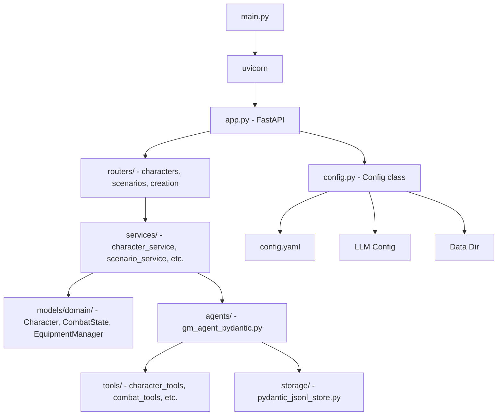
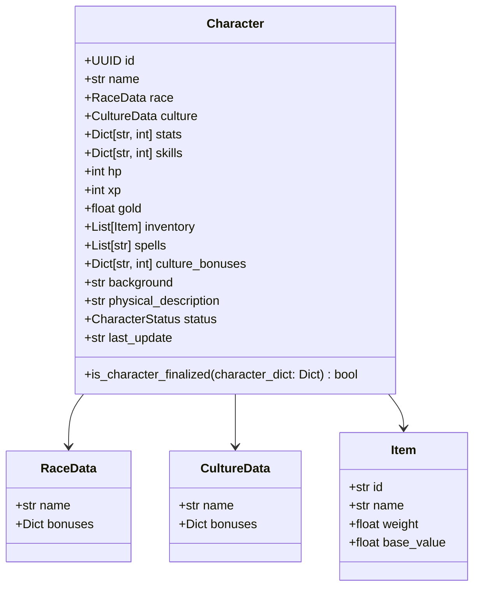
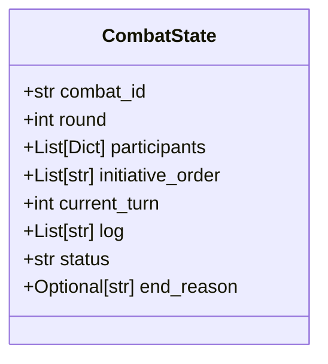
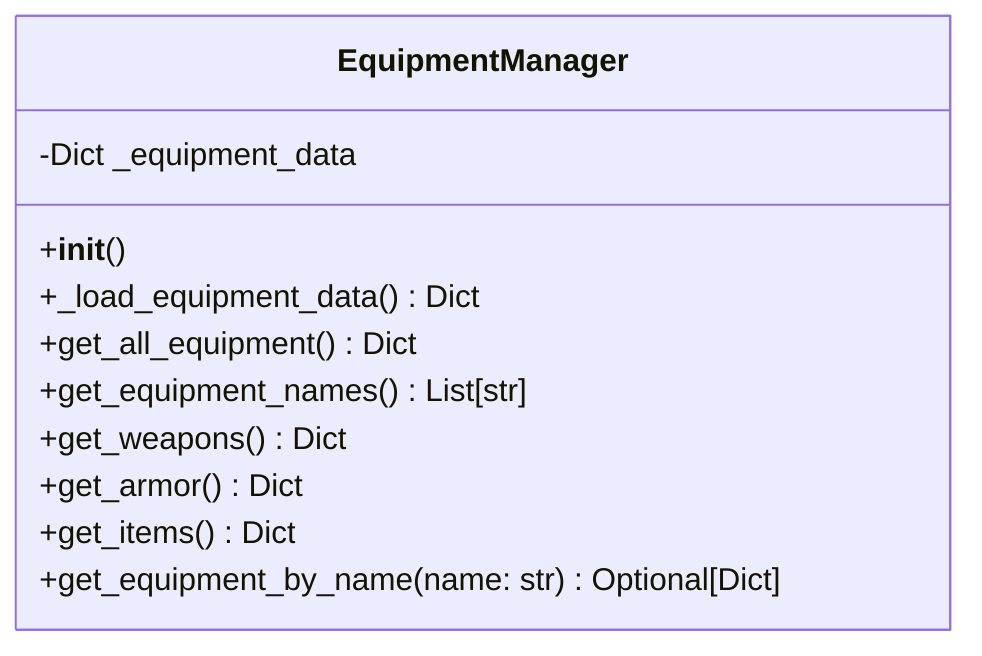
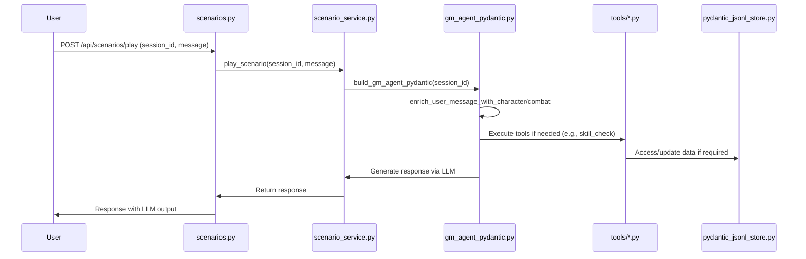

# JdR "Terres du Milieu" - Middle-earth RPG

> **A Role-Playing Game orchestrated by Large Language Models**

This is a tabletop RPG set in Middle-earth (Tolkien's world), where the narration and game mechanics are orchestrated by a Large Language Model (LLM) acting as the Game Master (GM). The project combines traditional RPG rules with modern AI capabilities to create an immersive, dynamic gameplay experience.

## 🎯 Project Status

**Current Version**: 2.0 (Major Refactoring Complete)

### Recent Achievements ✅

- **Data Migration**: Complete migration from JSON to YAML format
- **Language Translation**: Full translation from French to English (characteristics, skills, models)
- **Simplified System**: New CharacterV2 with 400 stat points (down from 550) and 40 skill points (down from 84)
- **Modern Framework**: Migration from LangChain to PydanticAI for better type safety and validation
- **Clean Architecture**: Strict separation of concerns with dedicated services

### Technology Stack

- **Backend**: FastAPI + PydanticAI + Pydantic V2
- **Frontend**: Vue.js 3 + TypeScript + TailwindCSS
- **Data**: YAML configuration files
- **LLM**: OpenAI-compatible API (DeepSeek by default)
- **Storage**: JSONL for conversation history, JSON for character sheets

## 🏗️ Architecture Overview

### Core Principles

The architecture follows strict **SOLID principles** with clear separation of responsibilities:

- **Services** (`back/services/`): Each service encapsulates a unique business responsibility (Single Responsibility Principle)
- **Agents** (`back/agents/`): Assemble tools and memory, orchestrate narration via LLM with PydanticAI
- **Routers** (`back/routers/`): Expose REST endpoints, delegate all business logic to services
- **Models** (`back/models/domain/`): Pydantic models with strict validation
- **Tools** (`back/tools/`): PydanticAI tools for LLM interaction
- **Memory**: Decoupled from agent, persisted via custom JSONL store

### Key Architectural Decisions

1. **No I/O in Services**: Services handle business logic, not file operations
2. **No Game Rules in Routers**: Routers only manage HTTP logic
3. **Strict Type Safety**: Pydantic models everywhere with comprehensive validation
4. **English Only**: All code, documentation, and data use English (post-migration)
5. **YAML for Game Data**: All game configuration in YAML format for better readability

### Documentation References

- [PydanticAI Framework](./pydanticai.md) - Agent framework documentation
- [GitHub Copilot Instructions](.github/copilot-instructions.md) - Development guidelines
- [Technical Specification](#technical-specification) - Detailed architecture below

## 📦 Service Architecture

The backend uses a modular architecture with strict separation of responsibilities (SRP):

### Character Management Services

- **CharacterDataService**: Specialized for loading and saving character data (I/O operations)
- **CharacterBusinessService**: Business logic (XP, gold, damage, healing)
- **CharacterPersistenceService**: Centralized character persistence (JSON files)
- **CharacterCreationService**: Dedicated character creation service
- **InventoryService**: Inventory management (add, remove, equip items)
- **EquipmentService**: Equipment buy/sell and money management

### Game Services

- **SessionService**: Game session management (history, character, scenario)
- **ScenarioService**: Scenario flow management
- **CombatService**: Combat mechanics
- **CombatStateService**: Combat state persistence
- **SkillService**: Skill checks and rolls
- **ItemService**: Item management

### PydanticAI Integration

- **GM Agent**: Uses `pydantic_ai.Agent` with OpenAI-compatible model and persistent memory (JSONL)
- **Tools**: All tools use `RunContext[SessionService]` signature to access services
- **Memory**: Conversation history stored in JSONL via `back/storage/pydantic_jsonl_store.py`
- **System Prompt**: Modular prompt built dynamically from scenario and rules

## 🎮 Game System

### Character Statistics (Simplified V2)

The new system uses **6 core attributes** with **400 total points**:

| Stat | Abbreviation | Category | Description |
|------|--------------|----------|-------------|
| **Strength** | STR | Physical | Melee damage, carrying capacity |
| **Constitution** | CON | Physical | HP, endurance, disease resistance |
| **Agility** | AGI | Physical | Initiative, defense, reflexes |
| **Intelligence** | INT | Mental | Spellcasting, problem-solving |
| **Wisdom** | WIS | Mental | Perception, willpower, intuition |
| **Charisma** | CHA | Social | Leadership, persuasion, influence |

**Point Allocation**:
- Each stat: 3-20 range
- Total points: ≤ 400
- Cost scaling: 1 point for 1-50, 2 points for 51-70, 3 points for 71-100

### Skills System

**6 skill groups** with **40 development points**:

1. **Combat**: Melee Weapons, Ranged Weapons, Unarmed Combat, Armor Proficiency
2. **General**: Athletics, Perception, Survival, Crafting
3. **Stealth**: Stealth, Lockpicking, Sleight of Hand
4. **Social**: Persuasion, Intimidation, Deception
5. **Magic**: Arcane Lore, Spellcasting, Alchemy
6. **Knowledge**: History, Nature, Religion, Investigation

**Uniform Cost**: 1 development point = 1 skill rank (ranks 0-10)

### Combat System

**Simplified combat mechanics**:
- **Initiative**: 1d100 + Agility modifier
- **Actions per turn**: 1 major + 1 minor + 1 reaction
- **Turn duration**: 6 seconds
- **Attack resolution**: Attack roll vs Defense roll
- **Damage**: Base weapon damage + (roll delta / 10) - armor

**Combat State Tracking**:
- Managed by `CombatState` Pydantic model
- Persistent storage in `data/combat/`
- Automatic initiative ordering
- HP tracking per participant

## 🗂️ Project Structure

```
.
├── back/                        # Back‑end FastAPI + PydanticAI
│   ├── __init__.py
│   ├── .coverage
│   ├── app.py                  # Point d'entrée FastAPI
│   ├── config.py               # Configuration centralisée
│   ├── config.yaml             # Fichier de configuration YAML
│   ├── main.py                 # Target uvicorn – démarre l'app + l'agent
│   ├── requirements.txt        # Dépendances Python
│   ├── agents/
│   │   ├── __init__.py
│   │   ├── gm_agent_pydantic.py # Agent LLM Maître du Jeu (PydanticAI - production)
│   │   └── PROMPT.py           # Prompt système modulaire
│   ├── docs/
│   │   └── LOGGING_GUIDE.md    # Guide de logging
│   ├── models/
│   │   ├── __init__.py
│   │   ├── api_dto.py          # DTO pour l'API
│   │   ├── schema.py           # DTO exposés par l'API
│   │   └── domain/
│   │       ├── __init__.py
│   │       ├── base.py         # Classes de base
│   │       ├── character.py    # Modèle de personnage
│   │       ├── combat_state.py # État de combat
│   │       ├── combat_system_manager.py # Gestionnaire du système de combat
│   │       ├── equipment_manager.py # Gestionnaire d'équipement
│   │       ├── races_manager.py # Gestionnaire des races
│   │       ├── skills_manager.py # Gestionnaire des compétences
│   │       ├── spells_manager.py # Gestionnaire des sorts
│   │       └── stats_manager.py # Gestionnaire des statistiques
│   ├── routers/
│   │   ├── __init__.py
│   │   ├── characters.py       # Endpoints pour la gestion des personnages
│   │   ├── creation.py         # Endpoints spécialisés pour la création de personnage
│   │   └── scenarios.py        # Endpoints pour la gestion des scénarios
│   ├── services/
│   │   ├── __init__.py
│   │   ├── character_business_service.py # Service spécialisé pour la logique métier (XP, or, dégâts)
│   │   ├── character_creation_service.py # Service dédié à la création de personnage
│   │   ├── character_data_service.py # Service spécialisé pour le chargement/sauvegarde des données
│   │   ├── character_persistence_service.py # Service centralisé pour la persistance des personnages (JSON)
│   │   ├── character_service.py # Service legacy en cours de refactoring
│   │   ├── combat_service.py    # Gestion des mécaniques de combat
│   │   ├── combat_state_service.py # Persistance de l'état des combats actifs
│   │   ├── equipment_service.py # Service spécialisé pour l'achat/vente d'équipement
│   │   ├── inventory_service.py # Service spécialisé pour la gestion d'inventaire
│   │   ├── item_service.py      # Gestion des objets
│   │   ├── scenario_service.py  # Gestion du déroulement des scénarios
│   │   ├── session_service.py   # Gestion des sessions de jeu (historique, personnage, scénario)
│   │   └── skill_service.py     # Gestion des compétences et de leurs jets
│   ├── storage/
│   │   ├── __init__.py
│   │   └── pydantic_jsonl_store.py # Store JSONL pour l'historique des messages PydanticAI
│   ├── tests/
│   │   ├── __init__.py
│   │   ├── test_character_service_refactored.py # Test spécifique du service personnage
│   │   ├── test_logging.py     # Tests de logging
│   │   ├── agents/
│   │   │   ├── __init__.py
│   │   │   └── test_gm_agent_dependency_injection.py # Tests d'injection de dépendances pour l'agent
│   │   ├── domain/
│   │   │   └── __init__.py
│   │   ├── routers/
│   │   │   ├── __init__.py
│   │   │   └── test_characters_refactored.py # Tests refactorés pour les personnages
│   │   ├── services/
│   │   │   └── __init__.py
│   │   ├── storage/
│   │   │   └── __init__.py
│   │   ├── tools/
│   │   │   └── __init__.py
│   │   └── utils/
│   │       └── __init__.py
│   ├── tools/
│   │   ├── __init__.py
│   │   ├── character_tools.py  # Outils pour la gestion des personnages
│   │   ├── combat_tools.py     # Outils de combat
│   │   ├── inventory_tools.py  # Outils pour l'inventaire (ajout, retrait, gestion d'objets)
│   │   └── skill_tools.py      # Outils pour les compétences
│   └── utils/
│       ├── __init__.py
│       ├── dice.py             # Fonctions pour les jets de dés
│       ├── exceptions.py       # Exceptions personnalisées
│       ├── logger.py           # Logger JSON (Grafana/Loki‑friendly)
│       ├── logging_tool.py     # Outil de logging pour l'agent
│       └── message_adapter.py  # Adaptateur de messages
├── front/                       # Front‑end Vue.js + TypeScript + TailwindCSS ✅
│   ├── src/                    # Code source de l'interface utilisateur
│   │   ├── components/         # Composants Vue réutilisables
│   │   │   ├── JdrDemo.vue     # Composant de démonstration avec lanceur de dés
│   │   │   ├── ChatMessage.vue # Composant générique d'affichage des messages LLM
│   │   │   ├── CharacterSheet.vue # Fiche de personnage
│   │   │   └── README-ChatMessage.md # Documentation du composant ChatMessage
│   │   ├── views/              # Pages/vues de l'application
│   │   │   ├── HomeView.vue    # Page d'accueil avec présentation des fonctionnalités
│   │   │   ├── Create.vue      # Création de personnage
│   │   │   ├── JeuView.vue     # Interface de jeu
│   │   │   ├── PersonnagesView.vue # Gestion des personnages
│   │   │   ├── ScenariosView.vue # Gestion des scénarios
│   │   │   ├── SessionsView.vue # Gestion des sessions
│   │   │   └── NouveauScenarioView.vue # Création de scénario
│   │   ├── core/               # Services et interfaces TypeScript ✅
│   │   │   ├── interfaces.ts   # Interfaces TypeScript basées sur OpenAPI JSON (strictement typées)
│   │   │   ├── api.ts          # Service API refactorisé avec nouvelles interfaces
│   │   │   └── api.test.ts     # Tests unitaires pour les interfaces et service API
│   │   ├── router/             # Configuration du routage Vue Router
│   │   ├── assets/             # Ressources CSS avec TailwindCSS configuré
│   │   ├── App.vue             # Composant racine avec navigation et thème JDR
│   │   └── main.ts             # Point d'entrée avec configuration FontAwesome
│   ├── tests/                  # Tests unitaires Vitest
│   │   ├── setup.ts            # Configuration des tests avec mocks
│   │   ├── App.test.ts         # Tests du composant principal
│   │   ├── components/         # Tests des composants
│   │   └── views/              # Tests des vues
│   ├── package.json            # Dépendances npm et scripts
│   ├── vite.config.ts          # Configuration Vite
│   ├── vitest.config.ts        # Configuration des tests
│   ├── tailwind.config.js      # Configuration TailwindCSS
│   └── README.md               # Documentation frontend détaillée
├── back/gamedata/               # Game data source (YAML files - synced to data/)
│   ├── stats.yaml
│   ├── skills_for_llm.yaml
│   ├── races_and_cultures.yaml
│   ├── equipment.yaml
│   ├── spells.yaml
│   └── combat_system.yaml
├── data/                        # Runtime data directory
│   ├── *.yaml                  # Game data (YAML files) ⭐ LOADED FROM HERE
│   │   ├── stats.yaml              # Character statistics (6 attributes, 400 points)
│   │   ├── skills_for_llm.yaml     # Skills organized in 6 groups
│   │   ├── races_and_cultures.yaml # Available races and cultures
│   │   ├── equipment.yaml          # Weapons, armor, items
│   │   ├── spells.yaml             # Magic spells
│   │   └── combat_system.yaml      # Combat mechanics
│   ├── characters/             # Character sheets (JSON files)
│   ├── combat/                 # Active combat states
│   ├── scenarios/              # Scenario Markdown files
│   ├── sessions/               # Conversation history (JSONL files)
│   ├── game/                   # Legacy CSV data
│   └── json_backup/            # Backup of original JSON game data
├── docs/                        # Game system documentation (French)
│   ├── 00 - introduction.md
│   ├── 01 - Caractéristiques.md
│   ├── 02 - Guide Complet des Compétences.md
│   ├── 02 - Races et cultures.md
│   ├── 04 - Equipement, armes et armures.md
│   ├── 05 - Styles de combat.md
│   ├── 06 - Magie.md
│   ├── 07 - Sorts.md
│   └── section-6-combat.md
├── .github/
│   ├── copilot-instructions.md  # GitHub Copilot development guidelines ⭐ NEW
│   └── instructions/            # Code generation instructions
│       ├── python.instructions.md
│       ├── vuejs.instructions.md
│       └── generalcoding.instructions.md
├── pydanticai.md                # PydanticAI framework documentation
└── README.md                    # This file (comprehensive project documentation)
```

## 🔄 Migration and Modernization

### Completed Migrations ✅

#### 1. Data Format Migration (JSON → YAML)

All game data has been migrated from JSON to YAML format:

**Benefits**:
- Better readability and maintainability
- Built-in comments support
- Cleaner diffs in version control
- Easier manual editing

**Migrated Files**:
- `stats.json` → `data/stats.yaml`
- `skills_for_llm.json` → `data/skills_for_llm.yaml`
- `races_and_cultures.json` → `data/races_and_cultures.yaml`
- `equipment.json` → `data/equipment.yaml`
- `spells.json` → `data/spells.yaml`
- Plus: `combat_system.yaml`, `skill_groups.yaml`, `skills_affinities.yaml`

**Location**: YAML files are loaded from `data/` directory (configured in `back/config.yaml`)
**Source**: Development versions maintained in `back/gamedata/`
**Backup**: Original JSON files preserved in `data/json_backup/` for reference

#### 2. Language Translation (French → English)

Complete translation of all game elements to English for international accessibility:

**Statistics (Caractéristiques)**:
- Force → Strength
- Constitution → Constitution (unchanged)
- Agilité → Agility
- Intelligence → Intelligence (unchanged)
- Sagesse/Volonté → Wisdom
- Charisme/Présence → Charisma

**Code and Models**:
- All Pydantic model field names translated
- All service methods and function names in English
- All docstrings and comments in English
- Database field names: `caracteristiques` → `stats`, `competences` → `skills`

#### 3. Character System Simplification (V2)

**Old System** (V1):
- 8 characteristics with 550 points
- 9 skill groups with 84 development points
- Complex cost scaling
- Mixed French/English naming

**New System** (V2):
- 6 core stats with 400 points (27% reduction)
- 6 skill groups with 40 development points (52% reduction)
- Simplified uniform cost: 1 point = 1 rank
- Pure English naming
- Strict Pydantic V2 validation

**Migration Path**:
- `character.py` - Legacy model (deprecated)
- `character_v2.py` - New simplified model ✅
- Both models coexist during transition period
- Automatic migration tool planned

#### 4. Framework Migration (LangChain → PydanticAI)

**Why PydanticAI**:
- Better type safety with Pydantic V2
- Simpler agent definition
- Native async support
- Cleaner tool registration
- More maintainable code

**Changes**:
- Agent creation using `pydantic_ai.Agent`
- Tools using `@agent.tool` decorator
- `RunContext[DepsType]` for dependency injection
- Custom JSONL store for message history

### In Progress 🔄

1. **Complete CharacterV2 Migration**: Migrate all services to use CharacterV2
2. **NPC Generation System**: Automated NPC creation with archetypes
3. **Combat Manager Service**: Centralized combat state management
4. **API Versioning**: Support `/api/v1` and `/api/v2` endpoints

### Planned Improvements ⏳

1. **Remove Fallback Data**: Eliminate hardcoded fallback data in managers (fail fast on missing config)
2. **Enhanced Testing**: Increase test coverage to 90%+
3. **Performance Optimization**: Caching for frequently accessed game data
4. **Frontend Refactoring**: Update Vue components for CharacterV2

## 📊 Architecture Diagrams

### Architecture Diagram

This diagram illustrates the overall backend architecture, showing the flow from entry points to agents, services, and dependencies.



### Class Diagrams

#### Character Model



#### CombatState Model



#### EquipmentManager



### Sequence Diagram for API Request Workflow

This diagram shows the sequence for a user playing a scenario turn via the API.



## 🌐 REST API Reference

### API Routes Summary

| Méthode | Endpoint                                   | Arguments d'entrée                                                        | Retour principal / Description                                      |
|---------|--------------------------------------------|--------------------------------------------------------------------------|---------------------------------------------------------------------|
| GET     | /api/scenarios/                           | Aucun                                                                   | Liste des scénarios (`ScenarioList`)                                |
| GET     | /api/scenarios/sessions                   | Aucun                                                                   | Sessions actives (`ActiveSessionsResponse`)                         |
| GET     | /api/scenarios/{scenario_file}            | scenario_file (str, path)                                               | Contenu du fichier Markdown du scénario                             |
| POST    | /api/scenarios/start                      | scenario_name (str), character_id (str) (body JSON)                     | session_id, scenario_name, character_id, message, llm_response      |
| POST    | /api/scenarios/play                       | session_id (UUID, query), message (str, body JSON)                      | responses (list de messages générés par l'agent)                    |
| GET     | /api/scenarios/history/{session_id}       | session_id (UUID, path)                                                 | history (list de tous les messages de la session)                   |
| DELETE  | /api/scenarios/history/{session_id}/{message_index} | session_id (UUID, path), message_index (int, path) | Confirmation de suppression avec infos du message supprimé          |
| GET     | /api/characters/                          | Aucun                                                                   | Liste complète des personnages avec leurs fiches détaillées         |
| GET     | /api/characters/{character_id}            | character_id (UUID, path)                                              | Détail du personnage (`Character`)                                  |
| GET     | /creation/races                           | Aucun                                                                   | Liste des races disponibles                                         |
| GET     | /creation/skills                          | Aucun                                                                   | Structure complète des compétences                                  |
| GET     | /creation/equipments                      | Aucun                                                                   | Liste des équipements disponibles                                   |
| GET     | /creation/equipments-detailed             | Aucun                                                                   | Équipements avec détails complets                                   |
| GET     | /creation/spells                          | Aucun                                                                   | Liste des sorts disponibles                                         |
| POST    | /creation/allocate-attributes             | race_id (str, body JSON)                                                | Attributs alloués automatiquement                                   |
| POST    | /creation/check-attributes                | attributes (dict, body JSON)                                            | Validation de la distribution des points d'attributs                |
| POST    | /creation/new                             | Aucun                                                                   | Création d'un nouveau personnage avec ID                            |
| POST    | /creation/save                            | character_id (str), character (dict, body JSON) | Statut de sauvegarde du personnage |
| GET     | /creation/status/{character_id}           | character_id (str, path)                        | Statut de création du personnage |
| POST    | /creation/check-skills                    | skills (dict, body JSON)                        | Validation de la distribution des points de compétences |
| POST    | /creation/generate-name                   | character (dict, body JSON)                     | 5 noms générés par LLM |
| POST    | /creation/generate-background             | character (dict, body JSON)                     | 5 backgrounds générés par LLM |
| POST    | /creation/generate-physical-description   | character (dict, body JSON)                     | 5 descriptions physiques générées par LLM |
| GET     | /creation/stats                           | Aucun                                           | Données complètes des statistiques |
| DELETE  | /creation/delete/{character_id}           | character_id (str, path)                        | Suppression d'un personnage |
| POST    | /creation/update-skills                   | character_id (str), skills (dict, body JSON)    | Mise à jour des compétences |
| POST    | /creation/add-equipment                   | character_id (str), equipment_name (str, body JSON) | Ajout d'équipement avec déduction d'argent |
| POST    | /creation/remove-equipment                | character_id (str), equipment_name (str, body JSON) | Retrait d'équipement avec remboursement |
| POST    | /creation/update-money                    | character_id (str), amount (int, body JSON)     | Mise à jour de l'argent du personnage |

> Toutes les routes sont documentées dans le code source et la [documentation technique](instructions/openai-instructions.md).

## Documentation détaillée des API Scénarios

### 1. `GET /api/scenarios/` - Liste des Scénarios

**Description :** Récupère la liste de tous les scénarios disponibles et en cours.

**Paramètres :** Aucun

**Format de réponse :**
```json
{
    "scenarios": [
        {
            "name": "Les_Pierres_du_Passe.md",
            "status": "available",
            "session_id": null,
            "scenario_name": null,
            "character_name": null
        },
        {
            "name": "Les_Pierres_du_Passe.md - Galadhwen",
            "status": "in_progress", 
            "session_id": "12345678-1234-5678-9012-123456789abc",
            "scenario_name": "Les_Pierres_du_Passe.md",
            "character_name": "Galadhwen"
        }
    ]
}
```

### 2. `GET /api/scenarios/sessions` - Sessions Actives

**Description :** Récupère la liste de toutes les sessions de jeu en cours.

**Paramètres :** Aucun

**Format de réponse :**
```json
{
    "sessions": [
        {
            "session_id": "12345678-1234-5678-9012-123456789abc",
            "scenario_name": "Les_Pierres_du_Passe.md",
            "character_id": "87654321-4321-8765-2109-987654321def",
            "character_name": "Galadhwen"
        }
    ]
}
```

### 3. `GET /api/scenarios/{scenario_file}` - Contenu de Scénario

**Description :** Récupère le contenu complet d'un scénario au format Markdown.

**Paramètres :**
- `scenario_file` (path) : Nom du fichier de scénario (ex: `Les_Pierres_du_Passe.md`)

**Format de réponse :** Chaîne de caractères contenant le Markdown

**Codes d'erreur :** `404` - Scénario introuvable

### 4. `POST /api/scenarios/start` - Démarrer un Scénario

**Description :** Démarre un nouveau scénario avec un personnage spécifique.

**Paramètres (body JSON) :**
```json
{
    "scenario_name": "Les_Pierres_du_Passe.md",
    "character_id": "87654321-4321-8765-2109-987654321def"
}
```

**Format de réponse :**
```json
{
    "session_id": "12345678-1234-5678-9012-123456789abc",
    "scenario_name": "Les_Pierres_du_Passe.md",
    "character_id": "87654321-4321-8765-2109-987654321def",
    "message": "Scénario 'Les_Pierres_du_Passe.md' démarré avec succès...",
    "llm_response": "**Esgalbar, place centrale du village**..."
}
```

**Codes d'erreur :**
- `409` : Session déjà existante pour ce scénario et ce personnage
- `404` : Scénario ou personnage introuvable

### 5. `POST /api/scenarios/play` - Jouer un Tour

**Description :** Envoie un message au Maître du Jeu pour continuer le scénario.

**Paramètres :**
- `session_id` (query) : UUID de la session
- Body JSON : `{"message": "j'examine la fontaine"}`

**Format de réponse :**
```json
{
    "response": [
        {
            "parts": [
                {
                    "content": "j'examine la fontaine",
                    "timestamp": "2025-06-09T17:50:53.234253Z",
                    "part_kind": "user-prompt"
                }
            ],
            "kind": "request"
        },
        {
            "parts": [
                {
                    "content": "**Examen des inscriptions sur la fontaine**...",
                    "part_kind": "text"
                }
            ],
            "kind": "response",
            "usage": {
                "requests": 1,
                "request_tokens": 6447,
                "response_tokens": 480,
                "total_tokens": 6927
            },
            "model_name": "deepseek-chat",
            "timestamp": "2025-06-09T17:51:00Z"
        }
    ]
}
```

**Types de `part_kind` :**
- `"system-prompt"` : Instructions système envoyées au LLM
- `"user-prompt"` : Message du joueur 
- `"text"` : Réponse textuelle du LLM
- `"tool-call"` : Appel d'un outil par le LLM
- `"tool-return"` : Résultat de l'appel d'outil

**Codes d'erreur :**
- `404` : Session introuvable
- `500` : Erreur lors de la génération de la réponse

### 6. `GET /api/scenarios/history/{session_id}` - Historique de Session

**Description :** Récupère l'historique complet des messages d'une session.

**Paramètres :**
- `session_id` (path) : UUID de la session

**Format de réponse :** Identique à `/scenarios/play` mais contient tous les messages depuis le début de la session.

**Codes d'erreur :**
- `404` : Session introuvable
- `500` : Erreur lors de la récupération de l'historique

### 7. `DELETE /api/scenarios/history/{session_id}/{message_index}` - Supprimer un Message

**Description :** Supprime un message spécifique de l'historique d'une session.

**Paramètres :**
- `session_id` (path) : UUID de la session
- `message_index` (path) : Index du message à supprimer (base 0)

**Format de réponse :**
```json
{
    "message": "Message à l'index 2 supprimé avec succès...",
    "deleted_message_info": {
        "kind": "response",
        "timestamp": "2025-06-21T12:05:05.000000Z",
        "parts_count": 3,
        "model_name": "deepseek-chat"
    },
    "remaining_messages_count": 5
}
```

## Documentation détaillée des API Personnages

### 1. `GET /api/characters/` - Liste des Personnages

**Description :** Récupère la liste de tous les personnages disponibles dans le système avec leurs informations complètes.

**Paramètres :** Aucun

**Format de réponse :**
```json
{
    "characters": [
        {
            "id": "d7763165-4c03-4c8d-9bc6-6a2568b79eb3",
            "name": "Aragorn",
            "race": "Humain",
            "culture": "Gondor",
            "caracteristiques": {
                "Force": 85,
                "Constitution": 80,
                "Agilité": 70,
                "Rapidité": 75,
                "Volonté": 80,
                "Raisonnement": 65,
                "Intuition": 75,
                "Présence": 70
            },
            "competences": {
                "Perception": 60,
                "Combat": 75,
                "Survie": 55,
                "Nature": 65
            },
            "hp": 85,
            "gold": 200,
            "inventory": [
                {
                    "id": "sword_001",
                    "name": "Épée longue",
                    "weight": 1.5,
                    "base_value": 150.0
                }
            ],
            "spells": [],
            "culture_bonuses": {
                "Combat": 5,
                "Influence": 3
            }
        }
    ]
}
```

**Codes d'erreur :**
- `500` : Erreur interne du serveur lors de la récupération des personnages

### 2. `GET /api/characters/{character_id}` - Détail d'un Personnage

**Description :** Récupère le détail d'un personnage à partir de son identifiant unique (UUID).

**Paramètres :**
- `character_id` (UUID) : Identifiant unique du personnage

**Format de réponse :**
```json
{
  "id": "d7763165-4c03-4c8d-9bc6-6a2568b79eb3",
  "name": "Aragorn",
  "race": "Humain",
  "culture": "Gondor",
  "caracteristiques": { ... },
  "competences": { ... },
  "hp": 85,
  "xp": 0,
  "gold": 0,
  "inventory": [ ... ],
  "spells": [],
  "culture_bonuses": { ... }
}
```

**Codes d'erreur :**
- `404` : Personnage introuvable

## 🧪 Technical Specification

### Data Loading and Managers

All game data is loaded through manager classes that read YAML files from `back/gamedata/`:

#### StatsManager
- **File**: `stats.yaml`
- **Provides**: Stat info, bonus table, cost table, starting points (400)
- **Methods**: `get_description()`, `get_bonus()`, `calculate_cost()`, `get_all_stats()`

#### SkillsManager
- **File**: `skills_for_llm.yaml`
- **Provides**: 6 skill groups with detailed skills
- **Methods**: `get_all_skills()`, `get_skill_by_name()`, `get_skills_by_group()`

#### RacesManager
- **File**: `races_and_cultures.yaml`
- **Provides**: Available races, cultures, stat bonuses
- **Methods**: `get_all_races()`, `get_race_by_name()`, `get_cultures_for_race()`

#### EquipmentManager
- **File**: `equipment.yaml`
- **Provides**: Weapons, armor, items with stats
- **Methods**: `get_all_equipment()`, `get_equipment_by_name()`, `get_weapons()`, `get_armor()`

#### SpellsManager
- **File**: `spells.yaml`
- **Provides**: Available spells, organized by sphere
- **Methods**: `get_all_spells()`, `get_spell_by_name()`, `get_spells_by_sphere()`

#### CombatSystemManager
- **File**: `combat_system.yaml`
- **Provides**: Combat rules, actions, damage calculations
- **Methods**: Combat-related rule lookups

### PydanticAI Tools

All tools follow the PydanticAI pattern with `RunContext`:

```python
from pydantic_ai import Agent, RunContext
from back.services.session_service import SessionService

agent = Agent('openai:gpt-4o', deps_type=SessionService)

@agent.tool
async def skill_check_with_character(
    ctx: RunContext[SessionService],
    skill_name: str,
    difficulty: int = 50
) -> str:
    """Perform a skill check for the session's character"""
    session = ctx.deps
    character = session.character_data
    # Implementation
    return json.dumps(result)
```

#### Available Tools

1. **skill_tools.py**
   - `skill_check_with_character` - Perform skill checks with character's bonuses

2. **combat_tools.py**
   - `roll_initiative_tool` - Calculate initiative order
   - `perform_attack_tool` - Execute attack roll
   - `resolve_attack_tool` - Resolve attack vs defense
   - `calculate_damage_tool` - Calculate damage with modifiers
   - `end_combat_tool` - End combat and distribute rewards

3. **inventory_tools.py**
   - `inventory_add_item` - Add item to character inventory
   - `inventory_remove_item` - Remove item from inventory

4. **character_tools.py**
   - `character_apply_xp` - Apply experience points
   - `character_add_gold` - Add gold to character
   - `character_take_damage` - Apply damage to character
   - `character_heal` - Heal character HP

### Memory and Session Management

**Conversation History**:
- **Format**: JSONL (one message per line)
- **Location**: `data/sessions/{session_id}.jsonl`
- **Content**: User messages, assistant responses, tool calls/returns
- **Exclusion**: System prompts (not persisted, reconstructed each run)

**Serialization**:
```python
# Saving messages
messages_json = [msg.to_jsonable_python() for msg in messages]
# Each message written as one line in JSONL

# Loading messages
from pydantic_ai import ModelMessagesTypeAdapter
messages = ModelMessagesTypeAdapter.validate_python(messages_json)
```

**Session Structure**:
- Session ID: UUID
- Character ID: UUID
- Scenario name: string
- Message history: JSONL file
- Session metadata: JSON file

## 🎨 Character Creation Service (2025)

- **character_creation_service.py** : Service dédié à la création de personnage, gérant l'allocation automatique des caractéristiques selon la race, la validation des points, et la fourniture des listes (races, compétences, cultures, équipements, sorts).
- **creation.py** : Routeur FastAPI spécialisé pour la création de personnage, exposant les routes pour chaque étape, l'enregistrement et le suivi du statut de création.

Ce module permet de découper la création de personnage en étapes validées côté backend, pour un front progressif et interactif.

## Gestion de l'historique et mémoire (PydanticAI)

- L'historique des messages (sessions de jeu) est stocké en JSONL via `back/storage/pydantic_jsonl_store.py`.
- La sérialisation utilise `to_jsonable_python` (PydanticAI) ; la désérialisation utilise `ModelMessagesTypeAdapter.validate_python`.
- Seuls les messages utilisateur, assistant et outils sont persistés : le prompt système n'est jamais dupliqué.
- La structure de chaque message respecte strictement le schéma PydanticAI (voir [pydanticai.md](./pydanticai.md)).

## Outils PydanticAI

### Compétences (`back/tools/skill_tools.py`)
- **`skill_check_with_character`** : Effectue un test de compétence pour le personnage de la session courante en récupérant ses données via CharacterService.

### Combat (`back/tools/combat_tools.py`)
- **`roll_initiative_tool`** : Calcule l'ordre d'initiative des personnages
- **`perform_attack_tool`** : Effectue un jet d'attaque
- **`resolve_attack_tool`** : Résout une attaque (attaque > défense)
- **`calculate_damage_tool`** : Calcule les dégâts infligés en tenant compte des modificateurs
- **`end_combat_tool`** : Termine un combat

### Inventaire (`back/tools/inventory_tools.py`)
- **`inventory_add_item`** : Ajoute un objet à l'inventaire du personnage
- **`inventory_remove_item`** : Retire un objet de l'inventaire du personnage

### Personnage (`back/tools/character_tools.py`)
- **`character_apply_xp`** : Applique les points d'expérience au personnage
- **`character_add_gold`** : Ajoute de l'or au portefeuille du personnage
- **`character_take_damage`** : Applique des dégâts au personnage (réduit ses PV)

### Utilitaires
- **`logging_tool`** : Outil de logging pour l'agent

## 💬 Interface de Chat LLM Généralisée (2025) ✅

### Composant ChatMessage
Un composant Vue.js générique pour afficher les messages de conversation basé sur l'interface `ConversationMessage` :

#### Fonctionnalités
- **Messages typés** : Support complet de l'interface TypeScript `ConversationMessage[]`
- **Affichage hiérarchique** : Chaque message contient des parties (`MessagePart[]`) avec types distincts
- **Types de messages** : Différenciation visuelle pour `request`, `response`, `system`, `error`
- **Types de parties** : Support des `system-prompt`, `user-prompt`, `text`, `tool-call`, `tool-return`
- **Formatage intelligent** : Contenu code pour les outils, markdown basique pour le texte
- **Informations de debug** : Affichage optionnel des détails d'usage des tokens
- **Timestamps** : Formatage automatique en français pour messages et parties

#### Structure supportée
- **Interface stricte** : `ConversationMessage` avec `MessagePart[]` typés
- **Usage des tokens** : `MessageUsage` avec détails de consommation LLM
- **Métadonnées** : `model_name`, `vendor_details`, `vendor_id` optionnels
- **Références dynamiques** : Support des `dynamic_ref` dans les parties

#### Props du composant
```typescript
interface Props {
  messages: ConversationMessage[]  // Tableau de messages à afficher
  showDebugInfo?: boolean         // Affichage des détails techniques
}
```

## Tests

- Les tests unitaires et d'intégration sont dans `back/tests/`.
- Tous les tests ont été migrés et validés pour PydanticAI.
- Organisation par responsabilité : `agents/`, `tools/`, `services/`, `domain/`, etc.
- **Frontend** : Tests Vitest pour les composants Vue.js, dont ChatMessage

## Système de Prévention des Sessions Dupliquées (2025)

### Fonctionnalité
Le système empêche automatiquement la création de sessions dupliquées en détectant les combinaisons existantes de `character_name` + `scenario_name`. Cette protection évite les conflits de données et assure l'intégrité des sessions de jeu.

### Codes de réponse

| Code HTTP | Signification | Description |
|-----------|---------------|-------------|
| **200** | Succès | Session créée avec succès |
| **404** | Scénario introuvable | Le fichier de scénario n'existe pas |
| **409** | Session dupliquée | Une session existe déjà pour cette combinaison personnage/scénario |

## Migration 2025 : Suppression de la clé `state` dans les fiches de personnage

- **Structure simplifiée** : Les fiches de personnage JSON n'utilisent plus de clé intermédiaire `state`. Tous les champs du personnage (nom, race, caractéristiques, inventaire, etc.) sont désormais à la racine du fichier JSON.
- **Compatibilité** : Toute la logique de lecture/écriture, les services et les tests ont été adaptés pour fonctionner sans la clé `state`.
- **Conséquences** :
  - Les anciennes méthodes manipulant la section `state` (ex : `load_character_state`, `update_character_state`, etc.) ont été supprimées.
  - Les tests unitaires et d'intégration ont été corrigés pour écrire/lire les personnages directement à la racine.
  - Toute fiche de personnage doit désormais respecter ce format :

```json
{
  "id": "d1a4064a-c956-4d46-b6ea-5e688cf2f78b",
  "name": "Test Hero",
  "race": "Humain",
  "culture": "Rurale",
  "caracteristiques": {"Force": 10, ...},
  "competences": {"Athletisme": 5},
  "hp": 42,
  "xp": 0,
  "gold": 0,
  "inventory": [],
  "spells": [],
  "culture_bonuses": {},
  "created_at": "2025-06-14T19:08:31.148010",
  "last_update": "2025-06-14T19:08:31.148010",
  "current_step": "creation",
  "status": "en_cours"
}
```

- **Avantages** :
  - Lecture/écriture plus simple et plus rapide
  - Moins d'ambiguïté sur la structure des données
  - Maintenance facilitée pour les évolutions futures

> ⚠️ Toute référence à la clé `state` dans le code ou les tests doit être supprimée pour garantir la compatibilité.

## Ajout des skills de culture (2025)

- Un nouveau groupe de compétences "Culture" a été ajouté dans `data/skills_for_llm.json`.
- Chaque trait de culture issu de `data/races_and_cultures.json` est désormais représenté comme un skill de culture, avec une propriété `culture` précisant la ou les cultures associées.
- Ces skills de culture ne peuvent être acquis naturellement que par les personnages issus de la culture correspondante.
- La structure d'un skill de culture est identique à celle des autres skills : `name`, `description`, `stats`, `examples`, et `culture`.

- **Affinités culturelles pour les compétences** :
  - Les affinités entre cultures et compétences sont centralisées dans `data/skills_affinities.json`.
  - Un script (`tools/generate_skills_with_affinities.py`) injecte automatiquement la propriété `cultures` dans chaque compétence de `skills_for_llm.json`.
  - Pour ajouter une nouvelle culture ou compétence, il suffit de mettre à jour le mapping dans `skills_affinities.json` puis de relancer le script.
  - Ce système garantit la cohérence et la facilité de maintenance du fichier des compétences.

## Tests

- Les tests unitaires et d'intégration sont organisés dans `back/tests/` avec la structure suivante :
  - `agents/` : Tests des agents PydanticAI
  - `domain/` : Tests des modèles du domaine
  - `routers/` : Tests des endpoints REST
  - `services/` : Tests des services métier
  - `storage/` : Tests de la persistance
  - `tools/` : Tests des outils PydanticAI
  - `utils/` : Tests des utilitaires

- **Frontend** : Tests Vitest pour les composants Vue.js avec 100% de réussite

## 💻 Development

### Prerequisites

- Python 3.11+
- Node.js 18+
- OpenAI-compatible API key (DeepSeek, OpenAI, or compatible)

### Environment Setup

1. **Clone the repository**
```bash
git clone https://github.com/cyberbobjr/jdr.git
cd jdr
```

2. **Backend setup**
```bash
cd back
python3.11 -m venv venv
source venv/bin/activate  # On Windows: venv\Scripts\activate
pip install -r requirements.txt
```

3. **Configure environment**
Create `.env` file in `back/` directory:
```bash
DEEPSEEK_API_KEY=your_api_key_here
JDR_DATA_DIR=../data  # Optional: override data directory
```

4. **Frontend setup**
```bash
cd front
npm install
```

### Running the Application

### Installation
```bash
cd back
python3.11 -m venv venv
source venv/bin/activate
pip install -r requirements.txt
```

#### Development Mode

**Backend** (FastAPI with hot reload):
```bash
cd back
source venv/bin/activate
uvicorn main:app --reload --host 0.0.0.0 --port 8000
```

API will be available at: `http://localhost:8000`
API documentation: `http://localhost:8000/docs`

**Frontend** (Vite dev server):
```bash
cd front
npm run dev
```

Application will be available at: `http://localhost:5173`

#### Production Build

**Backend**:
```bash
cd back
uvicorn main:app --host 0.0.0.0 --port 8000 --workers 4
```

**Frontend**:
```bash
cd front
npm run build
# Outputs to front/dist/
```

### Testing

#### Backend Tests
```bash
cd back
source venv/bin/activate

# Run all tests
pytest tests/ -v

# Run with coverage
pytest tests/ -v --cov=back --cov-report=html

# Run specific test file
pytest tests/services/test_character_service.py -v

# Run tests matching pattern
pytest tests/ -k "test_character" -v
```

#### Frontend Tests
```bash
cd front

# Run unit tests
npm test

# Run tests in watch mode
npm test -- --watch

# Run with coverage
npm test -- --coverage
```

## 📋 Coding Standards and Best Practices

### Python (Backend)

#### 1. Type Hints
Always use type hints for function parameters and return values:
```python
from typing import Optional, List, Dict
from uuid import UUID

def get_character(character_id: UUID) -> Optional[Character]:
    """Load a character by ID"""
    return character_data
```

#### 2. Pydantic Models
Use Pydantic V2 for all data structures:
```python
from pydantic import BaseModel, Field, field_validator

class Character(BaseModel):
    name: str = Field(..., min_length=1, max_length=100)
    hp: int = Field(..., ge=0)
    
    @field_validator('name')
    @classmethod
    def validate_name(cls, v: str) -> str:
        if not v.strip():
            raise ValueError("Name cannot be empty")
        return v.strip()
```

#### 3. Async/Await
Use async/await for I/O operations:
```python
async def load_character(character_id: UUID) -> Character:
    async with aiofiles.open(filepath, 'r') as f:
        data = await f.read()
        return Character.model_validate_json(data)
```

#### 4. Error Handling
Use custom exceptions and proper error logging:
```python
from back.utils.exceptions import CharacterNotFoundError
from back.utils.logger import log_error

try:
    character = await load_character(character_id)
except FileNotFoundError:
    log_error("Character not found", character_id=str(character_id))
    raise CharacterNotFoundError(f"Character {character_id} not found")
```

#### 5. Service Pattern
Separate concerns with dedicated services:
```python
# DON'T: Mix I/O and business logic
class CharacterService:
    def apply_damage(self, character_id: UUID, damage: int):
        character = self._load_from_file(character_id)  # ❌ I/O in business logic
        character.hp -= damage
        self._save_to_file(character)  # ❌ I/O in business logic

# DO: Separate I/O and business logic
class CharacterDataService:
    def load_character(self, character_id: UUID) -> Character:
        """Handle I/O only"""
        return Character.from_file(character_id)
    
    def save_character(self, character: Character) -> None:
        """Handle I/O only"""
        character.to_file()

class CharacterBusinessService:
    def apply_damage(self, character: Character, damage: int) -> Character:
        """Handle business logic only"""
        character.hp = max(0, character.hp - damage)
        return character
```

#### 6. Docstrings
Use structured docstrings:
```python
def calculate_bonus(stat_value: int) -> int:
    """
    Calculate the modifier bonus for a stat value.
    
    **Description:** Applies the simplified bonus calculation: (value - 10) // 2
    **Parameters:**
    - `stat_value` (int): The stat value (3-20)
    **Returns:**
    - int: The calculated bonus modifier (-3 to +5)
    **Raises:**
    - ValueError: If stat_value is out of valid range
    """
    if not (3 <= stat_value <= 20):
        raise ValueError(f"Stat value must be 3-20, got {stat_value}")
    return (stat_value - 10) // 2
```

### TypeScript (Frontend)

#### 1. Interface Definition
Define interfaces for all data structures:
```typescript
interface Character {
  id: string;
  name: string;
  stats: Stats;
  skills: Skills;
  hp: number;
  maxHp: number;
}

interface Stats {
  strength: number;
  constitution: number;
  agility: number;
  intelligence: number;
  wisdom: number;
  charisma: number;
}
```

#### 2. Vue 3 Composition API
Use Composition API for components:
```typescript
<script setup lang="ts">
import { ref, computed } from 'vue';
import type { Character } from '@/core/interfaces';

const props = defineProps<{
  character: Character;
}>();

const currentHp = ref(props.character.hp);
const hpPercentage = computed(() => 
  (currentHp.value / props.character.maxHp) * 100
);
</script>
```

### General Guidelines

1. **English Only**: All code, comments, and documentation in English
2. **YAML for Config**: Use YAML for all configuration and game data
3. **No Hardcoded Data**: Load all data through manager classes
4. **Strict SRP**: One responsibility per class/file
5. **Type Safety**: Leverage Pydantic and TypeScript for type safety
6. **Test Coverage**: Aim for 80%+ test coverage
7. **Git Commits**: Use conventional commits (feat:, fix:, docs:, refactor:, test:)

## 🔧 Technical Architecture

### Backend Technology Stack

- **FastAPI 0.111+**: Modern web framework for building APIs
- **PydanticAI**: Agent framework for LLM integration with type safety
- **Pydantic V2**: Data validation and settings management
- **Uvicorn**: ASGI server for production deployment
- **PyYAML**: YAML file parsing for game data
- **aiofiles**: Async file I/O operations

### Logging System
Le projet utilise un système de logging centralisé et configurable pour tracer les erreurs, informations de débogage et événements métier.

#### Configuration
- **Fichier** : `back/config.yaml` (section `logging`)
- **Format** : JSON structuré compatible Grafana/Loki
- **Niveaux** : DEBUG, INFO, WARNING, ERROR, CRITICAL
- **Rotation** : Fichiers avec taille maximale et archivage automatique

#### Utilisation
```python
from back.config import get_logger

# Obtenir un logger pour le module
logger = get_logger(__name__)

# Utilisation standard
logger.info("Opération réussie", action="create_character", character_id="123")
logger.error("Erreur de validation", error=str(e), character_id="123")
logger.debug("Détails de débogage", variable=value)
```

#### Fonctions spécialisées
```python
from back.utils.logger import log_debug, log_info, log_error, log_warning

# Logging avec contexte métier
log_debug("Chargement du personnage", character_id="123", action="load")
log_info("Personnage créé avec succès", character_name="Aragorn")
log_error("Échec de sauvegarde", error=str(e))
```

#### Modules avec logging complet
- ✅ Services : `character_service.py`, `character_data_service.py`, etc.
- ✅ Outils : Tous les fichiers `tools/*.py`
- ✅ Routers : `scenarios.py`, `characters.py`
- ✅ Stockage : `pydantic_jsonl_store.py`

### Frontend (Vue.js + TypeScript)
- **Vue.js 3** : Framework JavaScript progressif
- **TypeScript** : Typage statique pour la robustesse
- **TailwindCSS** : Framework CSS utilitaire
- **Vite** : Outil de build rapide

### Stockage
- **JSONL** : Historique des conversations PydanticAI
- **JSON** : Fiches de personnage et données de jeu
- **Markdown** : Scénarios et documentation

## 🤝 Contributing

### Development Workflow

1. **Fork and Clone**
```bash
git clone https://github.com/your-username/jdr.git
cd jdr
```

2. **Create Feature Branch**
```bash
git checkout -b feature/your-feature-name
# or
git checkout -b fix/bug-description
```

3. **Make Changes**
- Follow coding standards
- Add tests for new features
- Update documentation
- Run linting and tests

4. **Commit with Conventional Commits**
```bash
git commit -m "feat: add NPC generation system"
git commit -m "fix: correct HP calculation in combat"
git commit -m "docs: update API documentation"
git commit -m "refactor: simplify character service"
git commit -m "test: add tests for skill checks"
```

5. **Push and Create Pull Request**
```bash
git push origin feature/your-feature-name
```

### Architectural Principles to Follow

The project follows a **strict modular architecture** with separation of concerns:

- **Routers** (`back/routers/`): Only HTTP logic, no business rules
- **Services** (`back/services/`): Business logic, no I/O or HTTP concerns
- **Agents** (`back/agents/`): LLM orchestration with PydanticAI
- **Tools** (`back/tools/`): Specific functionalities for agents
- **Models** (`back/models/domain/`): Data structures with Pydantic validation
- **Managers** (`back/models/domain/*_manager.py`): Game data loading from YAML

**Key Rules**:
1. Services must not handle HTTP requests directly
2. Routers must not contain game logic
3. All game data must be loaded through managers (no hardcoding)
4. Use dependency injection for service composition
5. Follow Single Responsibility Principle (SRP)

### Before Submitting

- [ ] Code follows style guidelines (English, type hints, docstrings)
- [ ] Tests added for new features
- [ ] All tests pass (`pytest tests/`)
- [ ] Documentation updated (README, docstrings, API docs)
- [ ] No breaking changes to existing API (or properly documented)
- [ ] Commit messages follow conventional commits format

## 🚀 Roadmap and Known Issues

### Completed (2024-2025)

- ✅ Migration from JSON to YAML for game data
- ✅ Complete translation from French to English
- ✅ Simplified character system (CharacterV2)
- ✅ Migration from LangChain to PydanticAI
- ✅ Service layer refactoring with strict SRP
- ✅ YAML-based data managers
- ✅ Custom JSONL store for conversation history
- ✅ Combat system implementation
- ✅ Character creation workflow

### In Progress

- 🔄 Complete migration to CharacterV2 across all services
- 🔄 NPC generation system with archetypes
- 🔄 Combat manager service for state management
- 🔄 Remove fallback data from managers (fail-fast approach)
- 🔄 Increase test coverage to 90%+

### Planned Features

#### Short Term (1-2 months)
- ⏳ API versioning (`/api/v1`, `/api/v2`)
- ⏳ Frontend migration to CharacterV2
- ⏳ Enhanced error handling and validation
- ⏳ Performance optimization (caching)
- ⏳ Database integration (replace JSON files)

#### Medium Term (3-6 months)
- ⏳ Multi-player session support
- ⏳ Real-time WebSocket communication
- ⏳ Advanced NPC AI behaviors
- ⏳ Dynamic scenario generation
- ⏳ Combat visualization improvements

#### Long Term (6+ months)
- ⏳ Campaign management system
- ⏳ Character progression tracking
- ⏳ Custom rule system support
- ⏳ Mobile app (React Native)
- ⏳ Community scenario sharing

### Known Issues and Limitations

1. **Character V1/V2 Coexistence**: Both character models exist during migration, causing potential confusion
2. **Fallback Data**: Managers still have hardcoded fallback data instead of failing fast
3. **Limited Test Coverage**: Current coverage ~70%, target is 90%+
4. **No Database**: Character and session data stored in JSON/JSONL files (not scalable)
5. **Single Player Only**: No multi-player session support yet
6. **French Documentation**: Game rules in `docs/` still in French (needs translation)

### Architecture Improvements (from TODO.md)

#### 1. Dependency Injection Container
**Status**: Planned

Replace direct service instantiation with a DI container:
```python
# Current (tight coupling)
item_service = ItemService()

# Planned (loose coupling)
item_service = get_service('item_service')
```

**Benefits**: Better testability, easier mocking, cleaner code

#### 2. Model Converter Utility
**Status**: Completed ✅

Centralized conversion between Pydantic models and dictionaries:
```python
from back.utils.model_converter import ModelConverter

# Replaces scattered model_dump() calls
character_dict = ModelConverter.to_dict(character)
```

#### 3. Enhanced Error Handling
**Status**: Planned

Standardize error responses across the API:
- Custom exception hierarchy
- Consistent error response format
- Better error messages for debugging
- HTTP status code mapping

#### 4. Logging Improvements
**Status**: Partially completed

Current state:
- ✅ JSON logging for Grafana/Loki
- ✅ Structured logs with context
- ⏳ Distributed tracing (OpenTelemetry)
- ⏳ Performance metrics
- ⏳ Request/response logging middleware

## 🙏 Acknowledgments

This project uses several excellent open-source libraries and frameworks:

- **PydanticAI** - Type-safe AI agent framework
- **FastAPI** - Modern web framework for Python
- **Vue.js** - Progressive JavaScript framework
- **TailwindCSS** - Utility-first CSS framework
- **Pydantic** - Data validation using Python type hints

Special thanks to the contributors and the open-source community!
