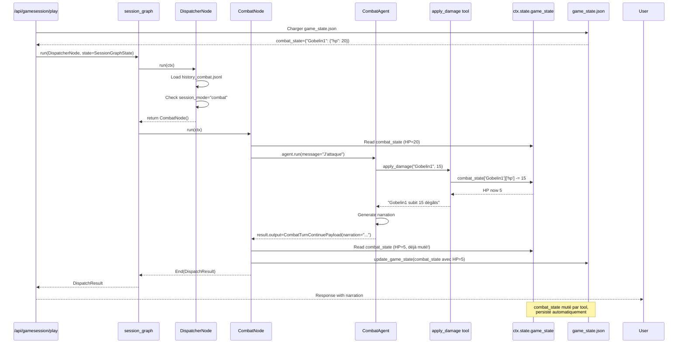

# Plan de Refactorisation du Graphe Combat & Narration

## Tasklist d'Implémentation

### 1. Stockage & DTO essentiels

- Garantir deux persistances simples par session : `history_narrative.jsonl` pour l'agent narratif et `history_combat.jsonl` pour l'agent combat (lecture/écriture via `ModelMessagesTypeAdapter.validate_json` et `to_json`).
- Persister dès l'initialisation de la session un `game_state.json` complet avec `SessionMode`, `narrative_history_id`, `combat_history_id`, `combat_state` (snapshot brut du combat) et tout champ annexe (ex : `last_combat_result`) afin que le graphe n'ait jamais à reconstruire l'état manuellement. `combat_state` n'est pas éclaté en dizaines d'objets : c'est une simple structure (dict) contenant l'ensemble des participants (joueur + PNJ), leurs HP restants, équipements, statuts, effets, etc., telle qu'attendue par l'agent combat.
- Déclarer un unique état de graphe `SessionGraphState` dans `back/graph/dto/session.py` : il encapsule une instance `GameState` (chargée depuis `game_state.json`), le `PlayerMessagePayload` courant (injecté par le routeur), un buffer `model_messages` (chargé par `DispatcherNode`), et un indicateur `active_history_kind`. L'état ne transporte aucun résultat de nœud ni les historiques complets : au début de chaque run, `DispatcherNode` lit `game_state.session_mode` et charge le JSONL d'historique correspondant (narratif ou combat) via `GameSessionService` avant de router vers le nœud adéquat. Chaque nœud persistera ensuite son historique mis à jour avant de retourner `End(DispatchResult(...))`. Les dépendances restent injectées via `deps` selon la section "Dependency Injection" de `pydantic-graph`. Les autres DTO (ex : `SessionMode`, `GameState`, `DispatchResult`) vivent dans le même répertoire `back/graph/dto/` pour centraliser les définitions liées au graphe.
- Normaliser `CombatSeedPayload`, `CombatTurnContinuePayload`, `CombatTurnEndPayload` et `CombatResultPayload` dans `back/graph/dto/combat.py`.
- Documenter `NarrativeResponsePayload`, `NarrativeTriggerCombatPayload` et les sous-DTO `CombatantOutcome`, `DamageEvent`, `HealingEvent`, `InventoryEvent`, `XPEvent`.

### 2. Graphe et Dispatcher

- Déclarer `session_graph = Graph(nodes=(DispatcherNode, NarrativeNode, CombatNode))`.
- `SessionGraphState` inclut : `game_state` (instance de `GameState` chargée depuis `game_state.json`), `pending_player_message` (instance de `PlayerMessagePayload`), `active_history_kind` ("narrative" ou "combat") et `model_messages` (buffer `list[ModelMessage]` chargé par le dispatcher avant chaque nœud).
- Implémenter `DispatcherNode.run()` : lit `ctx.state.game_state.session_mode` et retourne `NarrativeNode()` ou `CombatNode()`.
- Fournir un helper `load_graph_state(session_id, player_message)` qui charge `GameState` depuis disque et construit `SessionGraphState` (sans charger les historiques, c'est le rôle de `DispatcherNode`).

### 3. Noeud narratif & tools

- `NarrativeNode` **contient une instance de `NarrativeAgent`** (agent PydanticAI dédié à la narration).
- `NarrativeNode.run()` charge l'historique narratif depuis `ctx.state.model_messages` (préchargé par le dispatcher), construit le prompt système (markdown du scénario), puis appelle `narrative_agent.run(user_message, message_history=ctx.state.model_messages)`.
- L'agent répond normalement avec `output_type = NarrativeResponsePayload | NarrativeTriggerCombatPayload`. Le type de sortie structurée détermine implicitement la transition de mode :
  - `NarrativeResponsePayload` → le mode reste `"narrative"`, aucune transition.
  - `NarrativeTriggerCombatPayload` → le nœud persiste `session_mode = "combat"` dans `game_state.json`, déclenchant la transition vers `CombatNode` lors de la prochaine requête.
- Après avoir obtenu `result` de l'agent, le nœud persiste `result.all_messages()` dans `history_narrative.jsonl` via `ctx.deps.game_session_service.save_history("narrative", result.all_messages())`.
- Le nœud retourne `End(DispatchResult)` pour clore le run (pas de retour vers `DispatcherNode()` car chaque run ne traite qu'une seule interaction utilisateur).

### 4. Noeud combat & tools

- `CombatNode` **contient une instance de `CombatAgent`** (agent PydanticAI dédié au combat).
- `CombatNode.run()` charge l'historique combat depuis `ctx.state.model_messages` (préchargé par le dispatcher), puis appelle `combat_agent.run(user_message, message_history=ctx.state.model_messages)` avec `output_type = CombatTurnContinuePayload | CombatTurnEndPayload`.
- Les tools du CombatAgent appliquent dégâts, soins, inventaire, XP et mettent directement à jour `ctx.state.game_state.combat_state` (dict unique partagé) sans multiplier les classes intermédiaires.
- Le type de sortie structurée détermine la transition :
  - `CombatTurnContinuePayload` → le mode reste `"combat"`, le snapshot est persisté dans `game_state.json`. La prochaine requête reprendra sur `CombatNode`.
  - `CombatTurnEndPayload` → le nœud persiste `session_mode = "narrative"` dans `game_state.json`, stocke `CombatResultPayload` dans `game_state.last_combat_result`, et vide `combat_state`. La prochaine requête basculera sur `NarrativeNode`.
- Après avoir obtenu `result` de l'agent, le nœud persiste `result.all_messages()` dans `history_combat.jsonl` via `ctx.deps.game_session_service.save_history("combat", result.all_messages())`.
- Le nœud retourne `End(DispatchResult)` pour clore le run (chaque requête HTTP = un run de graphe complet).

### 5. Routeur `/api/gamesession/play`

- Le routeur charge `game_state.json` et instancie `SessionGraphState` avec le `PlayerMessagePayload` courant. Les historiques ne sont **pas** chargés par le routeur (c'est le rôle du `DispatcherNode`).
- Il construit les deps du graphe (ex : `GameSessionService(session_id)`) et lance le graphe via `await session_graph.run(DispatcherNode(), state=state, deps=deps)`.
- Les `response_parts` retournés dans `DispatchResult` sont streamés tels quels vers le client; aucune réécriture.
- Le routeur ne touche jamais aux fichiers JSONL d'historique : toute lecture/écriture passe par `GameSessionService` appelé depuis les nœuds.

### 6. Jeux de tests & documentation

- Tests unitaires : dispatcher (routage modes), nœud narratif (tool trigger), nœud combat (statuts, structured_output), router (historiques + SSE).
- Documentation : répliquer ce plan simplifié dans `REFACTO_COMBAT.md`, ajouter un paragraphe architecture dans `README.md` et `ARCHITECTURE.md`.

## 1. Objectifs

- Remplacer le simple va-et-vient entre deux agents par un graphe de session persistant construit avec **Pydantic Graph** afin que chaque appel à `/api/gamesession/play` traverse le même nœud de dispatch.
- Conserver un unique indicateur `session_mode` (`"narrative"` ou `"combat"`) et un curseur de graphe dans les métadonnées de session pour qu'un redémarrage reprenne exactement là où il s'est arrêté.
- Garder **CombatAgent** et **NarrativeAgent** strictement séparés, chacun avec son nœud, son prompt et son jeu d'outils, tout en décrivant les transitions via des sorties structurées.
- Laisser toutes les mutations propres au combat (dégâts, soins, initiative, inventaire, XP) dans les outils du CombatAgent alimentés par les services existants tandis que la progression narrative reste côté NarrativeAgent.
- Garantir des transitions déterministes et une persistance récupérable en stockant dans `game_state.json` l'intégralité du `GameState` (mode, identifiants d'historiques, `CombatSeedPayload`, derniers résultats), tandis que les échanges complets demeurent dans des fichiers JSONL PydanticAI dédiés par agent.

## 2. Contraintes Directrices

- **SRP** : les services portent la logique métier, les routeurs orchestrent, les agents n'émettent que des intentions structurées.
- **Gestionnaires YAML** : les managers existants (caractéristiques, races, équipement) restent la source de vérité.
- **Type hints + Pydantic v2** : tout nouveau DTO (nœuds de graphe, sorties structurées) est typé.
- **Routeurs FastAPI** : `/api/gamesession/play` délègue toujours au dispatcher du graphe et ne touche jamais la logique de combat directement.
- **Tests** : `back/run_tests.sh` reste la commande de référence; les nouveaux tests vivent sous `back/tests/graph/` pour refléter la topologie du graphe.

## 3. Stockage des messages et de l'état

- Deux fichiers JSONL par session : `history_narrative.jsonl` et `history_combat.jsonl`. On lit/écrit avec `ModelMessagesTypeAdapter.validate_json(...)` et `to_json(...)` exactement comme décrit dans la doc PydanticAI « storing & loading JSON ». Désormais, c'est `DispatcherNode` qui déclenche la lecture (via `GameSessionService`) juste avant de router vers un nœud, et chaque nœud (`NarrativeNode` ou `CombatNode`) qui déclenche l'écriture dès qu'il reçoit la réponse de son agent.
- Un seul `game_state.json` par session est créé/persisté dès la création de la session avec toutes les données nécessaires (`session_mode`, `narrative_history_id`, `combat_history_id`, `combat_state`/`CombatSeedPayload`, `last_combat_result` éventuel). Ensuite, chaque appel `/play` ne fait que le charger/mettre à jour; il n'y a jamais de reconstruction ad hoc dans le routeur.

```python
from typing import Any
from pydantic import BaseModel
from typing import Literal

class GameState(BaseModel):
  """État de la session persisté dans game_state.json."""
  session_mode: Literal["narrative", "combat"] = "narrative"
  narrative_history_id: str = "default"
  combat_history_id: str = "default"
  combat_state: dict[str, Any] | None = None
  last_combat_result: dict[str, Any] | None = None  # CombatResultPayload sérialisé
```

- La clé `combat_state` stocke un snapshot brut du combat actif : un simple dictionnaire avec les participants (joueur et PNJ), leurs HP restants, équipements portés, statuts et effets en cours. 

**Structure détaillée de `combat_state`** :

```python
combat_state = {
    "combat_id": "uuid-du-combat",
    "location": "Forêt de Mirkwood",
    "round": 3,  # Tour actuel
    "current_turn": 0,  # Index du participant actif
    "initiative_order": ["Joueur", "Gobelin1", "Gobelin2"],
    "participants": {
        "Joueur": {
            "name": "Aragorn",
            "type": "player",
            "hp": 45,
            "max_hp": 60,
            "stats": {"strength": 16, "agility": 15, ...},
            "equipped_weapon": "Épée longue",
            "equipped_armor": "Cotte de mailles",
            "statuses": ["blessed"],  # Buffs/debuffs actifs
            "effects": []  # Effets temporaires (poison, etc.)
        },
        "Gobelin1": {
            "name": "Gobelin1",
            "type": "npc",
            "hp": 5,  # ← Mis à jour par apply_damage
            "max_hp": 20,
            "stats": {"strength": 10, "agility": 12},
            "equipped_weapon": "Dague rouillée",
            "equipped_armor": None,
            "statuses": ["poisoned"],
            "effects": [{"type": "poison", "duration": 2, "damage": 3}]
        },
        "Gobelin2": {
            "name": "Gobelin2",
            "type": "npc",
            "hp": 0,  # ← MORT après apply_damage
            "max_hp": 20,
            "stats": {"strength": 10, "agility": 12},
            "equipped_weapon": "Arc court",
            "equipped_armor": None,
            "statuses": ["dead"],
            "effects": []
        }
    },
    "combat_log": [
        "Tour 1: Aragorn attaque Gobelin1 pour 15 dégâts",
        "Tour 2: Gobelin1 attaque Aragorn pour 8 dégâts",
        "Tour 3: Aragorn tue Gobelin2"
    ]
}
```

**Cycle de vie de `combat_state`** :

1. **Initialisation** (NarrativeNode déclenche combat) :
   ```python
   # NarrativeTriggerCombatPayload contient CombatSeedPayload
   combat_state = trigger_payload.combat_seed.model_dump()
   ctx.state.game_state.combat_state = combat_state
   await ctx.deps.game_session_service.update_game_state(ctx.state.game_state)
   ```

2. **Mutation pendant le tour** (Tools du CombatAgent) :
   ```python
   # Les tools modifient directement le dict
   ctx.state.game_state.combat_state['participants']['Gobelin1']['hp'] -= damage
   ```

3. **Persistance après chaque tour** (CombatNode) :
   ```python
   # Après agent.run(), le combat_state a DÉJÀ été muté par les tools
   # On persiste directement sans récupérer de snapshot
   await ctx.deps.game_session_service.update_game_state(ctx.state.game_state)
   ```

4. **Rechargement au tour suivant** (Routeur → DispatcherNode) :
   ```python
   # Nouvelle requête HTTP
   game_state = GameState.from_file(session_id)  # combat_state rechargé depuis disque
   # Le CombatAgent reçoit le combat_state à jour dans son prompt système
   ```

**Point critique** : `combat_state` est **persisté dans `game_state.json` après chaque tour** via `GameSessionService.update_game_state()`, garantissant que les HP, statuts et effets sont conservés entre les requêtes HTTP.

- `SessionGraphState` (dataclass passée à `Graph.run(...)`) contient :

```python
from dataclasses import dataclass
from typing import Literal
from pydantic_ai.messages import ModelMessage

@dataclass
class SessionGraphState:
    """État du graphe de session, passé à chaque nœud via ctx.state."""
    
    # GameState persisté (chargé depuis game_state.json)
    game_state: GameState
    
    # Message joueur courant (injecté par le routeur à chaque requête)
    pending_player_message: PlayerMessagePayload
    
    # Buffer d'historique (chargé par DispatcherNode, consommé par les nœuds)
    model_messages: list[ModelMessage] | None = None
    
    # Type d'historique actuellement chargé ("narrative" ou "combat")
    active_history_kind: Literal["narrative", "combat"] | None = None
```

**Points clés** :
  - `game_state` : instance de `GameState` chargée depuis `game_state.json` par le routeur.
  - `pending_player_message` : dernier `PlayerMessagePayload` reçu par le routeur (contient le texte saisi par le joueur).
  - `model_messages` : buffer chargé par `DispatcherNode` juste avant de router vers un nœud. Remis à `None` naturellement entre les requêtes HTTP (chaque requête = nouveau `SessionGraphState`).
  - `active_history_kind` : permet au `DispatchResult` de signaler quel historique a été utilisé ("narrative" ou "combat").

- Le `GameSessionService` (et toute autre dépendance côté services) est injecté via les `deps` du graphe (`Graph[DepsT, ...]`), conformément à la section "Dependency Injection" de `pydanticai.md` (exemple `GraphDeps` + `ctx.deps`). Chaque nœud accède donc à `ctx.deps.game_session_service` plutôt que de lire la référence dans l'état.

```python
class PlayerMessagePayload(BaseModel):
    session_id: UUID
    character_id: UUID
    content: str
    timestamp: datetime
```

Ce DTO est uniquement écrit par le routeur : il encapsule textuellement le message tapé par le joueur (champ `content`) ainsi que les identifiants nécessaires, ce qui permet d'injecter cette entrée brute dans le dispatcher sans toucher immédiatement aux historiques.

```python
class DispatchResult(BaseModel):
    """Résultat retourné par un node du graphe."""
    narration: str  # Texte à afficher au joueur
    structured_output: dict[str, Any]  # Serialized payload (Continue/End)
    all_messages: list[ModelMessage]  # Historique complet depuis result.all_messages()
    history_kind: Literal["narrative", "combat"]
    session_mode: Literal["narrative", "combat"]
    combat_state: dict[str, Any] | None
```

## 4. Session Graph & Dispatcher

- Le graphe unique vit dans `back/graph/session_graph.py` : `session_graph = Graph(nodes=(DispatcherNode, NarrativeNode, CombatNode))`.
- `Graph.run` est l'appel direct recommandé par pydantic-graph (cf. exemple `await vending_machine_graph.run(...)` dans `pydanticai.md`). Nous l'utilisons pour exécuter le nœud actif sur la base de `session_graph_state` : `await session_graph.run(DispatcherNode(), state=session_graph_state, deps=deps)`.
- `DispatcherNode.run()` lit `ctx.state.game_state.session_mode` et retourne simplement `NarrativeNode()` ou `CombatNode()`. Aucune logique complexe : le dispatcher ne fait que router.
- **Flux détaillé du `DispatcherNode`** :
  1. Lit `ctx.state.game_state.session_mode` pour déterminer le mode actuel
  2. Charge l'historique correspondant via `ctx.deps.game_session_service.load_history(session_id, history_kind)` où `history_kind` = "narrative" si mode="narrative", sinon "combat"
  3. Dépose cette liste de `ModelMessage` dans `ctx.state.model_messages`
  4. Renseigne `ctx.state.active_history_kind` pour traçabilité
  5. Retourne `NarrativeNode()` ou `CombatNode()` selon le mode
- `NarrativeNode.run()` et `CombatNode.run()` retournent toujours `End(DispatchResult)` (cf. doc Pydantic Graph : `End` clôt un run et transporte l'objet résultat). Le run se termine donc après un seul nœud métier; la requête suivante relancera `DispatcherNode` avec l'état mis à jour. Même si les agents renvoient des sorties structurées riches (cf. sections 5 et 6), c'est bien `session_mode` persistant dans `game_state.json` qui reste la source de vérité pour choisir le nœud suivant.

```mermaid
graph TD
  D[DispatcherNode]
  N[NarrativeNode]
  C[CombatNode]
  D -->|session_mode=narrative| N
  D -->|session_mode=combat| C
  N -->|End(DispatchResult)| E1[Fin du run]
  C -->|End(DispatchResult)| E2[Fin du run]
```

## 5. Noeud narratif & agent narratif

### Architecture du NarrativeNode

`NarrativeNode` est un `BaseNode[SessionGraphState, GameSessionService, DispatchResult]` qui :
1. **Contient** une instance de `NarrativeAgent` (agent PydanticAI)
2. **Reçoit** le contexte via `ctx: GraphRunContext[SessionGraphState, GameSessionService]`
3. **Retourne** `End[DispatchResult]` pour terminer le run

### Flux d'exécution

1. **Chargement de l'historique** : `NarrativeNode.run()` récupère `ctx.state.model_messages` (liste de `ModelMessage` préchargée par `DispatcherNode` depuis `history_narrative.jsonl`)

2. **Appel de l'agent** :
   ```python
   result = await self.narrative_agent.run(
       user_message=ctx.state.pending_player_message.content,
       message_history=ctx.state.model_messages,
       deps=ctx.deps  # GameSessionService injecté
   )
   ```

3. **Structured output & transition de mode** :
   - `NarrativeAgent` déclare `output_type = NarrativeResponsePayload | NarrativeTriggerCombatPayload`
   - **`NarrativeResponsePayload`** : Réponse narrative standard (texte, hints optionnels). Le `session_mode` reste `"narrative"`. Aucune action supplémentaire.
   - **`NarrativeTriggerCombatPayload`** : Contient un `CombatSeedPayload` complet. Le nœud détecte ce type et :
     - Persiste `game_state.session_mode = "combat"` via `ctx.deps.game_session_service.update_game_state()`
     - Copie `combat_seed` dans `game_state.combat_state`
     - Initialise un nouveau `combat_history_id` via `str(uuid.uuid4())`
     - Calcule l'ordre d'initiative en triant les participants par `1d100 + AGI`
     - À la **prochaine requête** `/play`, le `DispatcherNode` routera vers `CombatNode` car `session_mode == "combat"`

4. **Persistance de l'historique** :
   ```python
   all_messages = result.all_messages()  # Historique complet incluant les nouveaux messages
   await ctx.deps.game_session_service.save_history("narrative", all_messages)
   ```

5. **Construction du résultat** :
   ```python
   dispatch_result = DispatchResult(
       response_parts=result.output.response_parts,
       structured_output=result.output,
       conversation_history=all_messages,
       history_kind="narrative",
       session_mode=ctx.state.game_state.session_mode,  # "narrative" ou "combat"
       combat_state=ctx.state.game_state.combat_state  # None ou snapshot
   )
   return End(dispatch_result)
   ```

### Points clés

- **Un agent par nœud** : `NarrativeNode` possède son propre `NarrativeAgent`, configuré avec les tools narratifs (`trigger_combat`, `skill_check`, etc.)
- **Transition implicite** : Le type de `structured_output` suffit à déterminer le prochain mode. Pas besoin de logique conditionnelle complexe dans le nœud.
- **Persistance immédiate** : `result.all_messages()` contient **tout** l'historique (messages précédents + nouveaux), prêt à être sauvegardé et rechargé au prochain run.
- **Run unique** : Chaque requête HTTP = 1 run de graphe = 1 interaction utilisateur-agent. Le nœud retourne toujours `End()` pour clore le run.

> **Important** : Chaque requête HTTP crée un **nouveau** `SessionGraphState` avec `model_messages=None`. Le `DispatcherNode` charge systématiquement l'historique depuis disque, garantissant la cohérence entre le disque (source de vérité) et la mémoire.

## 6. Noeud combat & agent combat

### Architecture du CombatNode

`CombatNode` est un `BaseNode[SessionGraphState, GameSessionService, DispatchResult]` qui :
1. **Contient** une instance de `CombatAgent` (agent PydanticAI)
2. **Reçoit** le contexte via `ctx: GraphRunContext[SessionGraphState, GameSessionService]`
3. **Retourne** `End[DispatchResult]` pour terminer le run

### Structured Output du CombatAgent

```python
class CombatTurnContinuePayload(BaseModel):
    """Tour de combat en cours, le combat continue."""
    narration: str  # Description narrative du tour
    # NOTE: Le snapshot N'EST PAS dans le structured output!
    # Le combat_state est muté directement par les tools durant agent.run()


class CombatTurnEndPayload(BaseModel):
    """Tour final, le combat se termine."""
    narration: str
    outcome: Literal["player_win", "player_flee", "player_die", "npc_flee", "forced_end", "error_abort"]
    rewards: CombatResultPayload | None = None  # Loot, XP, etc.


# Déclaration de l'agent combat avec structured output union
combat_agent = Agent(
    model=openai_model,
    output_type=CombatTurnContinuePayload | CombatTurnEndPayload,
    deps_type=CombatDeps,  # Wrapper contenant GameSessionService + combat_state
    system_prompt="""Tu es le Maître du Jeu en mode COMBAT.
    
    À chaque tour, tu DOIS décider de l'action du participant actif :
    - Si c'est le joueur : exécute son action demandée
    - Si c'est un NPC : tu décides de son action (attaque, fuite, défense) selon :
        * Son état (HP bas → fuite)
        * Sa personnalité (agressif, lâche, tactique)
        * Le contexte du combat
    
    Utilise TOUJOURS les tools pour modifier le combat_state.
    NE JAMAIS inventer des HP ou statuts.
    """  # System prompt statique pour bénéficier du cache LLM
)
```

**Point clé** : Le `combat_state` est un `dict` muté **directement par les tools** durant `agent.run()`. Il n'est **PAS** retourné dans le structured output :

- ❌ **INCORRECT** : `result.output.snapshot` (n'existe pas!)
- ✅ **CORRECT** : `ctx.state.game_state.combat_state` (muté in-place par les tools)

Le `combat_state` contient :
- Liste des participants (joueur + NPCs)
- HP restants, statuts (empoisonné, étourdi, etc.)
- Équipements portés, effets actifs
- Ordre d'initiative

Les **tools du CombatAgent** manipulent directement ce dictionnaire via `ctx.state.game_state.combat_state` pendant l'exécution de l'agent.

### Flux d'exécution

1. **Chargement de l'historique** : `CombatNode.run()` récupère `ctx.state.model_messages` (préchargé par `DispatcherNode` depuis `history_combat.jsonl`)

2. **Injection de l'état du combat** : L'état est injecté dans le `user_message` enrichi avec le snapshot combat actuel (HP, initiative, round). Le system prompt reste statique pour bénéficier du cache LLM (voir section "System Prompt du CombatAgent" ci-dessous)

3. **Appel de l'agent** :
   ```python
   # Enrichir le message joueur avec l'état du combat
   combat_state = ctx.state.game_state.combat_state
   current_fighter = combat_state['initiative_order'][combat_state['current_turn']]
   
   # Formatter l'état pour l'agent
   participants_summary = "\n".join([
       f"  • {name}: {data['hp']}/{data['max_hp']} HP [{','.join(data['statuses'])}]"
       for name, data in combat_state['participants'].items()
   ])
   
   enriched_message = f"""[ÉTAT DU COMBAT - Round {combat_state['round']}]
   Lieu: {combat_state['location']}
   Tour actuel: {current_fighter}
   
   Participants:
   {participants_summary}
   
   [MESSAGE JOUEUR]
   {ctx.state.pending_player_message.content}
   """
   
   # Créer wrapper deps avec combat_state
   combat_deps = CombatDeps(
       game_session_service=ctx.deps.game_session_service,
       combat_state=combat_state,
       equipment_manager=ctx.deps.equipment_manager
   )
   
   result = await self.combat_agent.run(
       user_message=enriched_message,
       message_history=ctx.state.model_messages,
       deps=combat_deps
   )
   ```
   **Durant cet appel** : Les tools de l'agent (`apply_damage`, `check_combat_status`, etc.) mutent **directement** `ctx.deps.combat_state`. Le snapshot mis à jour existe déjà dans `ctx.state.game_state.combat_state` après le `run()`.

4. **Structured output & transition de mode** :
   - **`CombatTurnContinuePayload`** : Tour normal, combat en cours
     - Le structured output contient seulement `narration` (texte à afficher au joueur)
     - Le `combat_state` a **déjà été muté** par les tools durant `agent.run()`
     - Le nœud persiste `game_state.json` avec `session_mode = "combat"` (inchangé)
     - La **prochaine requête** continuera sur `CombatNode`
   
   - **`CombatTurnEndPayload`** : Combat terminé
     - Le structured output contient `narration`, `outcome`, et `rewards`
     - Le nœud stocke `ctx.state.game_state.last_combat_result = result.output.model_dump()` (contient outcome + rewards)
     - Vide `ctx.state.game_state.combat_state = None`
     - Persiste `game_state.session_mode = "narrative"`
     - La **prochaine requête** basculera sur `NarrativeNode` qui pourra exploiter `last_combat_result` pour narrer la suite

5. **Persistance de l'historique** :
   ```python
   all_messages = result.all_messages()
   await ctx.deps.game_session_service.save_history("combat", all_messages)
   ```

6. **Persistance du game_state.json** :
   ```python
   # Le combat_state a été muté par les tools durant agent.run()
   # On persiste maintenant le game_state complet
   await ctx.deps.game_session_service.update_game_state(ctx.state.game_state)
   ```

7. **Construction du résultat** :
   ```python
   dispatch_result = DispatchResult(
       narration=result.output.narration,
       structured_output=result.output.model_dump(),  # CombatTurnContinuePayload ou CombatTurnEndPayload
       all_messages=result.all_messages(),  # list[ModelMessage] depuis PydanticAI
       history_kind="combat",
       session_mode=ctx.state.game_state.session_mode,  # "combat" ou "narrative"
       combat_state=ctx.state.game_state.combat_state  # Déjà muté par les tools, ou None si combat terminé
   )
   return End(dispatch_result)
   ```

### ⚠️ Points critiques sur le snapshot combat

**ATTENTION** : Le `combat_state` (snapshot) **N'EST PAS** dans le structured output de l'agent !

| ❌ INCORRECT | ✅ CORRECT |
|-------------|-----------|
| `result.output.snapshot` | `ctx.state.game_state.combat_state` |
| `CombatTurnContinuePayload` contient `snapshot: dict` | `CombatTurnContinuePayload` contient seulement `narration: str` |
| Le snapshot est retourné par l'agent | Le snapshot est **muté par les tools** durant `agent.run()` |

**Flux réel** :
1. **Avant `agent.run()`** : `ctx.state.game_state.combat_state` contient l'état initial (ex: Gobelin1 HP=20)
2. **Durant `agent.run()`** : L'agent appelle `apply_damage("Gobelin1", 15)` → le tool mute directement `ctx.state.game_state.combat_state['participants']['Gobelin1']['hp'] = 5`
3. **Après `agent.run()`** : `ctx.state.game_state.combat_state` contient déjà l'état final (Gobelin1 HP=5)
4. **Dans `result.output`** : Seulement `narration` (et `outcome`/`rewards` si `CombatTurnEndPayload`)
5. **Persistance** : `update_game_state(ctx.state.game_state)` sauvegarde le `combat_state` déjà muté

**Structured outputs du CombatAgent** (pour rappel) :
```python
class CombatTurnContinuePayload(BaseModel):
    narration: str  # ← Seulement le texte narratif

class CombatTurnEndPayload(BaseModel):
    narration: str
    outcome: Literal["player_win", "player_flee", "player_die", ...]
    rewards: CombatResultPayload | None
```

### Exemple complet de CombatNode.run()

Voici l'implémentation complète pour clarifier le flux :

```python
class CombatNode(BaseNode[SessionGraphState, GameSessionService, DispatchResult]):
    def __init__(self):
        self.combat_agent = Agent(
            model=openai_model,
            output_type=CombatTurnContinuePayload | CombatTurnEndPayload,
            deps_type=GameSessionService,
            system_prompt="Tu es le maître du jeu en mode combat..."
        )
    
    async def run(self, ctx: GraphRunContext[SessionGraphState, GameSessionService]) -> End[DispatchResult]:
        # 1. Récupérer l'historique (déjà chargé par DispatcherNode)
        message_history = ctx.state.model_messages
        
        # 2. Préparer le system prompt avec l'état du combat actuel
        combat_state = ctx.state.game_state.combat_state
        system_prompt = f"""
        Combat actif à {combat_state['location']}.
        État des participants :
        {json.dumps(combat_state['participants'], indent=2)}
        Ordre d'initiative : {combat_state['initiative_order']}
        """
        
        # 3. Exécuter l'agent (les tools vont muter ctx.state.game_state.combat_state durant cet appel)
        result = await self.combat_agent.run(
            user_message=ctx.state.pending_player_message.content,
            message_history=message_history,
            deps=ctx.deps
        )
        
        # 4. Après agent.run(), ctx.state.game_state.combat_state contient déjà les HP/statuts à jour
        #    car les tools (apply_damage, etc.) l'ont muté directement
        
        # 5. Détecter le type de structured output pour savoir si le combat continue ou se termine
        if isinstance(result.output, CombatTurnEndPayload):
            # Combat terminé
            ctx.state.game_state.last_combat_result = result.output.model_dump()
            ctx.state.game_state.combat_state = None  # Vider le snapshot
            ctx.state.game_state.session_mode = "narrative"  # Transition vers narratif
        else:
            # Combat continue (CombatTurnContinuePayload)
            # combat_state reste tel quel, déjà muté par les tools
            ctx.state.game_state.session_mode = "combat"  # Inchangé
        
        # 6. Persister l'historique
        all_messages = result.all_messages()
        await ctx.deps.game_session_service.save_history("combat", all_messages)
        
        # 7. Persister le game_state.json (contient combat_state muté OU None si terminé)
        await ctx.deps.game_session_service.update_game_state(ctx.state.game_state)
        
        # 8. Construire le résultat
        dispatch_result = DispatchResult(
            response_parts=[{"type": "text", "content": result.output.narration}],
            structured_output=result.output.model_dump(),
            conversation_history=all_messages,
            history_kind="combat",
            session_mode=ctx.state.game_state.session_mode,
            combat_state=ctx.state.game_state.combat_state  # Déjà muté ou None
        )
        
        return End(dispatch_result)
```

**Points clés de cet exemple** :
- ✅ Aucun accès à `result.output.snapshot` (n'existe pas!)
- ✅ Les tools mutent `ctx.state.game_state.combat_state` durant `agent.run()`
- ✅ Le `isinstance()` check détermine si on doit vider `combat_state` et transitionner
- ✅ La persistance se fait APRÈS le run, avec l'état déjà muté
- ✅ Le structured output ne contient que `narration` (+`outcome`/`rewards` si fin)

### System Prompt du CombatAgent

Le system prompt du `CombatAgent` est **statique** pour bénéficier du cache LLM (réduction des coûts). L'état du combat est injecté dans le `user_message` enrichi. Voici le prompt statique complet :

```python
COMBAT_SYSTEM_PROMPT = """# Rôle : Maître du Jeu - Mode Combat

Tu es le Maître du Jeu (Game Master) d'un JdR dans l'univers de la Terre du Milieu (Tolkien). 
Tu es actuellement en **mode COMBAT** et dois orchestrer un tour de combat tactique et immersif.

## Responsabilité CRITIQUE : Actions des NPCs

**TU ES RESPONSABLE** de décider des actions des NPCs à leur tour d'initiative :

### Analyse de la situation
- Évalue l'état du NPC (HP, statuts, équipement)
- Considère sa personnalité/archétype (guerrier agressif, archer prudent, lâche, etc.)
- Analyse le contexte tactique (distance, couverture, HP des adversaires)

### Décision d'action
1. **Si HP < 30% et personnalité lâche** → Fuite
2. **Si HP < 50% et aucun allié vivant** → Fuite probable
3. **Si à distance et archer** → Tir à distance
4. **Sinon** → Attaque corps-à-corps sur la cible la plus faible

### Exécution
- Appelle les tools appropriés (`calculate_and_apply_damage`, `check_combat_status`)
- Narre l'action du NPC de manière immersive
- Fais avancer le tour avec `advance_turn()`

## Règles de combat (système simplifié V2)

### Initiative et tours
- L'initiative est déjà calculée (ordre ci-dessus)
- Chaque tour dure 6 secondes
- Actions par tour : 1 action majeure + 1 action mineure + 1 réaction

### Résolution des attaques
1. **Jet d'attaque** : 1d100 + modificateur AGI de l'attaquant
2. **Jet de défense** : 1d100 + modificateur AGI du défenseur
3. **Touche si** : jet_attaque > jet_defense
4. **Dégâts** : dégâts_arme + (delta_jets / 10) - absorption_armure

### Modificateurs de combat
- **Avantage** : +20 au jet (position tactique favorable)
- **Désavantage** : -20 au jet (blessé, aveuglé, etc.)
- **Critique** : jet naturel 95+ → dégâts doublés
- **Échec critique** : jet naturel 5- → action échoue + malus

## Tools disponibles

Tu disposes de 4 tools pour gérer le combat :

1. **`apply_damage(target_name: str, damage: int)`** : Applique des dégâts à un participant
   - Détecte automatiquement la mort (HP=0)
   - Ajoute le status "dead" si nécessaire
   - Log l'événement dans combat_log

2. **`check_combat_status()`** : Vérifie si le combat doit continuer ou se terminer
   - Compte les participants vivants (joueur vs NPCs)
   - Retourne "COMBAT_END:player_win" si tous les NPCs sont morts
   - Retourne "COMBAT_END:player_die" si le joueur est mort
   - Retourne "COMBAT_CONTINUE" sinon

3. **`advance_turn()`** : Passe au participant suivant dans l'ordre d'initiative
   - Incrémente current_turn
   - Gère le passage au round suivant si nécessaire

4. **`get_combat_snapshot()`** : Récupère un résumé de l'état du combat
   - Utile pour générer la narration finale

## Instructions comportementales

### Narration
- **Immersive** : Décris les actions avec des détails tactiques (position, mouvement, expression)
- **Dynamique** : Rythme vif, phrases courtes pour l'action
- **Contextuelle** : Intègre l'environnement ({combat_state['location']}) dans les descriptions
- **Équilibrée** : Donne de l'importance à tous les participants (joueur + NPCs)

### Utilisation des tools
1. **TOUJOURS** appeler `apply_damage()` après une attaque réussie
2. **TOUJOURS** appeler `check_combat_status()` après des dégâts
3. **NE JAMAIS** inventer des HP ou statuts : utilise les tools
4. Si le joueur veut passer son tour : appeler `advance_turn()`

### Structured Output
Tu dois retourner **soit** `CombatTurnContinuePayload` **soit** `CombatTurnEndPayload` :

**Si le combat continue** (`check_combat_status()` retourne "COMBAT_CONTINUE") :
- Utilise `CombatTurnContinuePayload`
- Champ `narration` : Description du tour actuel (300-500 mots)

**Si le combat se termine** (`check_combat_status()` retourne "COMBAT_END:*") :
- Utilise `CombatTurnEndPayload`
- Champ `narration` : Description de la fin + transition narrative
- Champ `outcome` : "player_win", "player_die", "player_flee", etc.
- Champ `rewards` : XP et loot gagnés (si victoire joueur)

## Exemple de tour complet

1. **Joueur demande** : "J'attaque le gobelin avec mon épée"
2. **Tu résous** :
   - Jet d'attaque joueur vs défense gobelin (utilise les tools internes)
   - Si touche : calcule dégâts → `apply_damage("Gobelin1", 12)`
   - Appelle `check_combat_status()` → reçois "COMBAT_CONTINUE" ou "COMBAT_END:*"
3. **Tu narres** : Description vivante de l'action
4. **Tu avances** : `advance_turn()` pour passer au prochain participant
5. **Tu retournes** : `CombatTurnContinuePayload` avec narration

## Important
- **NE modifie PAS manuellement** le combat_state : utilise les tools
- **Les HP/statuts sont la source de vérité** : ne les invente jamais
- **Chaque action doit avoir une conséquence mécanique** via les tools
- **Le combat_state est persisté automatiquement** après ton run

Bonne chance, Maître du Jeu ! ⚔️
"""
```

### Points clés du system prompt

1. **État du combat injecté dynamiquement** : HP, participants, ordre d'initiative
2. **Règles de combat explicites** : Initiative, résolution d'attaque, dégâts
3. **Description des tools** : Utilisation obligatoire, pas d'invention de données
4. **Instructions sur structured output** : Quand utiliser `Continue` vs `End`
5. **Ton narratif** : Immersif, dynamique, contextuel
6. **Contraintes strictes** : Ne pas modifier combat_state manuellement

### Wrapper de dépendances (Solution 4A)

```python
from dataclasses import dataclass

@dataclass
class CombatDeps:
    """Wrapper de dépendances pour les tools du CombatAgent."""
    game_session_service: GameSessionService
    combat_state: dict  # Référence mutable au combat_state actuel
    equipment_manager: EquipmentManager  # Pour lookup stats armes/armures
```

### Utilisation dans CombatNode

```python
class CombatNode(BaseNode[SessionGraphState, GameSessionService, DispatchResult]):
    def __init__(self):
        # Agent créé avec system_prompt STATIQUE (cache LLM)
        self.combat_agent = Agent(
            model=openai_model,
            output_type=CombatTurnContinuePayload | CombatTurnEndPayload,
            deps_type=CombatDeps,
            system_prompt=COMBAT_SYSTEM_PROMPT  # ← Statique
        )
    
    async def run(self, ctx: GraphRunContext[SessionGraphState, GameSessionService]) -> End[DispatchResult]:
        # 1. Préparer l'état enrichi (voir étape 3 ci-dessus)
        # 2. Créer wrapper deps
        # 3. Exécuter agent avec user_message enrichi
        # (Code complet dans la section "Appel de l'agent" ci-dessus)
```

### Tools du CombatAgent

Les tools accèdent directement à `ctx.state.game_state.combat_state` et le mutent. Voici les tools essentiels :

#### 1. `apply_damage` - Appliquer des dégâts

```python
@combat_agent.tool
async def apply_damage(
    ctx: RunContext[CombatDeps], 
    target_name: str, 
    damage: int
) -> str:
    """Applique des dégâts à un participant et vérifie s'il meurt."""
    combat_state = ctx.deps.combat_state  # Accès via deps, pas ctx.state
    
    if target_name not in combat_state['participants']:
        return f"Erreur: {target_name} introuvable dans le combat"
    
    target = combat_state['participants'][target_name]
    old_hp = target['hp']
    target['hp'] = max(0, target['hp'] - damage)
    
    # Log l'événement
    log_entry = f"Tour {combat_state['round']}: {target_name} subit {damage} dégâts ({old_hp} → {target['hp']} HP)"
    combat_state['combat_log'].append(log_entry)
    
    # Détection de mort
    if target['hp'] == 0 and 'dead' not in target['statuses']:
        target['statuses'].append('dead')
        combat_state['combat_log'].append(f"{target_name} est mort!")
        return f"{target_name} subit {damage} dégâts et MEURT! (0 HP)"
    
    return f"{target_name} subit {damage} dégâts (HP restants: {target['hp']}/{target['max_hp']})"
```

#### 2. `check_combat_status` - Vérifier l'état du combat

```python
@combat_agent.tool
async def check_combat_status(ctx: RunContext[CombatDeps]) -> str:
    """Vérifie si le combat doit continuer ou se terminer."""
    combat_state = ctx.deps.combat_state
    participants = combat_state['participants']
    
    # Compter les vivants par type
    alive_player = any(
        p['type'] == 'player' and p['hp'] > 0 
        for p in participants.values()
    )
    alive_npcs = [
        name for name, p in participants.items() 
        if p['type'] == 'npc' and p['hp'] > 0
    ]
    
    # Conditions de fin
    if not alive_player:
        return "COMBAT_END:player_die - Le joueur est mort, le combat se termine."
    
    if not alive_npcs:
        return "COMBAT_END:player_win - Tous les ennemis sont morts, le joueur a gagné!"
    
    # Combat continue
    return f"COMBAT_CONTINUE - Joueur vivant, {len(alive_npcs)} ennemi(s) restant(s): {', '.join(alive_npcs)}"
```

#### 3. `advance_turn` - Passer au participant suivant

```python
@combat_agent.tool
async def advance_turn(ctx: RunContext[CombatDeps]) -> str:
    """Passe au prochain participant dans l'ordre d'initiative."""
    combat_state = ctx.deps.combat_state
    
    # Incrémenter le tour
    combat_state['current_turn'] += 1
    if combat_state['current_turn'] >= len(combat_state['initiative_order']):
        combat_state['current_turn'] = 0
        combat_state['round'] += 1
        return f"Nouveau round {combat_state['round']} - C'est au tour de {combat_state['initiative_order'][0]}"
    
    current_participant = combat_state['initiative_order'][combat_state['current_turn']]
    return f"C'est au tour de {current_participant}"
```

#### 4. `calculate_and_apply_damage` - Calcul complet des dégâts

```python
@combat_agent.tool
async def calculate_and_apply_damage(
    ctx: RunContext[CombatDeps],
    attacker: str,
    defender: str,
    attack_roll: int,
    defense_roll: int
) -> str:
    """Calcule et applique les dégâts selon les règles du jeu."""
    combat_state = ctx.deps.combat_state
    
    # Vérifier que l'attaque touche
    if attack_roll <= defense_roll:
        return f"{attacker} rate son attaque contre {defender}!"
    
    # Lookup stats arme de l'attaquant
    weapon_name = combat_state['participants'][attacker]['equipped_weapon']
    weapon = ctx.deps.equipment_manager.get_equipment_by_name(weapon_name)
    base_damage = weapon.get('damage', 5) if weapon else 5
    
    # Lookup stats armure du défenseur
    armor_name = combat_state['participants'][defender].get('equipped_armor')
    if armor_name:
        armor = ctx.deps.equipment_manager.get_equipment_by_name(armor_name)
        absorption = armor.get('absorption', 0) if armor else 0
    else:
        absorption = 0
    
    # Calcul selon formule : dégâts_arme + (delta_jets / 10) - absorption_armure
    delta = attack_roll - defense_roll
    final_damage = max(0, base_damage + (delta // 10) - absorption)
    
    # Appliquer les dégâts
    old_hp = combat_state['participants'][defender]['hp']
    combat_state['participants'][defender]['hp'] = max(0, old_hp - final_damage)
    new_hp = combat_state['participants'][defender]['hp']
    
    # Détection de mort
    if new_hp == 0 and 'dead' not in combat_state['participants'][defender]['statuses']:
        combat_state['participants'][defender]['statuses'].append('dead')
        combat_state['combat_log'].append(f"{attacker} TUE {defender}!")
        return f"{attacker} inflige {final_damage} dégâts MORTELS à {defender}! (0 HP)"
    
    combat_state['combat_log'].append(
        f"{attacker} inflige {final_damage} dégâts à {defender} ({old_hp} → {new_hp} HP)"
    )
    return f"{attacker} inflige {final_damage} dégâts à {defender} (HP: {new_hp}/{combat_state['participants'][defender]['max_hp']})"
```

#### 5. `get_combat_snapshot` - Récupérer l'état complet

```python
@combat_agent.tool
async def get_combat_snapshot(ctx: RunContext[CombatDeps]) -> str:
    """Retourne un résumé de l'état actuel du combat."""
    combat_state = ctx.deps.combat_state
    
    summary = f"=== Combat Tour {combat_state['round']} ===\n"
    summary += f"Lieu: {combat_state['location']}\n\n"
    
    for name, participant in combat_state['participants'].items():
        status_icons = "💀" if participant['hp'] == 0 else "⚔️" if participant['type'] == 'player' else "👹"
        summary += f"{status_icons} {name}: {participant['hp']}/{participant['max_hp']} HP"
        if participant['statuses']:
            summary += f" [{', '.join(participant['statuses'])}]"
        summary += "\n"
    
    return summary
```

### Persistance automatique du `combat_state`

Après chaque appel des tools, le `CombatNode` persiste automatiquement :

```python
# Dans CombatNode.run()
result = await self.combat_agent.run(
    user_message=enriched_message,  # Message enrichi avec état combat
    message_history=ctx.state.model_messages,
    deps=combat_deps  # CombatDeps avec combat_state mutable
)

# Le combat_state a DÉJÀ été muté par les tools durant agent.run()
# combat_deps.combat_state pointe vers ctx.state.game_state.combat_state
# → Pas besoin de copier, c'est la même référence

# PERSISTANCE CRITIQUE : sauvegarde sur disque après chaque tour
await ctx.deps.game_session_service.update_game_state(ctx.state.game_state)

# Maintenant game_state.json contient les HP à jour, les statuts "dead", etc.
```

### Détection de fin de combat

Le `CombatAgent` utilise `check_combat_status()` pour décider du type de payload :

```python
# Dans le CombatAgent (structured output)
status = check_combat_status()  # Appel du tool

if "COMBAT_END:" in status:
    outcome = status.split(":")[1]  # "player_win", "player_die", etc.
    return CombatTurnEndPayload(
        narration="Le combat se termine...",
        outcome=outcome,
        rewards=calculate_rewards()  # Calculé depuis combat_state via tool
    )
else:
    return CombatTurnContinuePayload(
        narration="Le combat continue..."  # Seulement la narration
    )
```

### Récapitulatif : Garantie de persistance du `combat_state`

| **Étape** | **Action** | **Persistance** |
|-----------|------------|-----------------|
| **Tour 1** | Joueur attaque Gobelin1 pour 15 dégâts | `combat_state['participants']['Gobelin1']['hp'] = 5` → `game_state.json` écrit |
| **Entre tours** | Joueur réfléchit, ferme le navigateur, revient 1h après | `game_state.json` contient toujours HP=5 |
| **Tour 2** | Nouvelle requête HTTP | `game_state.json` rechargé → `combat_state` restauré avec HP=5 |
| **Tour 2** | Joueur achève Gobelin1 (5 dégâts) | `combat_state['participants']['Gobelin1']['hp'] = 0`, `statuses: ["dead"]` → `game_state.json` écrit |
| **Tour 3** | `check_combat_status()` détecte tous les NPCs morts | `CombatTurnEndPayload` retourné → `session_mode = "narrative"` |

**Points critiques** :

1. **Persistance après chaque tour** : `await ctx.deps.game_session_service.update_game_state(ctx.state.game_state)` écrit `game_state.json` avec le `combat_state` à jour
2. **Rechargement au début de chaque requête** : Le routeur charge `game_state.json` → `combat_state` restauré avec les HP/statuts exacts
3. **Tools comme source de vérité** : Les tools (`apply_damage`, `check_combat_status`) détectent automatiquement les morts et fins de combat
4. **Pas de reconstruction** : Le `combat_state` n'est JAMAIS recalculé, il est toujours chargé depuis disque
5. **Cohérence garantie** : Entre deux requêtes HTTP, `game_state.json` est la source de vérité absolue

### Points clés de l'architecture combat

- **Un agent par nœud** : `CombatNode` possède son propre `CombatAgent`, configuré avec les tools de combat (`apply_damage`, `check_combat_status`, `advance_turn`, etc.)
- **Snapshot muté par les tools** : `combat_state` est un dict partagé modifié directement par les tools pendant le run, puis renvoyé dans `CombatTurnContinuePayload.snapshot`
- **Boucle multi-requête** : Chaque tour = 1 requête HTTP = 1 run de graphe. Tant que `session_mode == "combat"`, le dispatcher routera vers `CombatNode`
- **Transition déterministe** : Le type de `structured_output` dicte le prochain mode. `CombatTurnEndPayload` déclenche automatiquement le retour en mode narratif
- **Transmission du résultat** : `last_combat_result` dans `game_state.json` permet au `NarrativeAgent` de contextualiser la suite ("Après avoir vaincu les gobelins, vous trouvez 50 pièces d'or...")
- **Persistance obligatoire** : `CombatNode` DOIT appeler `update_game_state()` après chaque tour, sinon les changements (HP, morts) sont perdus entre les requêtes

## 7. Router `/api/gamesession/play`

### Flux d'exécution du routeur

1. **Charger l'état persisté** : Lire `game_state.json` ➜ `GameState`
2. **Construire le state du graphe** : Créer `SessionGraphState` avec :
   - `game_state` : instance chargée
   - `pending_player_message` : message joueur courant (depuis la requête FastAPI)
   - `model_messages` : `None` (sera chargé par `DispatcherNode`)
   - `active_history_kind` : `None`
3. **Exécuter le graphe** :

```python
# Helper pour construire le state initial
def load_graph_state(session_id: UUID, player_message: PlayerMessagePayload) -> SessionGraphState:
    """Charge GameState depuis disque et construit SessionGraphState."""
    game_state = GameState.from_file(session_id)  # Charge game_state.json
    return SessionGraphState(
        game_state=game_state,
        pending_player_message=player_message,
        model_messages=None,  # DispatcherNode chargera l'historique
        active_history_kind=None
    )

# Dans le routeur
state = load_graph_state(session_id, player_message)
deps = GameSessionService(session_id)  # Ou GraphDeps si plusieurs services
result = await session_graph.run(DispatcherNode(), state=state, deps=deps)
dispatch_result = result.output  # Type: DispatchResult
```

1. Le `Graph.run` renvoie un `DispatchResult` qui contient déjà les `response_parts`, les structured_outputs et la version à jour de l'historique (`conversation_history`) persistée par le nœud. Le routeur se contente de streamer ces `response_parts` et de retourner `conversation_history` tel quel au client (plus besoin de ré-écrire les JSONL côté routeur).
1. Si le nœud a besoin d'un nouvel input joueur, l'exécution s'arrête naturellement (le prochain `/play` relancera `session_graph.run(...)` avec l'état mis à jour par les services).

## 8. DTO & structured outputs

- `PlayerMessagePayload`: contenu brut reçu par FastAPI (id session, id personnage, texte, timestamp).
- `NarrativeResponsePayload`: sortie standard du NarrativeAgent (texte, `response_parts`, éventuelle question guidant le joueur) qui n'implique aucun changement de mode.
- `NarrativeTriggerCombatPayload`: même structure que ci-dessus avec, en plus, un `CombatSeedPayload` complet permettant au routeur de basculer le mode en combat et de stocker le snapshot dans `game_state.json`.
- `CombatSeedPayload`: contexte de combat partagé par Narrative ➜ Combat.
- `combat_state` (dict): snapshot global (joueur + PNJ) stocké dans `GameState` et renvoyé dans chaque `CombatTurn*Payload` sans passer par de nouvelles classes.
- `CombatTurnContinuePayload` / `CombatTurnEndPayload`: sorties structurées du CombatAgent décrivant respectivement une boucle de tour ou une résolution complète avec outcome.
- `CombatResultPayload`: résumé terminal transmis au narratif suite à un `CombatTurnEndPayload` (loot, XP, outcomes).
- `DispatchResult`: `response_parts`, payload structuré (`Narrative*` ou `CombatTurn*`), `conversation_history` (liste complète de `ModelMessage` à retourner côté `/play`), `history_kind` (`"narrative"` ou `"combat"`), `session_mode` à jour, `combat_state` optionnel, `errors` éventuelles (`NodeFailure`).

## 9. FAQ : Clarifications critiques sur combat_state et structured outputs

### Q1 : Le `combat_state` est-il dans le structured output de l'agent ?

**❌ NON.** Le `combat_state` n'est **jamais** retourné par `result.output`.

- `CombatTurnContinuePayload` contient : `narration: str` (c'est tout)
- `CombatTurnEndPayload` contient : `narration: str`, `outcome: str`, `rewards: dict | None`
- **Aucun champ `snapshot`** dans ces classes

### Q2 : Comment le `combat_state` est-il mis à jour alors ?

**Les tools** mutent `ctx.state.game_state.combat_state` **directement durant `agent.run()`**.

Exemple concret :
```python
@combat_agent.tool
async def apply_damage(ctx: RunContext[GameSessionService], target: str, dmg: int) -> str:
    # Mutation directe du combat_state
    ctx.state.game_state.combat_state['participants'][target]['hp'] -= dmg
    return f"{target} prend {dmg} dégâts"
```

Durant l'exécution de `agent.run()`, si l'agent appelle ce tool, le `combat_state` est modifié **immédiatement**.

### Q3 : Quelle est la source de vérité pour le snapshot combat ?

**`ctx.state.game_state.combat_state`** est la **seule source de vérité**.

- ✅ **AVANT** `agent.run()` : Contient l'état initial (ex: Gobelin1 HP=20)
- ✅ **DURANT** `agent.run()` : Muté par les tools (ex: HP=20 → HP=5)
- ✅ **APRÈS** `agent.run()` : Contient l'état final (HP=5)
- ✅ **Persisté dans** `game_state.json` via `update_game_state()`
- ✅ **Rechargé** à la prochaine requête HTTP depuis `game_state.json`

### Q4 : Que contient `result.output` exactement ?

`result.output` est une instance de `CombatTurnContinuePayload` ou `CombatTurnEndPayload` :

```python
# Si combat continue
result.output = CombatTurnContinuePayload(
    narration="Le gobelin chancelle sous le coup..."  # Seulement la narration
)

# Si combat terminé
result.output = CombatTurnEndPayload(
    narration="Vous avez vaincu tous les ennemis!",
    outcome="player_win",
    rewards=CombatResultPayload(xp_gained=150, gold_gained=25.0, loot=[])
)
```

**Aucun snapshot ici !** Le snapshot est dans `ctx.deps.combat_state` (référence vers `ctx.state.game_state.combat_state`).

### Q5 : Comment CombatNode.run() sait-il si le combat continue ou se termine ?

Via `isinstance()` check sur le structured output :

```python
if isinstance(result.output, CombatTurnEndPayload):
    # Combat terminé → transition vers narratif
    ctx.state.game_state.combat_state = None
    ctx.state.game_state.session_mode = "narrative"
else:
    # Combat continue (CombatTurnContinuePayload)
    # combat_state reste tel quel (déjà muté par les tools)
    ctx.state.game_state.session_mode = "combat"
```

L'agent **décide** via son structured output, mais le **snapshot** reste géré par les tools.

### Q6 : Pourquoi cette séparation entre structured output et combat_state ?

**Raisons architecturales** :

1. **Structured output** = Décisions de haut niveau (continuer/terminer, récompenses)
2. **combat_state** = État détaillé du combat (HP, statuts, initiative)
3. **Séparation des responsabilités** :
   - L'agent décide de la narration et des transitions
   - Les tools gèrent les mécaniques de jeu (dégâts, morts, tours)

4. **Persistance garantie** : `combat_state` muté par les tools est **toujours** persisté, même si l'agent ne le mentionne pas dans sa sortie

### Q7 : Exemple complet de flux

```python
# 1. État initial (chargé depuis game_state.json)
ctx.state.game_state.combat_state = {
    "participants": {"Gobelin1": {"hp": 20, "max_hp": 20}}
}

# 2. Créer wrapper deps avec référence au combat_state
combat_deps = CombatDeps(
    game_session_service=ctx.deps.game_session_service,
    combat_state=ctx.state.game_state.combat_state,  # Référence mutable
    equipment_manager=ctx.deps.equipment_manager
)

# 3. Agent run (appelle apply_damage tool)
result = await combat_agent.run(message="J'attaque le gobelin", deps=combat_deps)
# Durant ce run, le tool a exécuté :
#   ctx.deps.combat_state['participants']['Gobelin1']['hp'] = 5
# Comme combat_deps.combat_state pointe vers ctx.state.game_state.combat_state,
# la mutation est visible dans ctx.state

# 4. Après run
print(ctx.state.game_state.combat_state['participants']['Gobelin1']['hp'])  # 5 ✅
print(hasattr(result.output, 'snapshot'))  # False ✅ N'existe pas

# 5. Persistance
await ctx.deps.game_session_service.update_game_state(ctx.state.game_state)
# game_state.json contient maintenant HP=5

# 6. Prochaine requête HTTP
new_ctx = load_from_disk(session_id)
print(new_ctx.state.game_state.combat_state['participants']['Gobelin1']['hp'])  # 5 ✅
```

### Q8 : Diagramme de séquence complet



**Légende** :
- 🔵 Le tool **mute** `combat_state` durant `agent.run()`
- 🟢 Le structured output ne contient **que** `narration`
- 🟠 La persistance sauvegarde le `combat_state` **déjà muté**
- 🔴 Prochaine requête HTTP rechargera HP=5 depuis le disque

---

## 10. Checklist d'implémentation : Points de vigilance critiques

### ✅ Structured Outputs : Ce qu'il faut FAIRE

1. **Déclarer les unions correctement** :
   ```python
   # ✅ CORRECT
   narrative_agent = Agent(
       output_type=NarrativeResponsePayload | NarrativeTriggerCombatPayload,
       ...
   )
   combat_agent = Agent(
       output_type=CombatTurnContinuePayload | CombatTurnEndPayload,
       ...
   )
   ```

2. **Vérifier le type avec isinstance()** :
   ```python
   # ✅ CORRECT
   if isinstance(result.output, CombatTurnEndPayload):
       # Combat terminé
   else:
       # Combat continue (CombatTurnContinuePayload)
   ```

3. **Ne PAS inclure snapshot dans les structured outputs** :
   ```python
   # ✅ CORRECT
   class CombatTurnContinuePayload(BaseModel):
       narration: str  # Seulement le texte
   
   class CombatTurnEndPayload(BaseModel):
       narration: str
       outcome: Literal["player_win", "player_flee", ...]
       rewards: CombatResultPayload | None
   ```

### ❌ Structured Outputs : Ce qu'il faut ÉVITER

1. **NE PAS accéder à result.output.snapshot** :
   ```python
   # ❌ INCORRECT - snapshot n'existe pas dans result.output
   ctx.state.game_state.combat_state = result.output.snapshot
   
   # ✅ CORRECT - combat_state déjà muté par les tools
   # Rien à faire, juste persister
   await ctx.deps.game_session_service.update_game_state(ctx.state.game_state)
   ```

2. **NE PAS ajouter snapshot aux payloads** :
   ```python
   # ❌ INCORRECT
   class CombatTurnContinuePayload(BaseModel):
       narration: str
       snapshot: dict  # N'ajoutez PAS ce champ!
   ```

3. **NE PAS confondre source de vérité** :
   ```python
   # ❌ INCORRECT - Chercher snapshot dans result
   snapshot = result.output.get('snapshot')
   
   # ✅ CORRECT - La source de vérité est ctx.state
   snapshot = ctx.state.game_state.combat_state
   ```

### 🔧 Tools : Bonnes pratiques

1. **Muter ctx.state directement** :
   ```python
   # ✅ CORRECT
   @combat_agent.tool
   async def apply_damage(ctx: RunContext[GameSessionService], target: str, dmg: int):
       ctx.state.game_state.combat_state['participants'][target]['hp'] -= dmg
       return f"{target} subit {dmg} dégâts"
   ```

2. **Ne PAS retourner le snapshot complet** :
   ```python
   # ❌ INCORRECT
   @combat_agent.tool
   async def apply_damage(...):
       # ... mutations ...
       return ctx.state.game_state.combat_state  # Trop volumineux!
   
   # ✅ CORRECT
   @combat_agent.tool
   async def apply_damage(...):
       # ... mutations ...
       return f"Dégâts appliqués: {target} HP={new_hp}/{max_hp}"
   ```

3. **Toujours retourner un message descriptif** :
   ```python
   # ✅ CORRECT
   return f"{target} subit {dmg} dégâts (HP restants: {hp}/{max_hp})"
   return "COMBAT_END:player_win - Tous les ennemis sont morts"
   return f"C'est au tour de {next_participant}"
   ```

### 💾 Persistance : Séquence obligatoire

1. **Après agent.run() en mode combat** :
   ```python
   # 1. L'agent a terminé (tools ont déjà muté combat_state)
   result = await combat_agent.run(...)
   
   # 2. Détecter le type de sortie
   if isinstance(result.output, CombatTurnEndPayload):
       ctx.state.game_state.combat_state = None
       ctx.state.game_state.session_mode = "narrative"
   
   # 3. Persister l'historique
   await ctx.deps.game_session_service.save_history("combat", result.all_messages())
   
   # 4. Persister game_state (avec combat_state muté ou None)
   await ctx.deps.game_session_service.update_game_state(ctx.state.game_state)
   ```

2. **À la prochaine requête HTTP** :
   ```python
   # ✅ CORRECT - Charger depuis disque
   game_state = GameState.from_file(session_id)
   # combat_state contient les HP/statuts de la session précédente
   ```

### 🧪 Tests : Points de validation

1. **Tester la mutation par tools** :
   ```python
   # ✅ Test critique
   async def test_tools_mutate_combat_state():
       # Avant run
       assert ctx.state.game_state.combat_state['Gobelin1']['hp'] == 20
       
       # Run agent (appelle apply_damage)
       await combat_agent.run(...)
       
       # Après run, vérifier mutation
       assert ctx.state.game_state.combat_state['Gobelin1']['hp'] == 5
   ```

2. **Tester la persistance entre requêtes** :
   ```python
   # ✅ Test critique
   async def test_combat_state_persists_across_requests():
       # Requête 1: Infliger dégâts
       await play_turn(session_id, "J'attaque")
       game_state = GameState.from_file(session_id)
       assert game_state.combat_state['Gobelin1']['hp'] == 5
       
       # Requête 2: Recharger depuis disque
       new_ctx = load_session(session_id)
       assert new_ctx.state.game_state.combat_state['Gobelin1']['hp'] == 5
   ```

3. **Tester l'absence de snapshot dans result.output** :
   ```python
   # ✅ Test critique
   async def test_structured_output_no_snapshot():
       result = await combat_agent.run(...)
       
       # Vérifier que snapshot N'EXISTE PAS
       assert not hasattr(result.output, 'snapshot')
       assert 'snapshot' not in result.output.model_dump()
       
       # Vérifier champs attendus
       assert hasattr(result.output, 'narration')
   ```

### 📊 Tableau récapitulatif : Qui fait quoi ?

| Responsabilité | Où ? | Comment ? | Source de vérité |
|---------------|------|-----------|------------------|
| **Décision de transition** | `result.output` | `isinstance(result.output, CombatTurnEndPayload)` | Structured output de l'agent |
| **Narration au joueur** | `result.output.narration` | Texte généré par l'agent | Structured output |
| **État du combat (HP, statuts)** | `ctx.state.game_state.combat_state` | Muté par les tools durant `agent.run()` | **ctx.state.game_state** |
| **Persistance du combat_state** | `game_state.json` | `update_game_state()` après `agent.run()` | Fichier disque |
| **Historique des messages** | `history_combat.jsonl` | `save_history()` avec `result.all_messages()` | Fichier JSONL |
| **Détection de mort** | Tool `apply_damage` | Si HP=0, ajouter status "dead" | `combat_state['participants'][name]['statuses']` |
| **Fin de combat** | Tool `check_combat_status` | Compter NPCs vivants | Return "COMBAT_END" ou "COMBAT_CONTINUE" |
| **Récompenses** | `result.output.rewards` | Calculé par l'agent si `CombatTurnEndPayload` | Structured output |

**Synthèse** :

- 🔵 **Structured output** = Décisions haut niveau (continuer/terminer, narration, récompenses)
- 🟢 **ctx.state.game_state.combat_state** = État détaillé (HP, statuts, initiative)
- 🟠 **Tools** = Pont entre les deux (mutent combat_state, informent l'agent)

### ⚠️ Erreurs courantes à éviter (avec solutions)

#### Erreur #1 : Accéder à result.output.snapshot

```python
# ❌ ERREUR - AttributeError: 'CombatTurnContinuePayload' has no attribute 'snapshot'
ctx.state.game_state.combat_state = result.output.snapshot

# ✅ SOLUTION - Le combat_state est déjà muté par les tools
# Rien à faire, il suffit de le persister
await ctx.deps.game_session_service.update_game_state(ctx.state.game_state)
```

#### Erreur #2 : Inclure snapshot dans le structured output

```python
# ❌ ERREUR - Le snapshot ne doit PAS être dans la classe
class CombatTurnContinuePayload(BaseModel):
    narration: str
    snapshot: dict  # ← À SUPPRIMER

# ✅ SOLUTION - Seulement la narration
class CombatTurnContinuePayload(BaseModel):
    narration: str  # C'est tout!
```

#### Erreur #3 : Oublier de déclarer output_type

```python
# ❌ ERREUR - Agent sans structured output
combat_agent = Agent(
    model=openai_model,
    deps_type=GameSessionService
)

# ✅ SOLUTION - Déclarer l'union des payloads
combat_agent = Agent(
    model=openai_model,
    output_type=CombatTurnContinuePayload | CombatTurnEndPayload,
    deps_type=GameSessionService
)
```

#### Erreur #4 : Retourner snapshot depuis un tool

```python
# ❌ ERREUR - Trop volumineux, l'agent n'en a pas besoin
@combat_agent.tool
async def apply_damage(ctx, target, dmg):
    ctx.state.game_state.combat_state['participants'][target]['hp'] -= dmg
    return ctx.state.game_state.combat_state  # ← Trop gros!

# ✅ SOLUTION - Message concis pour l'agent
@combat_agent.tool
async def apply_damage(ctx, target, dmg):
    participant = ctx.state.game_state.combat_state['participants'][target]
    participant['hp'] -= dmg
    return f"{target} subit {dmg} dégâts (HP: {participant['hp']}/{participant['max_hp']})"
```

#### Erreur #5 : Ne pas persister après mutation

```python
# ❌ ERREUR - Les mutations sont perdues entre requêtes HTTP
result = await combat_agent.run(...)
# Pas de persistance → combat_state perdu!
return End(dispatch_result)

# ✅ SOLUTION - Toujours persister après agent.run()
result = await combat_agent.run(...)
await ctx.deps.game_session_service.update_game_state(ctx.state.game_state)
return End(dispatch_result)
```

#### Erreur #6 : Confondre session_mode et structured output type

```python
# ❌ ERREUR - Déduire session_mode du type de result.output
if isinstance(result.output, CombatTurnEndPayload):
    # Oublier de changer session_mode!
    pass

# ✅ SOLUTION - Toujours mettre à jour session_mode explicitement
if isinstance(result.output, CombatTurnEndPayload):
    ctx.state.game_state.session_mode = "narrative"  # ← Transition explicite
    ctx.state.game_state.combat_state = None
else:
    ctx.state.game_state.session_mode = "combat"  # ← Reste inchangé
```

#### Erreur #7 : Charger les historiques dans le routeur

```python
# ❌ ERREUR - Le routeur ne doit PAS charger les historiques
@router.post("/play")
async def play_turn(session_id: UUID):
    game_state = GameState.from_file(session_id)
    history = load_history(session_id, "combat")  # ← NON!
    # ...

# ✅ SOLUTION - Seul le DispatcherNode charge les historiques
# Le routeur charge SEULEMENT game_state.json
@router.post("/play")
async def play_turn(session_id: UUID):
    game_state = GameState.from_file(session_id)
    state = SessionGraphState(game_state=game_state, ...)
    result = await session_graph.run(DispatcherNode(), state=state, deps=deps)
```

---

## 11. Tests & documentation

### Tests unitaires essentiels

#### Tests du graphe
- `test_dispatcher_modes` : Vérifie que le dispatcher route correctement selon `session_mode` ("narrative" → `NarrativeNode`, "combat" → `CombatNode`)
- `test_dispatcher_loads_correct_history` : Vérifie que le dispatcher charge `history_narrative.jsonl` en mode narratif et `history_combat.jsonl` en mode combat

#### Tests de transition narrative → combat
- `test_narrative_trigger_combat` : 
  - Agent narratif retourne `NarrativeTriggerCombatPayload`
  - `game_state.json` est mis à jour avec `session_mode="combat"` et `combat_state` initialisé
  - Vérifier que `combat_state['participants']` contient joueur + NPCs avec HP pleins

#### Tests du combat (CRITIQUES pour la persistance)
- `test_combat_state_persistence` : 
  ```python
  # Tour 1: Appliquer 15 dégâts à Gobelin1
  combat_node.run(ctx)  # HP Gobelin1: 20 → 5
  # Vérifier que game_state.json contient HP=5
  reloaded_state = GameState.from_file(session_id)
  assert reloaded_state.combat_state['participants']['Gobelin1']['hp'] == 5
  
  # Tour 2: Nouvelle requête HTTP, simuler rechargement
  new_ctx = create_context_from_disk(session_id)  # Recharge depuis game_state.json
  assert new_ctx.state.game_state.combat_state['participants']['Gobelin1']['hp'] == 5
  
  # Tour 2: Achever Gobelin1 (5 dégâts)
  combat_node.run(new_ctx)
  # Vérifier HP=0 et status="dead" persistés
  reloaded_state = GameState.from_file(session_id)
  assert reloaded_state.combat_state['participants']['Gobelin1']['hp'] == 0
  assert 'dead' in reloaded_state.combat_state['participants']['Gobelin1']['statuses']
  ```

- `test_combat_death_detection` :
  - Appliquer assez de dégâts pour tuer un NPC
  - Vérifier que `apply_damage` ajoute le status "dead"
  - Vérifier que `check_combat_status` retourne "COMBAT_END:player_win" si tous les NPCs sont morts

- `test_combat_turn_continue_vs_end` :
  - Valider que `CombatTurnContinuePayload` est retourné si des NPCs sont vivants
  - Valider que `CombatTurnEndPayload` est retourné si conditions de fin remplies
  - Vérifier que le snapshot dans les deux cas contient le `combat_state` à jour

- `test_combat_end_transitions_to_narrative` :
  - Simuler un `CombatTurnEndPayload`
  - Vérifier que `game_state.json` est mis à jour avec `session_mode="narrative"`
  - Vérifier que `last_combat_result` contient les récompenses (XP, loot)
  - Vérifier que `combat_state` est vidé (None)

#### Tests du routeur
- `test_gamesession_router_play` : 
  - Chargement de `game_state.json` au début de chaque requête
  - Construction correcte de `SessionGraphState`
  - Streaming SSE des `response_parts`
  - Vérification que les historiques JSONL ne sont PAS chargés par le routeur

#### Fixtures et helpers

```python
@pytest.fixture
def mock_combat_state():
    """Combat state avec 2 gobelins vivants et 1 joueur."""
    return {
        "combat_id": "test-combat-123",
        "location": "Forêt test",
        "round": 1,
        "current_turn": 0,
        "initiative_order": ["Joueur", "Gobelin1", "Gobelin2"],
        "participants": {
            "Joueur": {
                "name": "Aragorn",
                "type": "player",
                "hp": 60,
                "max_hp": 60,
                "stats": {"strength": 16},
                "equipped_weapon": "Épée",
                "equipped_armor": "Cotte de mailles",
                "statuses": [],
                "effects": []
            },
            "Gobelin1": {
                "name": "Gobelin1",
                "type": "npc",
                "hp": 20,
                "max_hp": 20,
                "stats": {"strength": 10},
                "equipped_weapon": "Dague",
                "equipped_armor": None,
                "statuses": [],
                "effects": []
            },
            "Gobelin2": {
                "name": "Gobelin2",
                "type": "npc",
                "hp": 20,
                "max_hp": 20,
                "stats": {"strength": 10},
                "equipped_weapon": "Arc",
                "equipped_armor": None,
                "statuses": [],
                "effects": []
            }
        },
        "combat_log": []
    }

@pytest.fixture
def game_state_with_combat(mock_combat_state):
    """GameState en mode combat avec un combat actif."""
    return GameState(
        session_mode="combat",
        narrative_history_id="default",
        combat_history_id="combat_123",
        combat_state=mock_combat_state,
        last_combat_result=None
    )

def assert_combat_state_persisted(session_id: UUID, expected_hp: dict[str, int]):
    """Helper pour vérifier que combat_state est correctement persisté."""
    game_state = GameState.from_file(session_id)
    assert game_state.combat_state is not None
    for name, expected_hp_value in expected_hp.items():
        actual_hp = game_state.combat_state['participants'][name]['hp']
        assert actual_hp == expected_hp_value, \
            f"{name} devrait avoir {expected_hp_value} HP, mais a {actual_hp} HP"
```

### Documentation

- Copier ce plan simplifié dans `REFACTO_COMBAT.md` (EN).
- Ajouter un court paragraphe dans `README.md` et `ARCHITECTURE.md` pour expliquer : 
  - « Un graphe, deux agents, deux historiques, un game_state.json »
  - « `combat_state` persisté après chaque tour pour garantir la continuité entre requêtes HTTP »
  - « Les tools de combat détectent automatiquement les morts et fins de combat »

## 10. Structures de données définitives

### `CombatSeedPayload`

```python
class CombatSeedPayload(BaseModel):
    """Données initiales pour démarrer un combat."""
    combat_id: str = Field(default_factory=lambda: str(uuid.uuid4()))
    location: str
    participants: dict[str, dict[str, Any]]  # Nom → {type, hp, max_hp, stats, equipped_weapon, equipped_armor, statuses, effects}
    # NOTE: initiative_order sera calculé par NarrativeNode (Solution 9 Option B)
    round: int = 1
    current_turn: int = 0
    combat_log: list[str] = Field(default_factory=list)
```

### `CombatResultPayload`

```python
class CombatResultPayload(BaseModel):
    """Récompenses de fin de combat."""
    outcome: Literal["player_win", "player_flee", "player_die", "npc_flee", "forced_end", "error_abort"]
    xp_gained: int = 0
    gold_gained: float = 0.0
    loot: list[str] = Field(default_factory=list)  # Noms d'objets
    summary: str = ""  # Résumé narratif de la fin du combat
```

### `NarrativeResponsePayload`

```python
class NarrativeResponsePayload(BaseModel):
    """Réponse narrative standard."""
    narration: str
    hints: list[str] = Field(default_factory=list)  # Suggestions pour le joueur
```

### `NarrativeTriggerCombatPayload`

```python
class NarrativeTriggerCombatPayload(BaseModel):
    """Déclenchement de combat depuis le mode narratif."""
    narration: str  # Narration de transition vers le combat
    combat_seed: CombatSeedPayload
```

### Calcul de l'initiative (Solution 9 Option B)

```python
# Dans NarrativeNode.run(), après détection de NarrativeTriggerCombatPayload
if isinstance(result.output, NarrativeTriggerCombatPayload):
    # Conversion Pydantic → dict
    combat_state = result.output.combat_seed.model_dump()
    
    # Calcul de l'initiative (1d100 + AGI)
    import random
    initiative_rolls = {}
    for name, data in combat_state['participants'].items():
        agi_modifier = (data['stats'].get('agility', 10) - 10) // 2
        roll = random.randint(1, 100) + agi_modifier
        initiative_rolls[name] = roll
    
    # Trier par initiative décroissante
    combat_state['initiative_order'] = sorted(
        initiative_rolls.keys(),
        key=lambda n: initiative_rolls[n],
        reverse=True
    )
    
    # Initialiser game_state
    ctx.state.game_state.combat_state = combat_state
    ctx.state.game_state.session_mode = "combat"
    ctx.state.game_state.combat_history_id = str(uuid.uuid4())  # Solution 3A
    
    await ctx.deps.game_session_service.update_game_state(ctx.state.game_state)
```

## 11. Questions restantes

- Le scope actuel ne définit que deux modes (`narrative`, `combat`). Si d'autres modes (repos, boutique) sont envisagés, décider avant d'étendre `SessionMode`.
- `GameSessionService` reste la façade qui lit/écrit les historiques. Si l'on introduit plus tard un stockage différent (S3, base de données), seule cette couche devra changer.

## 11. Références PydanticAI / pydantic-graph

**Documentation officielle** : [https://ai.pydantic.dev/graph/](https://ai.pydantic.dev/graph/)

### Concepts clés utilisés dans notre implémentation

- **Graph & BaseNode** : `Graph(nodes=(DispatcherNode, NarrativeNode, CombatNode))` définit l'ensemble des nœuds et leurs transitions possibles. Chaque nœud hérite de `BaseNode[StateT, DepsT, RunEndT]` et implémente une méthode `async def run(self, ctx: GraphRunContext[StateT, DepsT]) -> NextNode | End[RunEndT]`.

- **GraphRunContext** : Contexte d'exécution passé à chaque nœud via `ctx`, contient `ctx.state` (l'état du graphe, ici `SessionGraphState`) et `ctx.deps` (les dépendances injectées, ici `GameSessionService` et autres services).

- **End** : Valeur de retour spéciale qui termine l'exécution du graphe. Dans notre cas, chaque nœud métier (NarrativeNode, CombatNode) retourne `End(DispatchResult)` pour clore le run après une seule interaction.

- **State Persistence** : Pydantic Graph propose `FileStatePersistence`, `SimpleStatePersistence` et `FullStatePersistence`. Dans notre cas, nous utilisons notre propre système de persistance (`game_state.json` + historiques JSONL) car l'état du graphe est principalement un pointeur vers ces fichiers.

- **Graph iteration** : L'exemple `async with count_down_graph.iter(CountDown(), state=state)` (section « Iterating Over a Graph ») montre comment ouvrir un run et exécuter un nœud à la fois. Notre routeur utilise `await session_graph.run(DispatcherNode(), state=state, deps=deps)` pour une exécution synchrone complète.

- **Dependency Injection** : Les deps sont injectés via le paramètre `deps` de `Graph.run()` et accessibles dans chaque nœud via `ctx.deps`. Exemple : `ctx.deps.game_session_service.load_history(...)`.

### Exemples pertinents de la documentation

1. **GenAI Example** ([lien](https://ai.pydantic.dev/graph/#genai-example)) : Montre comment un agent écrit un email et un autre fournit du feedback, avec historique de messages persisté dans le state. C'est similaire à notre pattern narratif/combat.

2. **State Persistence - Human in the loop** ([lien](https://ai.pydantic.dev/graph/#example-human-in-the-loop)) : Démontre comment un graphe peut être interrompu entre chaque nœud pour attendre une entrée utilisateur (HTTP request dans notre cas).

3. **Stateful Graphs** ([lien](https://ai.pydantic.dev/graph/#stateful-graphs)) : L'exemple de la vending machine illustre comment `ctx.state` est muté par chaque nœud pour faire progresser la machine d'état.
