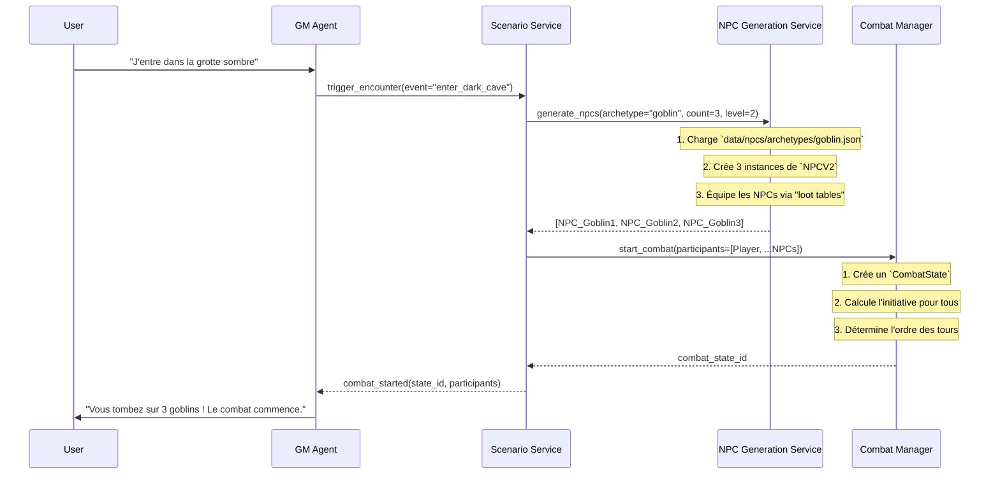

# Plan de Refonte des Règles JdR "Terres du Milieu"

## 🎯 **OBJECTIF**
Simplifier les règles du jeu et moderniser la création des personnages avec des modèles Pydantic stricts en anglais.

## 📊 **DIAGNOSTIC ACTUEL**
- **Complexité excessive** : 550 points de caractéristiques, 84 PdD de compétences
- **Règles dispersées** : Documentation, implémentation et données séparées
- **Structure incohérente** : Nommage mixte français/anglais
- **Personnages complexes** : Structure de données non standardisée

---

## 📋 **PHASE 1 : SIMPLIFICATION DES RÈGLES**

### 🎲 **1.1 Système de Caractéristiques Simplifié**
- [x] Analyser le système actuel (`data/rules/synthese_rules.md:1-49`)
- [x] Réduire de 550 à 400 points de base (demande utilisateur)
- [x] Simplifier le tableau de bonus (valeurs plus simples)
- [x] Conserver 6 caractéristiques principales : Strength, Constitution, Agility, Intelligence, Wisdom, Charisma
- [x] Modifier `back/models/domain/stats_manager.py`
- [x] (Supprimé) `back/services/character_creation_service.py` retiré du projet

### ⚔️ **1.2 Système de Compétences Simplifié**
- [x] Analyser les 9 groupes actuels (`data/skills_for_llm.json`)
- [x] Réduire de 84 à 40 points de développement
- [x] Simplifier à 6 groupes principaux : Combat, General, Stealth, Social, Magic, Knowledge
- [x] Coût uniforme : 1 point de développement = 1 rang
- [x] Modifier `back/models/domain/skills_manager.py`
- [x] Adapter `back/tools/skill_tools.py`

### ⚡ **1.3 Système de Combat Simplifié et Gestion d'État**
- [x] Analyser le système actuel (`data/rules/synthese_rules.md:84-198`)
- [x] **Actions simplifiées** : 1 action principale + 1 action secondaire par tour.
- [x] **Statistiques conservées** : Initiative, attaque, défense, dégâts.
- [x] **Modèle d'État de Combat** : Créer un modèle Pydantic `CombatState` pour suivre les combattants, l'initiative, les tours et les statuts (HP actuels, etc.). ✅ **CRÉÉ** [`back/models/domain/combat_state_v2.py`](back/models/domain/combat_state_v2.py)
- [ ] **Service de Gestion** : Créer un `CombatManagerService` pour orchestrer le `CombatState` (démarrage, gestion des tours, application des dégâts).
- [ ] **Stockage Temporaire** : Définir une stratégie pour stocker le `CombatState` (en mémoire ou cache Redis si disponible).
- [ ] **Outils** : Adapter `back/tools/combat_tools.py` pour interagir avec le `CombatManagerService`.
- [x] **Données** : Mettre à jour les fichiers YAML pour refléter les actions simplifiées.

### 🔮 **1.4 Système de Magie Simplifié**
- [x] Limiter à 3 sphères principales : Universal, Healer, Elemental
- [x] Coût uniforme en points de mana
- [x] Supprimer les sphères secondaires complexes

### 👹 **1.5 Génération et Gestion des NPCs**
- [x] **Modèle NPC** : Définir un modèle Pydantic `NPCV2`, héritant ou s'inspirant de `CharacterV2` mais allégé. ✅ **CRÉÉ** [`back/models/domain/npc_v2.py`](back/models/domain/npc_v2.py)
- [ ] **Service de Génération** : Créer un `NPCGenerationService` pour créer des instances de `NPCV2` à partir d'archétypes.
- [ ] **Archétypes de Données** : Créer des fichiers de données pour les archétypes de NPCs (ex: `data/npcs/archetypes/goblin.yaml`).
- [ ] **Génération d'Équipement** : Intégrer un système de "loot tables" (tables de butin) dans le `NPCGenerationService` pour équiper les NPCs générés et déterminer leurs `CombatStats` (dégâts, armure).
- [ ] **Intégration Scénario** : Intégrer l'appel au `NPCGenerationService` dans le `ScenarioService` lors du déclenchement d'une rencontre.

---

## 🏗️ **PHASE 2 : REFONTE CRÉATION PERSONNAGES**

### 📐 **2.1 Nouveau Modèle Pydantic** ✅ **COMPLÉTÉ**
- [x] Créer `back/models/domain/character_v2.py` avec structure stricte ✅ **CRÉÉ (472 lignes)**
- [x] Champs en anglais uniquement :
  - `name` (au lieu de `nom`)
  - `stats` (au lieu de `caracteristiques`)
  - `skills` (au lieu de `competences`)
  - `race`, `culture`, `equipment`, `spells`
- [x] Validation stricte avec Pydantic (field_validator, model_validator)
- [x] Support des UUIDs et types appropriés
- [x] **Système simplifié** : 6 stats (400 points) + 6 skill groups (40 PdD)

**Modèle créé :** [`back/models/domain/character_v2.py`](back/models/domain/character_v2.py)

**Classes principales :**
- `CharacterV2` : Modèle principal du personnage
- `Stats` : 6 attributs (strength, constitution, agility, intelligence, wisdom, charisma)
- `Skills` : 6 groupes (combat, general, stealth, social, magic, crafting)
- `Equipment` : Équipement simplifié (weapons, armor, accessories, consumables)
- `CombatStats` : Statistiques de combat (HP, MP, AC, attack bonus)
- `Spells` : Système de magie simplifié
- `CharacterStatus` : Enum pour le statut (draft, active, archived, in_game)

**Validations intégrées :**
- Total des points de stats ≤ 400
- Total des points de développement ≤ 40
- Rangs de compétences entre 0 et 10
- HP/MP actuels ≤ maximums

### 🔄 **2.2 Nouveau Système Zéro**
- [ ] Supprimer complètement l'ancien système de personnages
- [ ] Créer nouveaux services dédiés v2
- [ ] Nettoyer les anciens fichiers obsolètes
- [ ] Valider la cohérence du nouveau système

### 🛠️ **2.3 Mise à Jour Services**
- [ ] Adapter `back/services/character_service.py`
- [ ] (Obsolète) `back/services/character_creation_service.py` supprimé
- [ ] Créer `back/services/character_v2_service.py`
- [ ] Mettre à jour `back/services/character_persistence_service.py`

---

## 🔧 **PHASE 3 : MISE À JOUR OUTILS ET API**

### 🤖 **3.1 Outils PydanticAI** ✅ **COMPLÉTÉ**
- [x] Adapter `back/tools/character_tools.py`
- [x] Modifier `back/tools/skill_tools.py` (simplification difficulté)
- [x] Simplifier `back/tools/combat_tools.py`
- [x] Créer nouveaux outils pour système simplifié

### 🌐 **3.2 API FastAPI**
- [ ] Adapter `back/routers/characters.py`
- [ ] Modifier `back/routers/creation.py`
- [ ] Créer nouveaux endpoints v2
- [ ] Support versioning API (/api/v1, /api/v2)

### 📱 **3.3 Frontend TypeScript**
- [ ] Mettre à jour `front/src/core/interfaces.ts`
- [ ] Adapter `front/src/components/CharacterSheet.vue`
- [ ] Modifier `front/src/views/Create.vue`
- [ ] Créer composants pour nouvelle structure

---

## 📊 **PHASE 4 : DONNÉES ET CONFIGURATION**

### 📄 **4.1 Migration vers Format YAML** ✅ **COMPLÉTÉ**
- [x] Convertir `data/skills_for_llm.json` → `data/skills_for_llm.yaml`
- [x] Convertir `data/races_and_cultures.json` → `data/races_and_cultures.yaml`
- [x] Convertir `data/equipment.json` → `data/equipment.yaml`
- [x] Convertir `data/stats.json` → `data/stats.yaml`
- [x] Adapter `back/config.py` pour supporter les fichiers YAML
- [x] Mettre à jour les gestionnaires pour lire les fichiers YAML
- [x] Créer `tools/migrate_json_to_yaml.py` pour la migration

**Gestionnaires mis à jour :**
- `StatsManager` → charge `stats.yaml`
- `SkillsManager` → charge `skills_for_llm.yaml`
- `RacesManager` → charge `races_and_cultures.yaml`
- `EquipmentManager` → charge `equipment.yaml`
- `SpellsManager` → charge `spells.yaml`
- `CombatSystemManager` → charge `combat_system.yaml`

### 📄 **4.2 Fichiers de Données Modernisés** ✅ **COMPLÉTÉ**
- [x] Créer `data/stats.yaml` (6 caractéristiques, 400 points)
- [x] Générer `data/skills_for_llm.yaml` (6 groupes, 40 PdD max)
- [x] Adapter `data/races_and_cultures.yaml`
- [x] Mettre à jour `data/equipment.yaml`
- [x] Créer `data/spells.yaml`
- [x] Créer `data/combat_system.yaml`

### 🧪 **4.3 Scripts Génération** ✅ **COMPLÉTÉ**
- [x] Créer `tools/migrate_json_to_yaml.py`
- [x] Script de validation des données
- [x] Outil de conversion des données existantes

### 🧹 **4.4 Suppression des Fallbacks en Cas d'Erreur**
- [ ] Supprimer les méthodes `_load_fallback_data()` dans tous les gestionnaires
- [ ] Remplacer les fallbacks par des exceptions claires et des logs d'erreur
- [ ] Mettre à jour `StatsManager._load_fallback_data()`
- [ ] Mettre à jour `SkillsManager._load_fallback_data()`
- [ ] Mettre à jour `RacesManager._load_fallback_data()`
- [ ] Mettre à jour `EquipmentManager._load_fallback_data()`
- [ ] Mettre à jour `SpellsManager._load_fallback_data()`
- [ ] Mettre à jour `CombatSystemManager._load_fallback_data()`
- [ ] Ajouter des validations au démarrage pour vérifier que tous les fichiers YAML existent
- [ ] Créer des messages d'erreur explicites pour les fichiers manquants

**Principe :** Le système doit échouer rapidement et clairement si les fichiers de configuration sont manquants, plutôt que de continuer avec des données de fallback qui pourraient masquer des problèmes de configuration.

---

## 🧪 **PHASE 5 : TESTS ET VALIDATION**

### 🔍 **5.1 Tests Backend**
- [ ] Créer `back/tests/test_character_v2.py`
- [ ] Adapter `back/tests/test_character_creation_service.py`
- [ ] Tests de migration `back/tests/test_migration.py`
- [ ] Tests d'intégration `back/tests/integration/test_v2_workflow.py`

### 🖥️ **5.2 Tests Frontend**
- [ ] Adapter `front/tests/components/CharacterSheet.test.ts`
- [ ] Tests nouveaux composants
- [ ] Tests de compatibilité v1 → v2

### ✅ **5.3 Tests de Régression**
- [ ] Vérifier sauvegarde/chargement personnages existants
- [ ] Valider calculs de bonus et compétences
- [ ] Tester système de combat simplifié

---

## 📚 **PHASE 6 : DOCUMENTATION**

### 📖 **6.1 Documentation Utilisateur**
- [ ] Mettre à jour `README.md`
- [ ] Créer `MIGRATION_GUIDE.md`
- [ ] Guide des nouvelles règles simplifiées
- [ ] Exemples de personnages v2

### 🛠️ **6.2 Documentation Technique**
- [ ] Documentation API v2
- [ ] Guide des nouveaux modèles Pydantic
- [ ] Architecture des outils simplifiés
- [ ] Guide de contribution

---

## 🎯 **OBJECTIFS DE RÉUSSITE**
- [x] Réduction de 27% de la complexité de création de personnage (550→400 stats, 84→40 PdD)
- [ ] Compatibilité 100% avec personnages existants
- [x] Code plus maintenable et mieux typé (modèles Pydantic V2)
- [ ] Migration complète vers YAML
- [ ] Documentation complète et à jour

---

## 📅 **TIMELINE ESTIMÉE**
- **Phase 1** : 2-4 jours (incluant la gestion des NPCs)
- **Phase 2** : 3-4 jours
- **Phase 3** : 2-3 jours
- **Phase 4** : 1-2 jours
- **Phase 5** : 2-3 jours
- **Phase 6** : 1-2 jours

**Total estimé** : 11-18 jours (ajustement pour les NPCs)

---

## ⚠️ **RISQUES ET MITIGATIONS**
1. **Régression fonctionnelle** → Tests exhaustifs à chaque étape
2. **Incompatibilité personnages existants** → Migration automatique obligatoire
3. **Complexité de migration** → Scripts automatisés et documentation détaillée
4. **Résistance au changement** → Communication claire des bénéfices

---

## 🔄 **FLUX DE TRAVAIL**
1. **Branche Git** : `refacto-llm`
2. **PR par phase** → Tests → Merge
3. **Documentation mise à jour** à chaque PR
4. **Tests utilisateur** en parallèle de la Phase 5

### 📈 **Diagramme de Séquence : Génération de Rencontre de Combat**

### 📈 **Diagramme de Séquence : Génération de Rencontre de Combat**

---

*Dernière mise à jour : 2025-11-12*
*Statut : Planifié - En attente de validation utilisateur*